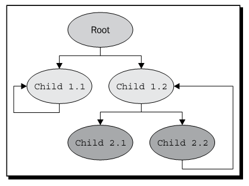

Chapter 3: Creating Your First OSG Program
==========================================

Constructing your own projects
------------------------------

Using a root node
-----------------

Understanding memory management
-------------------------------

在一个典型的编程场景中，开发者应该创建一个指向根节点的指针，根节点会直接或间接的管理场景图的所有其他子节点。在这种情况下，当他们不再需要进行渲染时，程序会遍历场景图并且小心的删除每一个节点及其内部数据。这个过程非常繁琐且极易出错，因为开发者不会知道有多少其他的对象依然指向正在被删除的节点。然而如果不编写管理代码，所有场景节点所占用的数据段就不会被删除，从而会导致不可预期的内存泄露。

这就是OSG编程中内存管理如此重要的原因。一个基本的内存管理概念通常涉及两个主题：

\# 分配：通过分配所请求的内存块为对象提供需要的内存。 \#
回收：当其数据不再被需要时回收所分配的内存以供重用。

一些现代的编程语言，例如C\#，Java与Visual
Basic，使用垃圾回收器来释放任意的程序变量不再引用的内存块。这意味着存储引用内存块的对象数目，并且当数目减少到零时回收内存。

标准的C++方法并没有以这种方式进行工作，但是我们可以通过智能指针（smart
pointer）的方法来模拟，智能指针被定义为一个类似于指针的对象，但是在内存管理中更为智能。例如，boost库提供了boost::shared\_ptr&lt;&gt;类模板来存储指针以实现动态分配相关的对象。

ref\_ptr&lt;&gt; and Referenced classes
---------------------------------------

幸运的是，OSG也提供了一个原生的智能指针，osg::ref\_ptr&lt;&gt;，用于自动垃圾收集与释放。为了使其正确工作，OSG同时提供了osg::Referenced类来管理引用计数的内存块，该类被用作扮演模板参数角色的所有类的基类。

osg::ref\_ptr&lt;&gt;类模板重新实现了大量的C++操作符以及成员函数，从而为开发者提供了方便的方法。其主要组成部分如下：

-   get()：该公共方法返回被管理的指针，例如，如果我们使用osg::Node作为模板参数则会返回osg::Node\*
    指针。
-   operator\*()：这实际上是一个解引用操作符，该操作符会返回指针地址处的左值，例如，osg::Node&引用变量。
-   operator-&gt;()与operator=()：这两个操作符允许用户程序将osg::ref\_ptr&lt;&gt;用作普通指针。前者调用被管理对象的成员函数，而后者使用一个新指针来替换当前被管理的指针。
-   operator==()，operator!=()与operator!()：这几个操作符用于比较智能指针，或是检测特定的指针是否正确。被赋值为NULL值或是没有任何赋值的osg::ref\_ptr&lt;&gt;对象被认为是不正确的。
-   valid()：如果被管理的指针不为NULL，该公共方法会返回真。如果some\_ptr被定义为智能指针，则表达式some\_ptr.valid()等同于some\_ptr!=NULL。
-   release()：当由函数中返回被管理的地址时，这个公共方法会非常有用。我们会在稍后进行讨论。

osg::Referenced类是所有场景图中所有元素的纯基类，例如节点，几何体，渲染状态以及所有其他可分配的场景对象。osg::Node类实际上间接派生自osg::Refereced。这也正是我们可以编写如下语句的原因：

    osg::ref_ptr<osg::Node> root;

osg::Referenced类包含一个整数用来处理所分配的内存块。在类的构造函数中引用计数被初始化为0，如果osg::Referenced对象被一个osg::ref\_ptr&lt;&gt;智能指针引用时，引用计数会增加1。相对的，如果对象被由特定的智能指针移除时，引用计数会减1。当不再为任何智能指针引用时，对象本身将会被自动销毁。

osg::Referenced类提供了三个主要成员方法：

-   公共方法ref()将引用计数值增加1
-   公共方法unref()将引用计数值减少1
-   公共方法referenceCount()返回当前的引用计数值，这对于代码调试非常有用

这些方法同样可以作用于由osg::Referenced派生的类。注意，在用户程序中无需直接调用ref()与unref()方法，这意味着引用计数是由手动进行管理的，且也许会与osg::ref\_ptr&lt;&gt;的操作产生冲突。否则，OSG的内部垃圾回收系统将会获得错误的正在使用中的智能指针数目，甚至在以不正确的方式管理内存块会导致程序崩溃。

Collecting garbage: why and how
-------------------------------

下面是一些在程序中使用智能指针与垃圾回收系统的原因：

-   更少的错误：使用智能指针意味着指针的自动初始化与清除。不会产生野指针，因为他们总是引用计数的。
-   高效管理：当对象不再被引用时他们会被立即回收，从而在有限的资源下为程序提供更多可用的内存。
-   调试容易：我们可以很容易获取对象的引用计数以及其他信息，然后应用其他的优化与实验。

例如，场景图是由一个根节点与多层子节点构成的。假定所有的子节点都是由osg::ref\_ptr&lt;&gt;进行管理的，用户程序只需要保存指向根节点的指针。如下图所示，删除根节点指针的操作将会导致销毁整个节点层次结构的级联效果：

示例中的每一个节点都是由其父节点进行管理的，并会在父节点的删除过程中自动解引用。该节点如果不再由其他的节点进行引用，会被立即销毁，而且其所有的子节点会被释放。整个场景图会在最后一个组合节点或是叶子节点被删除之后被最终清理。

这一过程非常方便与高效，不是吗？请确信OSG智能指针正适合我们，并且使用由osg::Referenced派生的类作为osg::ref\_ptr&lt;&gt;的模板参数，并且正确的向智能指针赋值新分配的对象。

智能指针可以被用作局部变量，全局变量或是类变量，并且会在重新赋值给其他对象或是超出智能指针声明的范围时自动减少引用计数。

强烈推荐用户程序总是使用智能指针来管理其场景，但是仍然有一些需要特别注意的问题：

-   osg::Referenced及其派生类只能由堆上生成。他们不能被用作局部变量，因为出于安全考虑类析构函数在内部被声明为proteced。例如：

<!-- -->

    osg::ref_ptr<osg::Node> node = new osg::Node; // this is legal
    osg::Node node; // this is illegal!

-   普通的C++指针可以临时起作用。但是用户程序应记得将其赋值给osg::ref\_ptr&lt;&gt;，或是在最后将其添加到场景图元素（几乎所有的OSG场景类都使用智能指外域来管理子对象），因为他总是最安全的方法。

<!-- -->

    osg::Node* tmpNode = new osg::Node; // this is OK
    …
    osg::ref_ptr<osg::Node> node = tmpNode; // Good finish!

-   不要使用循环引用，因为垃圾回收机制不能处理。循环引用意味着一个对象直接或是间接引用其自身，从而会导致错误的引用计数的计算。

下图中所示的场景图包含两种类型的循环引用，这两种类型都是错误的。节点Child
1.1添加其自身作为子节点，从而会导致遍历子节点时的死循环，因为他也是其自身的子节点。节点Child
2.2是一个间接循环引用，当运行时会导致相同的问题：

下面让我们通过一个非常简单的示例来更好的理解内存管理的基本概念。

Tracing the managed entities
----------------------------

我们所感兴趣的是osg::ref\_ptr&lt;&gt;如何绑定与处理osg::Referenced对象，以及何时销毁被管理的对象。我们已经了解的是：当对象不再为任何智能指针所引用，或是其引用者已经超出其声明范围时，所管理的对象会被自动销毁。让我们看一下实际这是如何操作的。

Parsing command-line arguments
------------------------------

主函数的命令行参数为用户程序定义了不同的参数。主函数的声明总是如下面的样子：

    int main( int argc, char** argv );

argc与argv参数构成了一个包含程序名与其他必须参数的字符串数组。OSG提供了一个快速与安全的osg::ArgumentParser来读取并使用这些参数。

Tracing with the notifier
-------------------------

OSG通知器机制为由OSG渲染后端或是由用户级别输出可视的调试信息提供了理想方法。对于跟踪与调试程序这确实是一个重要而省时的方法。另外，通知器也被用在OSG核心功能与插件中来显示错误，警告信息或是过程信息。开发者也许仅是简单的在源代码中插入调试输出函数，输出函数，osg::notify()，被设计来接受不同的信息级别并将其发送到控制台划用户定义的控制器。

osg::nofiy()函数可以被用作标准输出流std::cout。他需要一个NotifyServerity参数来指示消息级别，该参数可以为ALWAYS，FATAL，WARN，NOTICE，INFO，DEBUG\_INFO与DEBUG\_FP，依次由最严重级别到最轻级别。例如：

    osg::notify(osg::WARN) << "Some warn message." << std::endl;

默认情况下这会输出一条警告信息。这里osg::WARN被用于向OSG通知系统指示通知级别。

一系列的宏，例如OSG\_FATAL，OSG\_WARN与OSG\_NOTICE与使用不同级别的osg::notify()函数具有相同的作用。

Redirecting the notifier
------------------------

OSG输出信息总是包含关于运行状态，图形系统扩展以及OSG后端与用户程序中可能问题的相关信息。这对于作为调试基于OSG的程序的引用资源同样非常重要。

在某些情况下，在程序中并没有控制台输出，从而会阻碍我们读取通知信息与查找可能的错误。然而，osg::NotifyHandler派生类可以用于将通知器重定向到其他的输出流，例如文件或是GUI部件。

Summary
-------

本章提供了一个简单的指南来使用CMake工具创建我们自己的简单OSG程序，并且介绍了一些实用程序。OSG使用智能指针用于在运行时分配给场景节点的操作系统资源的高效管理，这对于这些要求安全的程序的性能非常重要。为了有助于理解智能指针的工作原则，我们花费了大量的章节来解释osg::ref\_ptr&lt;&gt;的使用以及如何计算引用计数，并且探讨了当管理OSG场景元素时可能会出现的各种情况。

在本章中，我们特别讨论了：

-   如何编写简单的CMake脚本文件并且使其与我们自己的源码和OSG依赖配合工作
-   OSG智能指针与垃圾回收机制的原则
-   在场景图对象上使用智能指针的优点与注意事项
-   用于解析命令行参数以及跟踪与调试我们源代码的其他有用类与函数

