Chapter 4: Building Geometry Models
===================================

OpenGL图像管线的基本操作是接受顶点数据（点，线，三角形与多边形）以及像素数据（图像数据），将其转换为帧并存储在帧缓冲区中。帧缓冲区作为开发者与计算机显示之间的重要接口，将图像内容的每一帧映射到内存空间用于读写操作。OSG封装了全部的OpenGL顶点转换以及基本的组装操作，从而管理并将顶点数据发送到OpenGL管线，以及用于改善渲染性能的数据传输优化以及额外的多边形技术等。

本章我们将会关注如何通过快速路径绘制与渲染几何模型，涉及如下内容：

-   如何通过少量的必要参数快速绘制基本对象
-   如何设置顶点与顶点属性数组来构建几何对象
-   使用基元索引顶点数据的原因与方法
-   如何通过使用不同的多边形技术优化渲染
-   如何访问几何属性与基元
-   将OpenGL绘制调用集成到我们的基于OSG的程序中

How OpenGL draws objects
------------------------

OpenGL使用几何基元在3D世界中绘制不同的对象。一个几何基元可以是点集合，线，三角形或是多边形面，决定了OpenGL如何排序并渲染其相关联的顶点数据。渲染基元最简单的方法就是在glBegin()与glEnd()对之间指定一个顶点列表，这被称为立即模式，但是在大多数情况下效率低下。

顶点数据，包括顶点坐标，法线，颜色以及纹理坐标，也可以存储在各种数组中。基元可以通过解引用与索引数组元素来形成。这种方法，名为顶点数组，减少了额外的共享顶点，因而性能要优于立即模式。

显示列表也极大的改进了程序性能，因为所有的顶点与像素数据都被编译并被拷贝到图像内存中。这些准备好的基元可以被重复使用，而无需多次传输数据。这在绘制静态几何时非常有用。

顶点缓冲区对象（VBO）机制允许顶点数组被存储在高性能内存中。这为传输动态数据提供了一种更为高效的解决方案。

默认情况下，OSG使用顶点数组与显示列表来管理与渲染几何。然而，这会依据不同的数据类型与渲染策略而发生变化。

我们需要强调在OpenGL ES与OpenGL
3.x中立即模式与显示列表的去除，这是出于提供更为轻量级的接口的考虑。当然OpenGL
3.x以及后续的版本中将会保留废弃的API以向后兼容。然而，这些API不推荐在新代码中使用。

Geode and Drawable classes
--------------------------

osg::Geode类对应于场景图中的叶子节点。他没有子节点，但是却总是包含渲染所需要的几何信息。其名字Geode是几何节点的缩写。

要被绘制的几何数据存储在由osg::Geode管理的osg::Drawable对象集合中。不可实例化的osg::Drawable类被定义为纯虚类。他有多个子类用于向OpenGL管线渲染模型，图像以及文本。这些可渲染的元素被统称为可绘制元素（drawables）。

osg::Geode类提供提供了多种方法来关联与解关联可绘制元素，以及获取相关的信息：

1.  公共方法addDrawable()采用一个osg::Drawable指针作为元素并将一个可绘制元素关联到osg::Geode实例。所添加的所有可绘制元素在内部是由osg::ref\_ptr&lt;&gt;智能指针进行管理的。
2.  公共方法removeDrawable()与removeDrawables()将会由当前的osg::Geode对象中删除一个或是多个可绘制对象，同时会减少其引用计数。removeDrawable()方法使用一个osg::Drawable指针作为其唯一参数，而removeDrawables()接受两个参数：基于零索引的起始元素以及要删除的元素数目。
3.  getDrawable()方法返回存储在指定基于零索引处的osg::Drawable对象。
4.  getNumDrawables()方法返回所关联可绘制元素的总数。然后开发者可以通过getDrawable()方法在循环中对每一个可绘制元素进行遍历，或是使用下面的代码来移除所有的可绘制元素：

<!-- -->

    geode->removeDrawables(0, geode->getNumDrawables());

Rendering basic shapes
----------------------

OSG提供了一个osg::ShapeDrawable类，该类继承于osg::Drawable基类，使用普通的参数来快速绘制基本几何图形。一个osg::ShapeDrawable实例总是包含一个osg::Shape对象来表示指定几何图形的类型与属性。

setShape()方法通常用于分配并设置图形。例如：

    shapeDrawable->setShape(new osg::Box(osg::Vec3(1.0f, 0.0f, 0.0f), 10.0f, 10.0f, 5.0f); 

他将会赋值一个中心点位于其本地坐标空间中（1.0， 0.0，
0.0）处，宽与高为10，而深度为5的盒子。这里，类osg::Vec3表示OSG中的一个三元素向量。其他预定义类如osg::Vec2与osg::Vec4在定义顶点，颜色，法线与纹理坐标时会非常有用。

注意，osg::Vec3表示一个浮点类型向量，osg::Vec3d表示一个双精度浮点型向量，同时osg::Vec2与osg::Vec2d，osg::Vec4与osg::Vec4d也是如此。

OSG中定义的最常使用的基本图形有osg::Box，osg::Capsule，osg::Cone，osg::Cylinder与osg::Sphere。其形状可以通过直接向构建函数传递参数进行定义。

### Time for action-quickly creating simple objects

使用osg::Shape子类可以很容易创建对象。我们将使用三个典型的图形作为示例：一个具有不同宽度、高度与深度值的盒子，一个具有半径值的圆形以及一个具有半径与高度值的锥体。

1.  包含所需的头文件：

<!-- -->

    #include <osg/ShapeDrawable>
    #include <osg/Geode>
    #include <osgViewer/Viewer>

2.  依次添加三个osg::ShapeDrawble对象，每一个带有一个基本形状类型。我们将这三个图形放置在不同的位置从而使得他们同时为查看者所见，并且为了将其彼此区分，我们通过使用osg::ShapeDrawble的setColor()方法依次将后两个图形设置为绿色与蓝色：

<!-- -->

    osg::ref_ptr<osg::ShapeDrawable> shape1 = new osg::ShapeDrawable;
    shape1->setShape( new osg::Box(osg::Vec3(-3.0f, 0.0f, 0.0f),
                                   2.0f, 2.0f, 1.0f) );
    osg::ref_ptr<osg::ShapeDrawable> shape2 = new osg::ShapeDrawable;
    shape2->setShape( new osg::Sphere(osg::Vec3(3.0f, 0.0f, 0.0f),
                                      1.0f) );
    shape2->setColor( osg::Vec4(0.0f, 0.0f, 1.0f, 1.0f) );
    osg::ref_ptr<osg::ShapeDrawable> shape3 = new osg::ShapeDrawable;
    shape3->setShape( new osg::Cone(osg::Vec3(0.0f, 0.0f, 0.0f),
                                    1.0f, 1.0f) );
    shape3->setColor( osg::Vec4(0.0f, 1.0f, 0.0f, 1.0f) );

3.  创建一个osg::Geode对象，并将所创建的可绘制元素添加到该对象。注意，在这里可绘制元素与几何体节点都是由osg::ref\_ptr&lt;&gt;智能指针管理的。osg::Geode对象最终被用作查看器的场景根节点：

<!-- -->

    osg::ref_ptr<osg::Geode> root = new osg::Geode;
    root->addDrawable( shape1.get() );
    root->addDrawable( shape2.get() );
    root->addDrawable( shape3.get() );
    osgViewer::Viewer viewer;
    viewer.setSceneData( root.get() );
    return viewer.run();

4.  现在是查看这些图形是否被正确渲染的时候了。我们在这里不必关心顶点位置，法线与颜色的实际绘制，这会为调试与快速的图形查看带来方便：

### What just happened?

osg::ShapeDrawble类对于快速显示非常有用，但是却并不是一种绘制几体基本元素的高效方法。他应只被用作我们开发3D程序时快速原型与调试的一种方法。要创建具有高效计算与可视化需求的几何体，下面将要介绍的osg::Geometry类总是一种更好的选择。

OSG有一个内部的osg::GLBeginEndAdapter类可以用来执行基本的图形绘制操作。这个类可以允许glBegin()与glEnd()对风格的顶点数组的使用，从而使得基本图形的实现更容易理解与扩展。

要获得并使用一个已初始化的osg::GLBeginEndAdapter对象，我们必须定义一个由osg::Drawble基类派生的类，并重新实现其drawImplementation()方法，并从头开始编程，就如同我们编写典型的OpenGL
1.0绘制调用一样：

    void drawImplementation( osg::RenderInfo& renderInfo ) const
    { 
        osg::GLBeginEndAdapter& gl =
            renderInfo.getState()->getGLBeginEndAdapter();
        gl.Begin( … );
        gl.Vertex3fv( … );
        gl.End();
    }

我们可以在本章的Implementing your own
drawables一节找到关于重新实现osg::Drawable类的更多信息。

Storing array data
------------------

正如在前面章节中所提到的，OSG支持顶点数组与VBO来加速渲染过程。要管理在这两种机制中所使用的顶点数据，OSG定义了一个基本的osg::Array类以及一些派生类用于通常用到的数组与索引数组类型。

osg::Array类不能被实例化，但是他声明了与OpenGL调用交换以及缓冲数据修饰符的接口。其子类（osg::Vec2Array，osg::Vec3Array，osg::UIntArray等）继续了STL
vector类的特点，因而可以使用所有的std::vector成员，包括push\_back()，pop\_back()，size()以及STL算法与迭代器。

下面的代码将会向一个已存在的osg::Vec3Array对象命名顶点添加一个三元素的向量：

    vertices->push_back( osg::Vec3(1.0f, 0.0f, 0.0f) );

OSG内建数组类应在堆上进行分配并且由智能指针进行管理。然而，对于数组元素如osg::Vec2与osg::Vec3则不必遵循这一规则，因为他们是非常基本的数据类型。

osg::Geometry类扮演了OpenGL顶点数组高层封装者的角色。他会记录不同的数组类型并且管理一个几何基元集合来以顺序方式渲染这些顶点数据。他由osg::Drawable类派生，并且可以被随时添加到osg::Geode对象中。该类接受数组作为基本的数据携带者，并且使用这些数据生成简单或复杂的几何模型。

Vertices and vertex attributes
------------------------------

顶点是几何基元的原子元素。他使用多个数值属性来描述2D或3D空间的点，包括顶点位置，颜色，法线与纹理坐标，雾坐标等。位置值总是必须的，而其他属性则有助于定义点的自然特性。OpenGL接受为每个顶点指定高达16个普通属性，并且可以创建不同的数组来存储这些属性。所有的属性数组都是通过相应的set\*Array()方法进行支持的。

OpenGL中内建的顶点属性列表如下表所示：

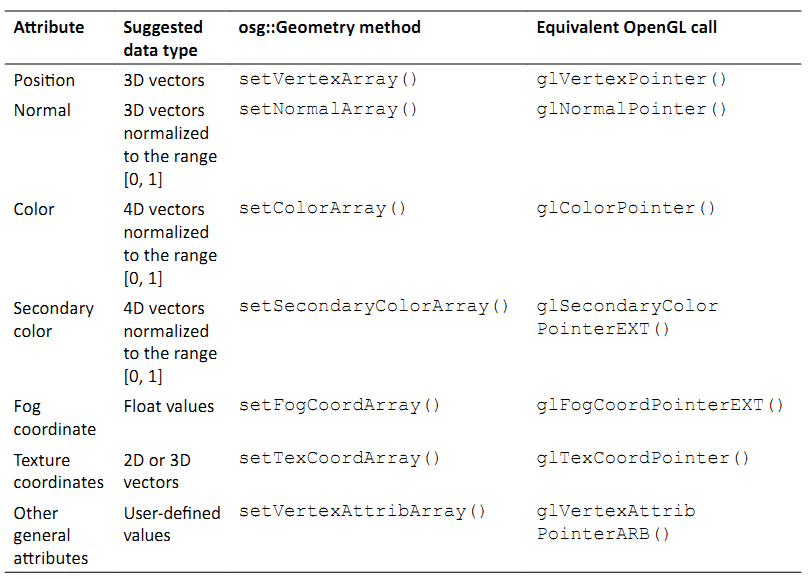

在当前的OpenGL图像系统中，一个顶点通常包含八个纹理坐标与三个普通属性。原则上，每一个顶点都应该将其所有属性设置为特定的值，并且构成一个具有相同尺寸的数组集合；否则未定义的属性也许会导致不可预料的问题。OSG提供了绑定方法使得这些工作更为方便。例如，开发者也许会在osg::Geometry对象geom上调用公共方法setColorBinding()，并且使用一个枚举作为参数：

    geom->setColorBinding( osg::Geometry::BIND_PER_VERTEX );

这表明颜色与顶点进入一对一的关系。然而，下面的代码：

    geom->setColorBinding( osg::Geometry::BIND_OVERALL );

他会将一个颜色值应用到整个几何体上。其他的setNormalBinding()，setSecondaryColorBinding()，setFogCoordBinding()与setVertexAttribBinding()会为其他的属性类型完成相应的工作。

Specifying drawing types
------------------------

在设置顶点属性数组之后的步骤就是通知osg::Geometry对象如何进行渲染。虚基类osg::PrimitiveSet被用来管理几何基元集合，该集合记录了顶点渲染顺序信息。osg::Geometry提供了一些公共方法在一个或是多个基元集合上进行操作：

1.  addPrimitiveSet()方法使用一个osg::PrimitiveSet指针作为参数并且将基元集合关联到osg::Geometry对象。
2.  removePrimitiveSet()方法需要一个基于零的索引参数以及要移除的基元集合的数目。他将会移除一个或是多个已关联的基元集合。
3.  getPrimitiveSet()返回指定索引处的osg::PrimitiveSet指针。
4.  getNumPrimitiveSets()返回基元集合的总数目。

osg::PrimitiveSet类不能被直接实例化，但是他派生了一些子类用来封装OpenGL的glDrawArrays()与glDrawElements()实体，例如osg::DrawArrays与osg::DrawElementsUInt。

osg::DrawArrays类使用顶点数组中的一系列序列元素来构建几何基元序列。可以通过下面的声明来创建并关联到osg::Geometry对象geom：

    geom->addPrimitiveSet( new osg::DrawArrays(mode, first, count) );

第一个参数mode指定了要渲染哪种基元类型。类似于OpenGL
glDrawArrays()实体，osg::DrawArrays通常接受十种基元类型：GL\_POINTS，GL\_LINE\_STRIP，GL\_LINE\_LOOP，GL\_LINES，GL\_TRIANGLE\_STRIP，GL\_TRIANGLE\_FAN，GL\_TRIANGLES，GL\_QUAD\_STRIP，GL\_QUADS与GL\_POLYGON。

第二与第三个参数指明基元集合起始于索引first处并且共有coount个元素。开发者应该确保在顶点数组中至少有first+count个元素。OSG并不会检查顶点数目是否满足基元集合需求，而这会导致崩溃。

### Time for action - drawing a colored quad

让我们操作一个普通的图形来了解一下完成一个可渲染几何体模型的步骤。我们只使用四个顶点作为四个角，并使用GL\_QUADS模式来绘制这些顶点，从而创建一个四边形。GL\_QUADS模式会告诉OpenGL组合顶点数组中的前四个坐标作为一个四边形，其次四个坐标作为第二个四边形，依次类推。

1.  包含必要的头文件：

<!-- -->

    #include <osg/Geometry>
    #include <osg/Geode>
    #include <osgViewer/Viewer>

2.  创建顶点数组，并通过使用与std::vector类似的操作符将四个顶点的坐标加入数组：

<!-- -->

    osg::ref_ptr<osg::Vec3Array> vertices = new osg::Vec3Array;
    vertices->push_back( osg::Vec3(0.0f, 0.0f, 0.0f) );
    vertices->push_back( osg::Vec3(1.0f, 0.0f, 0.0f) );
    vertices->push_back( osg::Vec3(1.0f, 0.0f, 1.0f) );
    vertices->push_back( osg::Vec3(0.0f, 0.0f, 1.0f) );

3.  我们需要为每个顶点指定法线；否则，OpenGL将会使用默认的法线向量(0,0,1)，因而灯光相等计算也许会不正确。四个顶点实际上朝向相同的方向，所以一个法线向量就足够了。同时我们稍后会将setNormalBinding()方法设置为BIND\_OVERALL。

<!-- -->

    osg::ref_ptr<osg::Vec3Array> normals = new osg::Vec3Array;
    normals->push_back( osg::Vec3(0.0f,-1.0f, 0.0f) );

4.  我们会为每个顶点指定唯一的颜色，并使其着色。默认情况下，OpenGL会在每一个顶点同时使用平滑着色与混合颜色：

<!-- -->

    osg::ref_ptr<osg::Vec4Array> colors = new osg::Vec4Array;
    colors->push_back( osg::Vec4(1.0f, 0.0f, 0.0f, 1.0f) );
    colors->push_back( osg::Vec4(0.0f, 1.0f, 0.0f, 1.0f) );
    colors->push_back( osg::Vec4(0.0f, 0.0f, 1.0f, 1.0f) );
    colors->push_back( osg::Vec4(1.0f, 1.0f, 1.0f, 1.0f) );

5.  接下来我们创建osg::Geometry对象并设置准备好的顶点，法线与颜色数组。同时我们指示单一的法线应绑定到整个几何体，而颜色则是绑定到每个顶点：

<!-- -->

    osg::ref_ptr<osg::Geometry> quad = new osg::Geometry;
    quad->setVertexArray( vertices.get() );
    quad->setNormalArray( normals.get() );
    quad->setNormalBinding( osg::Geometry::BIND_OVERALL );
    quad->setColorArray( colors.get() );
    quad->setColorBinding( osg::Geometry::BIND_PER_VERTEX );

6.  完成几何体并将其添加到场景图所需的最后一步是指定基元集合。在这里使用一个新分配的并将绘制模式设置为GL\_QUADS的osg::DrawArrays实例，从而以顺时针方向将四个顶点渲染为四边形的四个角：

<!-- -->

    quad->addPrimitiveSet( new osg::DrawArrays(GL_QUADS, 0, 4) );

7.  将几何体添加到osg::Geode对象并在场景查看器中进行渲染：

<!-- -->

    osg::ref_ptr<osg::Geode> root = new osg::Geode;
    root->addDrawable( quad.get() );
    osgViewer::Viewer viewer;
    viewer.setSceneData( root.get() );
    return viewer.run();

8.  我们的程序最终会得到一个漂亮的着色的四边形，如下面的截图所示：

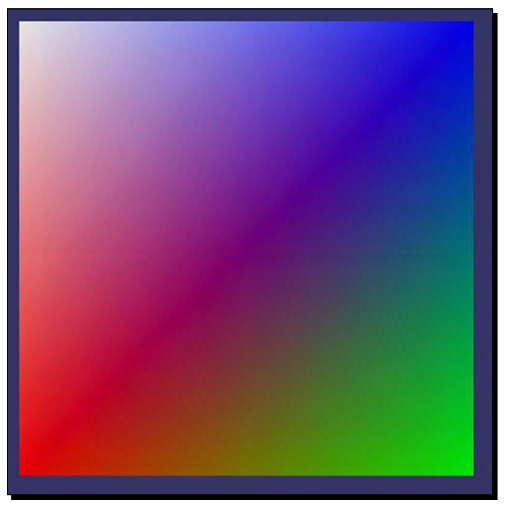

### What just happened?

我们假定已经熟悉下面的OpenGL代码片段：

    static const GLfloat vertices[][3] = { … };
    glEnableClientState( GL_VERTEX_ARRAY );
    glVertexPointer( 4, GL_FLOAT, 0, vertices );
    glDrawArrays( GL_QUADS, 0, 4 );

数组变量vertices被用来定义要渲染的坐标。OpenGL函数glDrawArrays()将会使用数组的四个顺序元素绘制GL\_QUADS模式的几何体基元，也就是3D空间中的四边形。

osg::Geometry类主要通过使用setVertexArray()与addPrimitiveSet()方法封装上面所提到的整个处理过程。实际上，这些顶点数据与基元集合并没有在用户程序调用这些方法时立即执行，而是在接下来的场景图绘制遍历中到达该几何体时才会被应用。这使得使用尽量多的osg::Geometry方法成为可能，例如属性，可以被读取与修改而不会强制场景重新渲染。

### Pop quiz - results of different primitive types

在前面的示例中，我们定义了基元的mode，start与count参数，从而生成了一个四边形。理解一个几何体是如何被一个或是多个基元集合解释对我们是非常重要的。我们能否列出十种模式符号（GL\_TRIANGLES，GL\_QUADS，等），及其主要行为？例如，我们是否知道每一个模式是如何处理顶点与索引的，并且在最后会绘制出哪种图形呢？

Indexing primitives
-------------------

当在数组中顺序读取顶点数据而没有忽略与跳跃时，osg::DrawArrays可以工作得很好。然而，如果存在大量的共享顶点，前面的方法就会有一些低效。例如，为了使得osg::DrawArrays以GL\_TRIANGLES模式绘制具有八个顶点的立方体时，顶点数组就会多次重复每一个顶点，从而至少将数据的尺寸增加到36（12个三角面）：

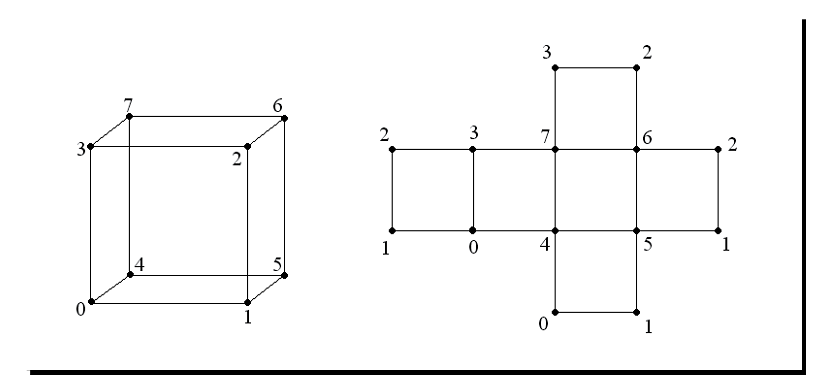

osg::DrawElementsUInt类，以及osg::DrawElementsUByte与osg::DrawElementsUShort类被用作索引数组来解决该问题。这些类均派生自osg::PrimitiveSet，使用不同的数据类型封装了OpenGL的glDrawElements()函数。索引数组保存顶点数组元素的索引。这样通过一个关联的索引基元集合，立方体的顶点数组尺寸可以减小到8个。

osg::DrawElements\*类被设计为类似于std::vector的使用，所以任意vector相关的方法都可以兼容使用。例如，要向新分配的osg::DrawElementsUInt对象添加索引，我们可以使用如下的代码：

    osg::ref_ptr<osg::DrawElementsUInt> de =
        new osg::DrawElementsUInt( GL_TRIANGLES );
    de->push_back( 0 ); de->push_back( 1 ); de->push_back( 2 );
    de->push_back( 3 ); de->push_back( 0 ); de->push_back( 2 );

这可以指定上图中立方体的前面。

### Time for action - drawing and octahedron

八面体是一个具有八个三角面的多面体。这确实是一个显示基元索引为什么如此重要的好盒子。我们首先演示八面体的结构，如下图所示：

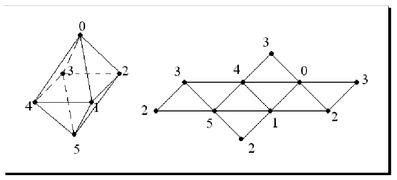

八面体有六个顶点，每一个为四个三角形所共享。当使用osg::DrawArrays时，我们需要创建一个具有24个元素的顶点数组来渲染所有的八个面。然而，借助于索引数组以及osg::DrawElementsUInt类，我们可以分配一个只有六个元素的顶点数组，从而改善绘制几何体的效率。

1.  包含必要的头文件：

<!-- -->

    #include <osg/Geometry>
    #include <osg/Geode>
    #include <osgUtil/SmoothingVisitor>
    #include <osgViewer/Viewer>

2.  正如我们前面所讨论的，osg::Vec3Array类继承了std::vector的特征，可以使用一个预先确定的尺寸参数构建，并直接使用operator\[\]进行操作。

<!-- -->

    osg::ref_ptr<osg::Vec3Array> vertices = new osg::Vec3Array(6);
    (*vertices)[0].set( 0.0f, 0.0f, 1.0f);
    (*vertices)[1].set(-0.5f,-0.5f, 0.0f);
    (*vertices)[2].set( 0.5f,-0.5f, 0.0f);
    (*vertices)[3].set( 0.5f, 0.5f, 0.0f);
    (*vertices)[4].set(-0.5f, 0.5f, 0.0f);
    (*vertices)[5].set( 0.0f, 0.0f,-1.0f);

3.  osg::DrawElementsUInt除接受绘制模式参数以外也接受一个尺寸参数。然后，我们将指定顶点的索引来描述所有八个三角面。

<!-- -->

    osg::ref_ptr<osg::DrawElementsUInt> indices =
        new osg::DrawElementsUInt(GL_TRIANGLES, 24);
    (*indices)[0] = 0; (*indices)[1] = 1; (*indices)[2] = 2;
    (*indices)[3] = 0; (*indices)[4] = 2; (*indices)[5] = 3;
    (*indices)[6] = 0; (*indices)[7] = 3; (*indices)[8] = 4;
    (*indices)[9] = 0; (*indices)[10]= 4; (*indices)[11]= 1;
    (*indices)[12]= 5; (*indices)[13]= 2; (*indices)[14]= 1;
    (*indices)[15]= 5; (*indices)[16]= 3; (*indices)[17]= 2;
    (*indices)[18]= 5; (*indices)[19]= 4; (*indices)[20]= 3;
    (*indices)[21]= 5; (*indices)[22]= 1; (*indices)[23]= 4;

4.  为了使用默认的白颜色创建几何体，我们仅设置顶点数组与osg::DrawElementsUInt基元集合。法线数组与是必需的，但是手动计算并不容易。我们将会使用一个平滑的法线计算器来自动获取。该计算器将会在下一节进行描……

<!-- -->

    osg::ref_ptr<osg::Geometry> geom = new osg::Geometry;
    geom->setVertexArray( vertices.get() );
    geom->addPrimitiveSet( indices.get() );
    osgUtil::SmoothingVisitor::smooth( *geom );

5.  将几何体添加到osg::Geode对象并使其作为场景根节点：

<!-- -->

    osg::ref_ptr<osg::Geode> root = new osg::Geode;
    root->addDrawable( geom.get() );
    osgViewer::Viewer viewer;
    viewer.setSceneData( root.get() );
    return viewer.run();

6.  生成的八面体如下面的截图所示：

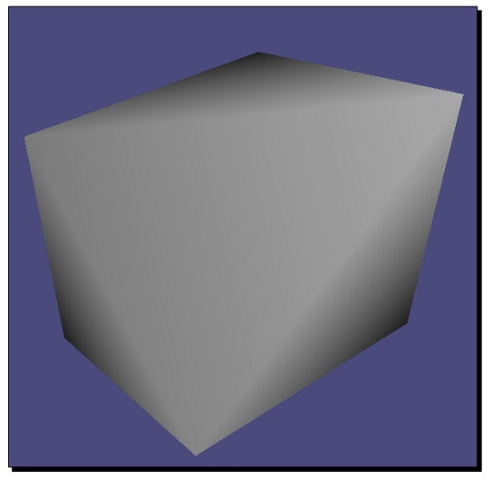

### What just happened?

顶点数组机制减少了OpenGL函数调用的数量。他将顶点数据存储在程序内存中，也就是所谓的客户端。服务器端的OpenGL管线访问不同的顶点数组。

正如由下图中可以看到的，OpenGL由客户端的缓冲区中获取数据，并以一种顺序的方式装配基元数据。

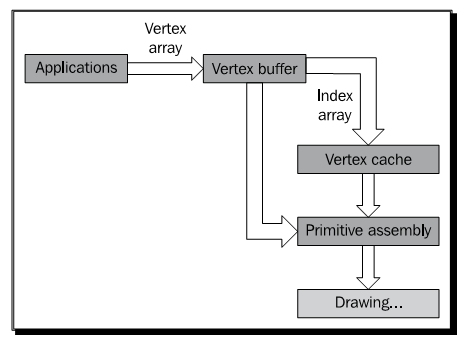

这里的顶点缓冲区被用于管理由osg::Geometry类的set\*Array()方法指定的数据。osg::DrawArrays在这些数组中直线前进并进行绘制。

然而，为了减少传输的顶点数量，osg::DrawElements\*类同时提供了一个索引数组。索引数组允许服务器端的新顶点缓存以用于临时存储。OpenGL将会直接由缓存获取顶点，而不是由位于客户端的顶点缓冲区进行读取。这会极大的改善性能。

### Pop quiz - optimizing indexed geometries

我们前面所绘制的八面体仅有六个顶点构成。如果我们不再索引几何体，我们能否算出实际上使用了多少个顶点吗？

在很多情况下，我们将会发现三角形连接串（triangle
strips）会在渲染连续的面时提供更好的性能。假定在前面的示例中我们选择了GL\_TRIANGLE\_STRIP而不是GL\_TRIANGLES，那么这次我们要如何构建索引数组呢？

### Have a go hero - challenges with cubes and pyramids

现在轮到我们绘制一些其他的多边形了，例如，立方体或锥体。立方体的结构在本节开始处进行了讨论。他包含六个顶点与12个三角面，这是索引顶点一个很的演示。

锥体通常有一个多边形底面，以及多个三角面汇聚在顶点处。以四面锥为例：他有五个顶点与六个三角面（四边形底面包含两个三角面）。每个顶点为三个或是四个三角面共享：

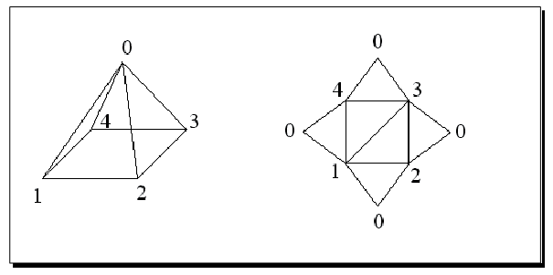

创建一个新的osg::Geometry对象并且添加顶点与法线数组。同时osgUtil::SmoothlingVisitor将会计算平滑法线。指定一个带有GL\_TRIANGLES绘制模式的osg::DrawElementsUInt基元集合。对于高级研究，我们甚至可以添加具有不同绘制模式的多个基元集合，例如，使用GL\_QUADS渲染锥底，使用GL\_TRIANGLES\_FAN渲染三角面。

Using polygonal techniques
--------------------------

OSG支持多种管理几何对象的多边形技术。这些预处理技术，例如多边形缩影与嵌套，经常被用于创建与改进多边形模型以备稍后渲染。他们被设计为具有简单的接口并且易于使用，但是也许会执行复杂的后台计算。他们不应被随时使用，因为也许会涉及到大量的计算。

OSG中的一些多边形技术实现如下所列：

1.  osgUtil::Simplfier：该类可以减少几何体中的多边形数量。公共方法simplify()可以用来简化几何对象。
2.  osgUtil::SmoothingVisitor：该类会为包含基元的几何体计算法线，例如，我们刚才看到的八面体。公共静态方法smooth()可以被用来几何体的光滑法线，而不需要我们自己重新分配并设置法线。
3.  osgUtil::TangentSpaceGenerator：该类会为几何顶点生成包含切线空间基准向量的数组。他会向generate()方法传递几何对象作为参数，并且将结果保存在getTangentArray()，getNormalArray()与getBinormalArray()中。这些结果可以用作GLSL中的变化顶点属性。
4.  osgUtil::Tessellator：该类会使用OpenGL实用程序（glu）嵌套例程来将复杂基元分解为简单基元。他提供了一个retessellatePolygons()方法将输入几何体的基元集合变为嵌套基元集合。
5.  osgUtil::TriStripVisitor：该类将几何体表面基元转换为不连续三角形，从而可以获得更快速的渲染与更高效的内存使用。公共方法stripify()被用来将输入几何体中的基元转换为GL\_TRIANGLE\_STRIP类型。

所介绍的这些方法都可以通过osg::Geometry&引用参数进行使用，例如：

    osgUtil::TriStripVisitor tsv;
    tsv. stripify( *geom );

这里geom是一个由智能指针管理的osg::Geometry对象。

osgUtil::Simplifier，osg::SmoothingVisitor与osgUtil::TriStripVisitor类也可以为场景图节点所接受。例如：

    osgUtil::TriStripVisitor tsv;
    node->accept( tsv );

变量node表示一个osg::Node对象。accept()可以将会遍历节点的孩子直到到达所有的叶子节点，找出并处理osg::Geode节点中所存储的几何体。

### Time for action - tessellating a polygon

复杂的基元通常不能直接由OpenGL
API进行正确的渲染。这包括凹入的多边形，自相交的多边形，以及带有洞的多边形。只有将其分解为凸多边形，这些非凸多边形也会为OpenGL渲染管线所接受。osgUtil::Tessellator类可以用于处理这种情况下的嵌入情况。

1.  包含必要的头文件：

<!-- -->

    #include <osg/Geometry>
    #include <osg/Geode>
    #include <osgUtil/Tessellator>
    #include <osgViewer/Viewer>

2.  我们将通过使用osg::Geometry类创建一个凹多边形。如果一个简单多边形的内角和大于180度则为凹多边形。这里的示例几何体表示一个在右侧凹入的四边形。他被作为GL\_POLYGON基元进行绘制。

<!-- -->

    osg::ref_ptr<osg::Vec3Array> vertices = new osg::Vec3Array;
    vertices->push_back( osg::Vec3(0.0f, 0.0f, 0.0f) );
    vertices->push_back( osg::Vec3(2.0f, 0.0f, 0.0f) );
    vertices->push_back( osg::Vec3(2.0f, 0.0f, 1.0f) );
    vertices->push_back( osg::Vec3(1.0f, 0.0f, 1.0f) );
    vertices->push_back( osg::Vec3(1.0f, 0.0f, 2.0f) );
    vertices->push_back( osg::Vec3(2.0f, 0.0f, 2.0f) );
    vertices->push_back( osg::Vec3(2.0f, 0.0f, 3.0f) );
    vertices->push_back( osg::Vec3(0.0f, 0.0f, 3.0f) );
    osg::ref_ptr<osg::Vec3Array> normals = new osg::Vec3Array;
    normals->push_back( osg::Vec3(0.0f,-1.0f, 0.0f) );
    osg::ref_ptr<osg::Geometry> geom = new osg::Geometry;
    geom->setVertexArray( vertices.get() );
    geom->setNormalArray( normals.get() );
    geom->setNormalBinding( osg::Geometry::BIND_OVERALL );
    geom->addPrimitiveSet( new osg::DrawArrays(GL_POLYGON, 0, 8) );

3.  如果我们立即将geom变量添加到osg::Geode对象，并且使用osgViewer::Viewer进行查看，我们会得到一个不正确的结果，如下图所示：

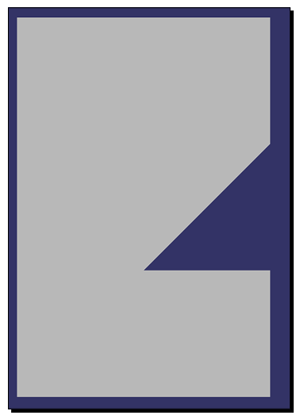

4.  要正确渲染一个凹多边形，我们应该使用osgUtil::Tessellator进行重新载入：

<!-- -->

    osgUtil::Tessellator tessellator;
    tessellator.retessellatePolygons( *geom );

5.  现在geom变量已经被修改。再次将其添加到几何体节点并启动场景查看器：

<!-- -->

    osg::ref_ptr<osg::Geode> root = new osg::Geode;
    root->addDrawable( geom.get() );
    osgViewer::Viewer viewer;
    viewer.setSceneData( root.get() );
    return viewer.run();

6.  这次我们会得到正确的结果：

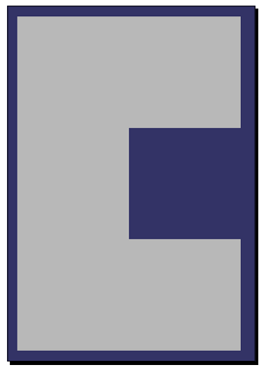

### What just happened?

大多数情况下，未经嵌入的凹多边形并不会如我们所期望的那样进行渲染。为了优化性能，OpenGL会将他们看作简单多边形或仅是忽略他们，而这总是会产生不可预期的结果。

osgUtil::Tessellator使用OpenGL嵌入例程来处理存储在osg::Geometry对象中的凹多边形。当执行嵌入时，他会确定最高效的基元类型。对于前面的示例，他将会使用GL\_TRIANGLE\_STRIP来处理原始多边形，也就是将其分为多个三角形。

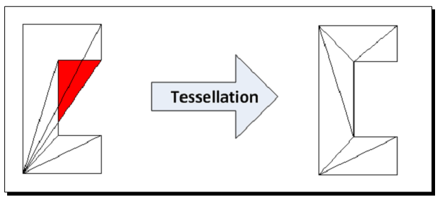

类似于OpenGL嵌入例程，osgUtil::Tessellator类也可以处理带有洞与自相交的多边形。其公共方法setWindingType()接受不同的规则，例如GLU\_TESS\_WINDING\_ODD与GLU\_TESS\_WINDING\_NONZERO，这些规则确定了复杂多边形的内部与外部区域。

Rereading geometry attributes
-----------------------------

osg::Geometry通过使用顶点数组管理大量顶点数据，并且使用有序基元集合渲染这些顶点与顶点属性。然而，osg::Geometry并没有任何拓扑元素，例如面，边，及其之间的关系。有时这会妨碍实现复杂的多边形技术以及自由编辑（拖拉特定的面或边来操作模型等）。

当前OSG并不支持数学拓扑功能，也许是因为对于一个渲染API实现该功能看起来有一些怪异。但是OSG已经实现了一个算符（functor）系列来由已存在的可绘制元素中读取几何属性与基元，并且将其用于拓扑编织模型等目的。

算符总是被看作一个类，但是其执行类似于函数。算符可以模仿某些具有相同返回类型与调用参数的已知接口，但是所有传递给算符的属性将会被捕获并且以自定义的方式进行处理。

osg::Drawable类接受四种算符类型：

1.  osg::Drawable::AttributeFunctor将顶点属性读取为数组指针。他具有可以应用于不同数据类型顶点属性的大量虚方法。要使用该算符，我们应继承该类并且重新实现一个或是多个虚方法，并且在其中执行我们需要的操作：

<!-- -->

    virtual void apply( osg::Drawable::AttributeType type,
                        unsigned int size, osg::Vec3* ptr )
    {
        // Read 3-elements vectors with the ptr and size parameters.
        // The first parameter determines the attribute type,
        // for example, osg::Drawable::VERTICES.
        …
    }

1.  osg::Drawable::ConstAttributeFunctor是osg::Drawable::AttributeFunctor的一个只读版本。区别仅在于他使用常量数组指针作为虚apply()方法的参数。
2.  osg::PrimitiveFunctor模仿OpenGL绘制例程，例如glDrawArrays()，glDrawElements()与立即模式。他会装作可绘制元素已经被渲染，而不是调用算符方法。osg::PrimitiveFunctor有两个重要的模板类：osg::TemplatePrimitiveFunctor&lt;&gt;与osg::TriangleFunctor&lt;&gt;，这两个类可以应用于实际使用。这两个类会接收每个基元顶点绘制结果，并将其发送给用户定义的operator()方法。
3.  osg::PrimitiveIndexFunctor也模拟OpenGL绘制例程。他是osg::TriangleIndexFunctor&lt;&gt;的子类，并接收每个基元的顶点索引并使用。

osg::Drawable派生类，例如osg::ShapeDrawable与osg::Geometry，具有accept()方法接受不同的算符。

Customizing a primitive functor
-------------------------------

构思使用具有前述信息的算符的场景非常抽象。我们采用三角集合作为示例。尽管我们使用顶点数组与基元集合来管理osg::Geometry的渲染数据，我们仍然希望收集所有的三角面与面顶点。从而我们可以维护几何体顶点，边与面的信息，并且使用集合器来构建几何数据结构。

### Time for action - collecting triangle faces

osg::TriangleFunctor&lt;&gt;算符类是用于收集三角面上信息的理解选择。他会在可能时将osg::Drawable对象的基元集合转换为三角形。模板参数必须实现一个具有三个const
osg::Vec3&参数与一个bool参数的operator()，从而在应用算符时为每个三角形进行调用。

1.  我们将模板参数实现为一个包含operator()的结构。前三个3D向量参数表示三角形顶点，而最后一个参数表明这些顶点是否来自临时顶点数组：

<!-- -->

    struct FaceCollector
    {
        void operator()( const osg::Vec3& v1, const osg::Vec3& v2,
                         const osg::Vec3& v3, bool )
        {
            std::cout << "Face vertices: " << v1 << "; " << v2 << "; "
                      << v3 << std::endl;
        }
    };

2.  我们将使用GL\_QUAD\_STRIP创建一个类似墙的对象，意味着几何体最初并不是由三角形构成。该对象包含八个顶点与四个四边形面：

<!-- -->

    osg::ref_ptr<osg::Vec3Array> vertices = new osg::Vec3Array;
        vertices->push_back( osg::Vec3(0.0f, 0.0f, 0.0f) );
        vertices->push_back( osg::Vec3(0.0f, 0.0f, 1.0f) );
        vertices->push_back( osg::Vec3(1.0f, 0.0f, 0.0f) );
        vertices->push_back( osg::Vec3(1.0f, 0.0f, 1.5f) );
        vertices->push_back( osg::Vec3(2.0f, 0.0f, 0.0f) );
        vertices->push_back( osg::Vec3(2.0f, 0.0f, 1.0f) );
        vertices->push_back( osg::Vec3(3.0f, 0.0f, 0.0f) );
        vertices->push_back( osg::Vec3(3.0f, 0.0f, 1.5f) );
        vertices->push_back( osg::Vec3(4.0f, 0.0f, 0.0f) );
        vertices->push_back( osg::Vec3(4.0f, 0.0f, 1.0f) );
        osg::ref_ptr<osg::Vec3Array> normals = new osg::Vec3Array;
        normals->push_back( osg::Vec3(0.0f,-1.0f, 0.0f) );
        osg::ref_ptr<osg::Geometry> geom = new osg::Geometry;
        geom->setVertexArray( vertices.get() );
        geom->setNormalArray( normals.get() );
        geom->setNormalBinding( osg::Geometry::BIND_OVERALL );
        geom->addPrimitiveSet( new osg::DrawArrays(GL_QUAD_STRIP, 0, 10) );

3.  我们首先通过一个osg::Geode场景根节点与osgViewer::Viewer查看对象。当与前面的几何体相比时并没有特别的东西：

<!-- -->

    osg::ref_ptr<osg::Geode> root = new osg::Geode;
    root->addDrawable( geom.get() );
    osgViewer::Viewer viewer;
    viewer.setSceneData( root.get() );
    viewer.run();

截图如下：

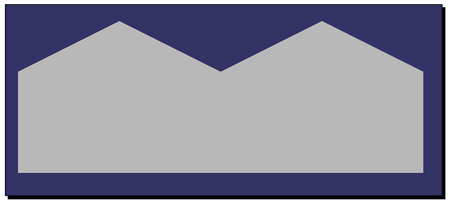

4.  现在添加用户定义的FaceCollector结构作为osg::TriangleFunctor&lt;&gt;的模板参数，并将其应用到osg::Geometry对象：

<!-- -->

    osg::TriangleFunctor<FaceCollector> functor;
    geom->accept( functor );

5.  在控制台启动程序，我们将会在命令行输出看到所输出的面顶点列表：

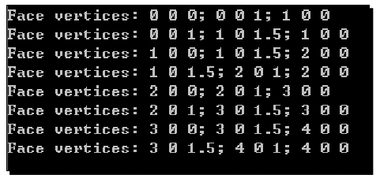

### What just happened?

算符简单的在osg::Geometry的accept()实现中模拟OpenGL调用。他通过使用setVertexArray()与drawArrays()方法读取顶点数据与基元集合，这两个方法与OpenGL的glVertexPointer()和glDrawArrays()函数具有相同的输入参数。然而，drawArrays()方法并不会真正在3D世界中绘制对象。他会调用模板类或是结构的成员方法，在其中我们可以执行不同类型的自定义操作，例如收集顶点数据。

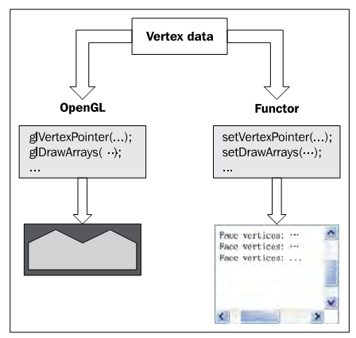

osg::TemplatePrimitiveFunctor&lt;T&gt;不仅收集特定可绘制元素的三角面；他还具有获取点，线与面的接口。他要求在模板参数中实现这些操作符：

    void operator()( const osg::Vec3&, bool );
    void operator()( const osg::Vec3&, const osg::Vec3&, bool );
    void operator()( const osg::Vec3&, const osg::Vec3&,
                     const osg::Vec3&, bool );
    void operator()( const osg::Vec3&, const osg::Vec3&,
                     const osg::Vec3&, const osg::Vec3&, bool );

### Have a go hero - analyzing toplogogy of a geometry

我们是否知道如何分析几何体的拓扑？我们也许需要一个存储这些顶点的顶点共享列表与面列表，或是边列表，每一个具有相邻顶点与相邻面的信息。

当收集可绘制元素的三角面时，算符可以帮助我们获取所有这些信息。唯一的问题是为了构建拓扑多边形我们更喜欢使用哪种数据结构；而这是我们自己的决定。

Implementing your own drawables
-------------------------------

osg::Drawable纯虚类有两个非常重要的虚方法：

-   computeBound()常量方法计算几何体周围的边框，这将会用于平面绘制过程以决定是否裁剪几何体。
-   drawImplementation()常量方法使用OSG与OpenGL调用实际绘制几何体。

要自定义用户定义的可绘制类，我们必须重新实现这两个方法并且在合适的位置添加我们自己的绘制代码。

computeBound()常量方法返回一个osg::BoundingBox值作为几何体的边框。创建边框的最简单方法就是设置其最小与最大长度，这两个值都是一个三元素向量。由（0，0，0）到（1，1，1）的边框可以定义为：

    osg::BoundingBox bb( osg::Vec3(0, 0, 0), osg::Vec3(1, 1, 1) );

注意，osg::BoundingBox并没有通过智能指针进行管理，同样下一章将会介绍的osg::BoundingSphere也是如此。

drawImplementation()常量方法是不同绘制调用的真正实现。他具有一个osg::RenderInfo&输入参数，该参数存储OSG绘制后端的当前绘制信息。该方法是由osg::Drawable的draw()方法在内部调用的。后者会自动将drawImplementation()中的OpenGL调用保存为显示列表，并且在后续的帧中进行重用。这意味着osg::Drawable实体的drawImplementation()方法只会被调用一次！

为了避免使用显示列表，我们可以在分配新的可绘制类时关闭相关的选项：

    drawable->setUseDisplayList( false );

这样后就会每次执行自定义的OpenGL调用。如果在drawImplementation()方法中存在几何变形动作或动画时，这将会非常有用。

Using OpenGL drawing calls
--------------------------

我们可以在drawImplementation()中添加任意的OpenGL函数。在进入该方法之前，渲染环境已经被创建，并且OpenGL使得当前操作已经完成。不要释放OpenGL渲染环境，因为他很快就会为为其他可绘制类使用。

GLUT库具有直接渲染固体茶壶模型的能力。茶壶表面法线与纹理坐标都是自动生成的。而茶壶也是使用OpenGL计算器生成的。

我们也许希望首先下载GLUT库，该库被设计为OpenGL的第三方工程
。源码可以在下面的网站找到：

-   <http://www.opengl.org/resources/libraries/glut/>
-   <http://www.xmission.com/~nate/glut.html>

预编译的二进制，头文件与库文件也可以下载，其中包括我们开始GLUT所需要的所有内容。

1.  我们需要修改CMake脚本文件来查找GLUT并将其添加为我们基于OSG工程的依赖：

<!-- -->

    find_package( glut )
    add_executable( MyProject teapot.cpp )
    config_project( MyProject OPENTHREADS )
    config_project( MyProject OSG )
    config_project( MyProject OSGDB )
    config_project( MyProject OSGUTIL )
    config_project( MyProject GLUT )

2.  CMake系统能够使用find\_package()宏直接查找GLUT库，但是有时我们遇到空的情况。我们应将GLUT\_INCLUDE\_DIR设置为gl/glut.h的父目录，而GLUT\_LIBRARY设置为GLUT静态链接库，例如，Windows平台上的glut32.lib。然后点击Configure与Generate生成解决方案或是makefile。

3.  包含必需的头文件。此时，记住同时添加GLUT头文件：

<!-- -->

    #include <gl/glut.h>
    #include <osg/Drawable>
    #include <osg/Geode>
    #include <osgViewer/Viewer>

4.  我们定义一个名为TeapotDrawable的全新类，该类由osg::Drawable类派生。为了确保其通过编译，我们需要使用OSG宏定义META\_Object来实现类的某些基本属性。同时创建一个拷贝构造函数来帮助实例化我们的TeapotDrawable类。

<!-- -->

    class TeapotDrawable : public osg::Drawable
    {
    public:
        TeapotDrawable( float size=1.0f ) : _size(size) {}
        TeapotDrawable( const TeapotDrawable& copy, 
                    const osg::CopyOp&  
                    copyop=osg::CopyOp::SHALLOW_COPY )
        : osg::Drawable(copy, copyop), _size(copy._size) {}
        META_Object( osg, TeapotDrawable );
        virtual osg::BoundingBox computeBound() const;
        virtual void drawImplementation( osg::RenderInfo& ) const;
    protected:
        float _size;
    };

5.  要以一种简单的方式实现computeBound()方法，我们可以使用成员变量\_size，该变量表示茶壶的相对尺寸，以构建一个足够大的边界方框。由最小点(-\_size,-\_size,-\_size)到最大点(\_size,\_size,\_size)的方框应总是包含茶壶表面：

<!-- -->

    osg::BoundingBox TeapotDrawable::computeBound() const
    {
        osg::Vec3 min(-_size,-_size,-_size), max(_size, _size, _size);
        return osg::BoundingBox(min, max);
    }

6.  drawImplementation()的实现也并不复杂。为了表面裁剪的目的，我们使用其前表面多边形顶点渲染GLUT茶壶，从而可以受益于OpenGL的默认后面裁剪机制：

<!-- -->

    void TeapotDrawable::drawImplementation( osg::RenderInfo& 
    renderInfo ) const
    {
        glFrontFace( GL_CW );
        glutSolidTeapot( _size );
        glFrontFace( GL_CCW );
    }

7.  TeapotDrawable对象可以被添加到一个osg::Geode节点，然后通过查看器查看，这是已经多次执行过的操作：

<!-- -->

    osg::ref_ptr<osg::Geode> root = new osg::Geode;
    root->addDrawable( new TeapotDrawable(1.0f) );
    osgViewer::Viewer viewer;
    viewer.setSceneData( root.get() );
    return viewer.run();

8.  现在构建并启动程序。持续按下鼠标左键来旋转我们的场景到一个合适的位置，并观赏一下最终的茶壶模式：

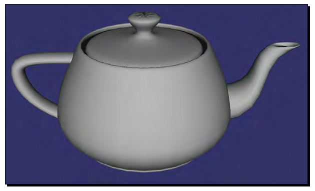

### What just happened?

在这里，拷贝构造函数用来创建一个新的TeapotDrawable作为已有对象的拷贝。在前面的示例中并不需要，但却为osg::Drawable派生类所需要。

另一个宏定义META\_Object对于实现自定义的可绘制元素也是必需的。他有两个参数，表明库名字是osg，而类类型与名字为TeapotDrawable。我们总是可以通过使用下面的方法来获取两个字符串值：

    const char* lib = obj->libraryName();
    const char* name = obj->className();

带有META\_Object宏的OSG类将重新实现这两个方法，包括几乎所有的场景相关的类。

用户定义的可绘制元素应总是具有一个拷贝构建函数与META\_Object宏，并且应总是重写computeBound()与drawImplementation()方法，否则也许会引起编译错误。

Summary
-------

本章解释了如何使用OSG所定义的顶点与绘制基元创建几何实体。这些几何体被存储在osg::Geode对象中，该对象被看作场景图的叶子节点。为了获得不同的渲染效果，3D世界中的所有场景管理与更新都承担着修改几何体行为与传输顶点数据和几何基元的目的。

在本章中，我们特别讨论了：

-   OpenGL立即模式，显示列表与顶点数组及其OSG实现的基本概念。
-   如何通过使用osg::ShapeDrawable类渲染简单形状用于快速测试。
-   如何通过使用osg::Geometry类以更为高效的方式创建与渲染各种形状。
-   如何在顶点属性数组，索引数组与几何基元集合上进行操作。
-   如何使用算符获取顶点属性，基元与索引数据，以及通过继承与重写成员方法，实现顶点数据的自定义。
-   将OpenGL调用集成到自定义的osg::Drawable派生类的可行方法，从而有助于OSG与其他基于OpenGL的库共同工作。

