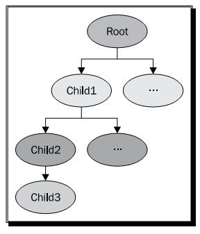
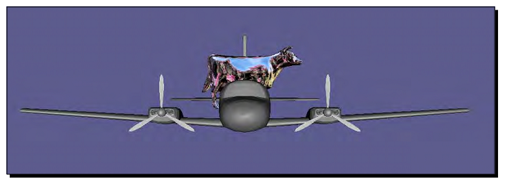
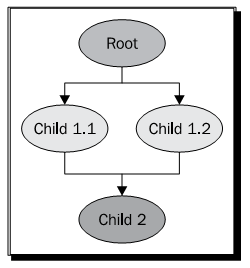
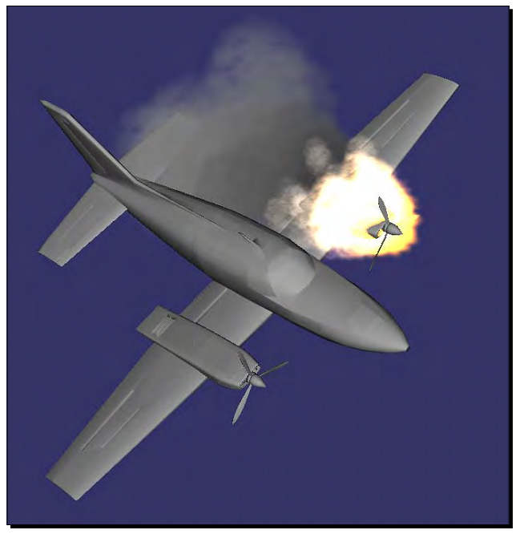
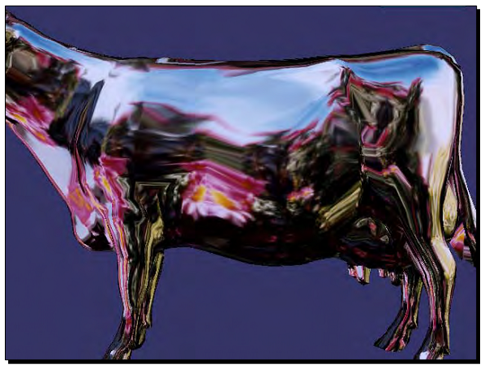
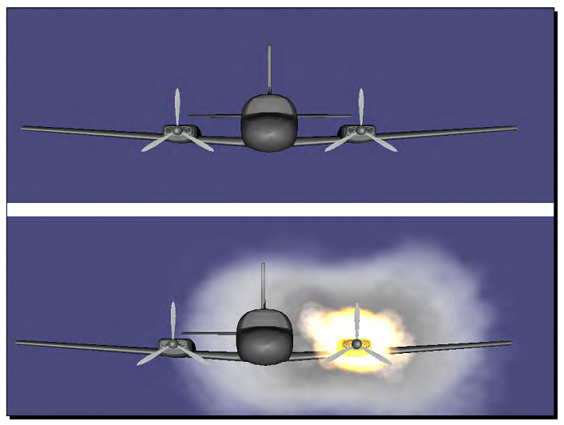
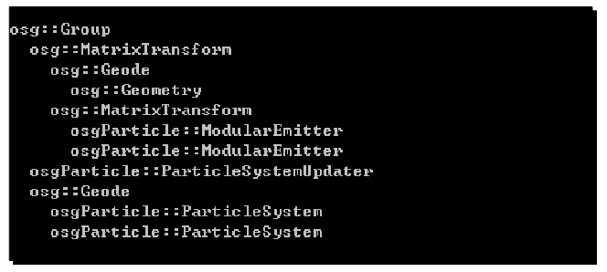

Chapter 5: Managing Scene Graph
===============================

场景图是表示图形与状态对象的空间布局的节点的层次图结构图。他封装了最底层的图像基元与状态组合，可以通过底层的图像API创建可视化事物。OpenSceneGraph释放了场景图的威力，并且开发优化机制来管理与渲染3D场景，从而允许开发者以标准方式使用简单但强大的代码实现如对象组装，遍历，传输栈，场景裁剪，细节管理以及其他基本或是高级图像特性等事情。

在本章中，我们将会探讨下列主题：

-   理解组合节点与叶子节点的概念
-   如何处理父节点与子节点接口
-   使用各种节点，包括转换节点，切换节点，细节节点与代理节点
-   如何由基本的节点类派生我们自己的节点
-   如何遍历已载入模式的场景图结构

The Group interface
-------------------

osg::Group类型表示OSG场景图的组合节点。他可以具有任意数量的子节点，包括osg::Geode叶子节点以及其他的osg::Group节点。他是最常用到的各种NodeKits的基类－也就是具有各种功能的节点。

osg::Group类派生自osg::Node，因而间接派生自osg::Referenced。osg::Group类包含一个子节点列表，每一个子节点由智能指针osg::ref\_ptr&lt;&gt;进行管理。这可以确保删除场景图中的级联节点集合时不会存在内存泄露。

osg::Group类提供了一个公共方法集合用于定义处理子节点的接口。这些方法非常类似于osg::Geode的可绘制元素的管理方法，但是大多数的输入参数是osg::Node指针。

1.  公共方法addChild()将一个节点关联到子节点列表的结尾。同时，有一个insertChild()方法用于将节点插入到osg::Group的指定位置处，该方法接受一个整数索引与一个节点指针作为参数。
2.  公共方法removeChild()与removeChildren()将会由当前的osg::Group对象移除一个或是多个子节点。后者使用两个参数：基于零的起始元素索引，以及要移除的元素数目。
3.  getChild()方法在指定索引处存储的osg::Node指针。
4.  getNumChildren()返回子节点的总数。

由于我们前面处理osg::Geode与可绘制元素的经验，我们可以很容易处理osg::Group子节点接口。

Managing parent nodes
---------------------

我们已经了解到osg::Group被用作组合节点，而osg::Geode被用作场景图的叶子节点。其方法在上一章中进行了介绍，而在本章中也同样会用到。另外，两个类都应具有用于管理父节点的接口。

正如稍后将会解释的，OSG允许一个节点具有多个父节点。在本节中，我们将会首先概略了解一个父节点管理方法，这些方法直接声明在osg::Node类中：

1.  getParent()方法返回一个osg::Group指针作为父节点。他需要一个表示父节点列表中索引的整数参数。
2.  getNumParents()方法返回父节点的总数。如果节点只有一个父节点，该方法将会返回1，而此时只有getParent(0)是正确可用的。
3.  getParentalNodePaths()方法返回由场景的根节点到当前节点（但是不包含当前节点）的所有可能路径。他返回一个osg::NodePath变量的列表。

osg::NodePath实际上是一个节点指针的std::vector对象，例如，假定我们有如下一个场景图：

下面的代码片段将会找到由场景根节点到节点child3的唯一路径：

    osg::NodePath& nodePath = child3->getParentalNodePaths()[0];
    for ( unsigned int i=0; i<nodePath.size(); ++i )
    {
        osg::Node* node = nodePath[i];
        // Do something...
    }

我们可以在循环中成功获取节点Root，Child1与Child2。

我们并不需要使用内存管理系统来引用节点的父节点。当父节点被删除时，他会自动由子节点的记录中移除。

没有任何父节点的节点只能被看作场景图的根节点。在这种情况下，getNumParents()方法将会返回0，并且不会获取到父节点。

### Time for action - adding models to the scene graph

在前面的示例中，我们只是通过osgDB::readNodeFile()函数载入一个模型，例如Cessna。这次我们将会尝试载入并管理多个模型。每一个模型将会被赋值给一个节点指针，然后添加到组合节点。组合节点被定义为根节点，将会被程序用来在最后渲染整个场景图：

1.  包含必需的头文件：

<!-- -->

    #include <osg/Group>
    #include <osgDB/ReadFile>
    #include <osgViewer/Viewer>

2.  在主函数中，我们首先载入两个不同的模型，然后将其赋值给osg::Node指针。载入的模型同时也是一个通过组合节点与叶子节点构建的子场景图。osg::Node类能够表示任意类型的子场景图，如果需要，他们可以被转换为osg::Group或是osg::Geode，或者通过C++
    dynamic\_cast&lt;&gt;操作符实现，或者是如asGroup()与asGeode()这样的便利方法，这要比dynamic\_cast&lt;&gt;节省时间。

<!-- -->

    osg::ref_ptr<osg::Node> model1 = osgDB::readNodeFile(  
        "cessna.osg" );
    osg::ref_ptr<osg::Node> model2 = osgDB::readNodeFile( "cow.osg" );

3.  通过addChild()方法向osg::Group节点添加两个模型：

<!-- -->

    osg::ref_ptr<osg::Group> root = new osg::Group;
    root->addChild( model1.get() );
    root->addChild( model2.get() );

4.  初始化并启动查看器：

<!-- -->

    osgViewer::Viewer viewer;
    viewer.setSceneData( root.get() );
    return viewer.run();

5.  现在我们将会看到一头牛与Cessna模型粘合在一起。实际上不可能看到这样的场景，但是在虚拟世界中，这两个模型属性于由一个组合节点管理的不相关的子节点，因而可以由场景查看器进行单独渲染。

### What just happened?

osg::Group与osg::Geode都由osg::Node基类派生。osg::Group允许添加任意类型的子节点，包括osg::Group自身。然而，osg::Geode类不包含组合节点或是叶子节点。他只接受用于渲染的可绘制元素。

如果我们能够确定一个节点的类型是osg::Group，osg::Geode还是其他的派生类型将会非常方便，特别是由文件读取并由osg::Node类所管理的节点，例如：

    osg::ref_ptr<osg::Node> model = osgDB::readNodeFile( "cessna.osg" );

dynamic\_cast&lt;&gt;操作符与如asGroup()，asGeode()以及其他的便利方法，会有助于将一个指针或引用类型转换为另一种指针或是引用类型。首先，我们以dynamic\_cast&lt;&gt;为例。这可以用来在类的继承层次结构中向下转换，例如：

    osg::ref_ptr<osg::Group> model = 
        dynamic_cast<osg::Group*>( osgDB::readNodeFile("cessna.osg") );

osgDB::readNodeFile()函数的返回值总是osg::Node\*，但是我们也可以尝试使用osg::Group指针进行管理。如果Cessna子图的根节点是一个组合节点，那么转换就会成功，否则转换失败，而变量model将会为NULL。

我们也可以执行向上转换，这实际上是隐式转换：

    osg::ref_ptr<osg::Group> group = ...;
    osg::Node* node1 = dynamic_cast<osg::Node*>( group.get() );
    osg::Node* node2 = group.get();

在大多数编译器上，node1与node2都会通过编译并正常工作。

转换方法也会完成类似的工作。事实上，如果我们所需要的类型存在一个这样的转换方法，则推荐使用转换方法，而不是dynamic\_cast&lt;&gt;，特别是在性能要求较高的代码中：

    // Assumes the Cessna's root node is a group node.
    osg::ref_ptr<osg::Node> model = osgDB::readNodeFile("cessna.osg");
    osg::Group* convModel1 = model->asGroup();  // OK!
    osg::Geode* convModel2 = model->asGeode();  // Returns NULL.

### Pop quiz - fast dynamic casting

在C++程序中，dynamic\_cast&lt;&gt;会以运行时检测的安全性执行类型转换，这会要求允许运行时类型信息（RTTI）。有时并不推荐与osg::Node类的转换方法相比较，后者已经由子类，例如osg::Group与osg::Geode进行了重写。我们知道其中的原因吗？何时我们应该使用asGroup()与asGeode()，而何时应该使用dynamic\_cast&lt;&gt;呢？

Traversing the scene graph
--------------------------

一个通常的遍历由下列步骤组成：

1.  首先，由任意节点开始（例如，根节点）。
2.  递归沿场景图向下（或向上）到子节点，直到叶子节点或是没有子节点的节点。
3.  反向到达没有完成探索的最近节点，重复上述步骤。这被称为场景图的尝试优先搜索。

在遍历过程中，可以对所有的场景节点应用不同的更新与渲染操作，从而使得遍历成为场景图的关键特性。有不同目的的多种遍历类型：

1.  事件（event）遍历在遍历节点时首先处理鼠标与键盘输入以及其他的用户事件。
2.  更新遍历（或应用遍历）允许用户应用修改场景图，例如设置节点与几何属性，应用节点功能，执行回调等。
3.  裁剪遍历（cull）测试一个节点是否位于一个视口内并可进行渲染。他会裁剪不可见与不可用的节点，并且向内部渲染列表输出优化的场景图。
4.  绘制遍历（draw）（或渲染遍历）执行底层的OpenGL
    API调用来真正的渲染场景。注意，他与场景图并没有关系，而仅是作用在由裁剪遍历所生成的渲染列表上。

在通常情况下，这些遍历应依次为每一帧所执行。但是对于具有多处理器与图形卡的系统，OSG可以并行执行从而提高渲染效率。

访问者模式可以用来实现遍历。该模式会在本章稍后进行讨论。

Transformation nodes
--------------------

osg::Group节点除了向下遍历到子节点外不做任何事情。然而，OSG同时支持osg::Transform类家庭，这是在应用到几何体的遍历相关转换过程中创建的。osg::Transform派生自osg::Group。他不能被直接实例化。相反，他提供了一个用于实现不同转换接口的子类集合。

当向下遍历场景图层次结构时，osg::Transform节点总是将其自己的操作添加到当前的变换矩阵，也就是，OpenGL模型-视图矩阵（model-view
matrix）。他等同于如glMultMatrix()这样的连接OpenGL矩阵命令，例如：

上面的示例场景图可以翻译为如下的OpenGL代码：

    glPushMatrix();
        glMultMatrix( matrixOfTransform1 );
        renderGeode1();  // Assume this will render Geode1    
        glPushMatrix();
            glMultMatrix( matrixOfTransform2 );
            renderGeode2();    // Assume this will render Geode2
        glPopMatrix();
    glPopMatrix();

要使用坐标帧（coordinate
frmae）的概念来描述上述过程，我们可以说Geode1与Transform2位于Transform1的相对引用帧之下，Geode2位于Transform2的相对引用帧之下。然而，OSG同时也允许设置绝对引用帧，从而导致与OpenGL命令glLoadMatrix()等同的行为：

    transformNode->setReferenceFrame( osg::Transform::ABSOLUTE_RF );

而要切换到默认的坐标帧，可以使用如下的代码：

    transformNode->setReferenceFrame( osg::Transform::RELATIVE_RF );

Understanding the matrix
------------------------

osg::Matrix是一个基本的OSG数据类型，而不需要使用智能指针进行管理。他支持4x4矩阵变换接口，例如变换，旋转，缩放与投影操作。他可以显式设置：

    osg::Matrix mat( 1.0f, 0.0f, 0.0f, 0.0f,
                     0.0f, 1.0f, 0.0f, 0.0f,
                     0.0f, 0.0f, 1.0f, 0.0f,
                     0.0f, 0.0f, 0.0f, 1.0f ); // Just an identity matrix

其他的方法与操作包括：

1.  公共方法postMult()与operator\*()将当前的矩阵对象与输入矩阵或向量参数执行后乘运算。而方法preMult()执行前乘运算。
2.  makeTranslate()，makeRotate()与makeScale()方法重置当前矩阵并且创建一个4x4变换，旋转或是缩放矩阵。其静态版本，translate()，rotate()与scale()可以使用特定的参数分配一个新的矩阵对象。
3.  公共方法invert()反转矩阵。其静态版本inverse()需要一个矩阵参数并且返回一个新的反转osg::Matrix对象。

我们将会注意到OSG使用行为主（row-major）矩阵来表示变换。这意味着OSG会将向量看作行，并使用行向量执行前乘矩阵操作。所以将变换矩阵mat应用到坐标vec的方法为：

    osg::Matrix mat = …;
    osg::Vec3 vec = …;
    osg::Vec3 resultVec = vec * mat;

当连接矩阵时，OSG行为主矩阵操作的顺序也很容易理解：

    osg::Matrix mat1 = osg::Matrix::scale(sx, sy, sz);
    osg::Matrix mat2 = osg::Matrix::translate(x, y, z);
    osg::Matrix resultMat = mat1 * mat2;

开发者总是可以由左向右读取变换过程，也就是，resultMat意味着首先使用mat1缩放向量，然而使用mat2进行反转。这种解释听起来更为清晰与合适。

osg::Matrix类表示一个4x4浮点类型矩阵。他可以通过直接使用osg::Matrix重载方法set()进行转换。

The Matrix Transform class
--------------------------

osg::MatrixTransform类派生自osg::Transform。他在内部使用一个osg::Matrix变量来应用4x4双精度浮点类型变换。公共方法setMatrix()与getMatrix()将osg::Matrix参数赋值给osg::MatrixTransform的成员变量。

### Time for action - performing translations of child nodes

现在我们要利用变换节点。osg::MatrixTransform节点，将当前的模型视图矩阵与指定的矩阵直接相乘，可以将我们的模型移动到视图空间中的其他位置。

1.  包含必需的头文件：

<!-- -->

    #include <osg/MatrixTransform>
    #include <osgDB/ReadFile>
    #include <osgViewer/Viewer>

2.  首先载入Cessna模型：

<!-- -->

    osg::ref_ptr<osg::Node> model = osgDB::readNodeFile(  
      "cessna.osg" );

3.  osg::MatrixTransform类由osg::Group类派生，所以他可以使用addChild()方法来添加多个子节点。所有的子节点都会受到osg::MatrixTransform节点的影响，并且会依据当前的矩阵进行变换。在这里，我们将会两次载入模型，以同时单独显示两个实例：

<!-- -->

    osg::ref_ptr<osg::MatrixTransform> transformation1 = new 
    osg::MatrixTransform;
    transform1->setMatrix( osg::Matrix::translate(  
      -25.0f, 0.0f, 0.0f) );
    transform1->addChild( model.get() );
    osg::ref_ptr<osg::MatrixTransform> transform2 = new 
    osg::MatrixTransform;
    transform2->setMatrix( osg::Matrix::translate(  
      25.0f, 0.0f, 0.0f) );
    transform2->addChild( model.get() );

4.  向根节点添加两个变换节点并启动查看器：

<!-- -->

    osg::ref_ptr<osg::Group> root = new osg::Group;
    root->addChild( transformation1.get() );
    root->addChild( transformation2.get() );
    osgViewer::Viewer viewer;
    viewer.setSceneData( root.get() );
    return viewer.run();

5.  Cessna模型，最初位于坐标原点，该模型被复制并在不同的位置显示。一个被变换到坐标(-25.0,
    0.0, 0.0)处，而另一个被变换到(25.0,0.0,0.0)处：

### What just happened?

我们也许会场景图的结构感到迷惑，因为model指针被关联到两个不同的父节点。在一个典型的树结构中，一个节点至多只有一个父节点，因而共享子节点是不可能的。然而，OSG支持对象共享机制，也就是，一个子节点（model指针）可以为不同的祖先节点（transformation1与transformation2）实例化。然后当遍历并渲染场景图时，由根节点到实例化节点会有多条路径，从而导致实例节点被显示多次。

这对于减少场景内存非常有用，因为程序只会保存一份共享数据的拷贝，并且在由其多个父节点管理的不同环境中简单的多次调用实现方法（例如，osg::Drawable派生类的drawImplementation()）。

共享子节点的每个父节点会保存有其自己的指向子节点的osg::ref\_ptr&lt;&gt;指针。在这种情况下，引用计数不会减少到0，而该节点在其所有的父节点解引用之前不会被释放。我们将会发现在管理节点的多个父节点时getParent()与getNumParents()方法将会非常有用。

建议在一个程序中尽可能的共享叶子节点，几何体，纹理以及OpenGL渲染状态。

### Pop quiz - matrix multiplications

正如我们已经讨论的，OSG使用行向量与行为主矩阵在右侧原则（right-hand
rule）下来执行前相乘（vector\*matrix）。然而，OpenGL使用列为主矩阵与列向量来执行后相乘（matrix\*vector）。所以，当将OpenGL变换转换为OSG变换时，我们会认为哪一个重要呢？

### Have a go hero - making use of the PositionAttitudeTransform class

osg::MatrixTransform类的执行类似于OpenGL的glMultMatrix()与glLoadMatrix()函数，该函数几乎可以实现所有的空间变换类型，但是并不容易使用。然而，osg::PositionAttitudeTransform类的作用类似于OpenGL的glTranslate()，glScale()与glRotate()函数的组合。他提供了公共方法在3D世界中变换子节点，包括setPosition()，setScale()与setAttitue()。前两个需要osg::Vec3输入值，而setAttitude()使用osg::Quat变量作为参数。osg::Quat是一个四元数类，该类被用来表示朝向。其构造函数可以接受一个浮点角度与一个osg::Vec3向量作为参数。欧拉旋转（关于三个固定坐标的旋转）也是可以接受的，但要使用osg::Quat的重载构造函数：

    osg::Quat quat(xAngle, osg::X_AXIS,
                   yAngle, osg::Y_AXIS,
                   zangle, osg::Z_AXIS); // Angles should be radians!

现在让我们重写前面的示例，使用osg::PositionAttitudeTransform类来替换osg::MatrixTransform节点。使用setPosition()来指定变换，使用setRotate()来指定子模型的旋转，体验一下在某些情况下对于是否更为方便。

Switch nodes
------------

osg::Switch节点能够渲染或是略过某些特定条件的子节点。他继承了超类osg::Group的方法，并且可以为每一个子节点关联一个布尔值。他有一些非常有用的公共方法：

1.  重载的addChild()方法除了osg::Node指针以外还可以有一个布尔参数。当布尔参数被设置为假时，所添加的节点对于查看器不可见。
2.  setValue()方法可以设置指定索引处子节点的可见性值。他有两个参数：基于零的索引与布尔值。getValue()可以获取输入索引处子节点的值。
3.  setNewChildDefaultValue()方法为新子节点设置默认可见性。如果一个子节点只是简单的被添加而没有指定值，则其值由setNewChildDefaultValue()决定，例如：

<!-- -->

    switchNode->setNewChildDefaultValue( false );
    switchNode->addChild( childNode ); // Turned off by default now!

### Time for action - switching between the normal and damaged Cessna

我们将要使用osg::Switch节点来构建场景。他甚至可以用来实现状态切换动画与更为复杂的工作，但是目前我们仅是演示如何在场景查看器启动之前预先定义子节点的可见性。

1.  包含必需的头文件：

<!-- -->

    #include <osg/Switch>
    #include <osgDB/ReadFile>
    #include <osgViewer/Viewer>

2.  我们由文件中读取两个模型并使用开关进行控制。我们可以在OSG示例数据目录中找到一个正常的Cessna与一个损坏的Cessna。他们非常适于模拟飞机的不同状态：

<!-- -->

    osg::ref_ptr<osg::Node> model1= osgDB::readNodeFile("cessna.osg");
    osg::ref_ptr<osg::Node> model2= osgDB::readNodeFile("cessnafire.
    osg");

3.  osg::Switch节点能够显示一个或多个子节点并隐藏其他的子节点。其作用不同于osg::Group父类，后者会在渲染场景时显示所有的子节点。如果我们要开发一个战斗游戏，并且要在任何时刻管理某些飞机对象时，这个功能将会非常有用。下面的代码会在将model2添加到根节点时设置为可见，并同时隐藏model1：

<!-- -->

    osg::ref_ptr<osg::Switch> root = new osg::Switch;
    root->addChild( model1.get(), false );
    root->addChild( model2.get(), true );

4.  启动查看器：

<!-- -->

    osgViewer::Viewer viewer;
    viewer.setSceneData( root.get() );
    return viewer.run();

5.  现在我们将会看到一个燃烧的Cessna而不是正常的Cessna：

### What just happened?

osg::Switch类在由其超类osg::Group管理的子节点列表之处添加一个开关值列表。两个列表具有相同的大小，而列表中的每个元素与另一个列表中的元素具有一对一的关系。所以，开关值列表中的任何变化将会影响到相关的子节点，打开或关闭其可见性。

当OSG后端遍历场景图并应用不同的NodeKit功能时，由addChild()或setValue()所触发的开关值变化将会被保存为属性并在下一个渲染帧中执行。在下面的代码片段中，只有位于索引0与1处的后两个子节点的开关值会实际起作用：

    switchNode->setValue( 0, false );
    switchNode->setValue( 0, true );
    switchNode->setValue( 1, true );
    switchNode->setValue( 1, false );

setValue()方法的重复调用会被简单覆盖且不会影响场景图。

Level-of-detail nodes
---------------------

详细级别技术为指定的对象创建详细或是复杂性级别，并且提供一定的线索来自动选择相应的对象级别，例如，依据距离观看者的距离。他会减少3D世界中对象表示的复杂性，并且在远距离对象的外观上具有不被注意到的质量损失。

osg::LOD节点派生自osg::Group，并且使用子节点来表示可变详细级别上的相同对象，由最高级别到最低级别。每一个级别需要一个最小与最大可视范围来指定在相邻级别之间切换的合理机会。osg::LOD节点的结果是子节点的离散量作为级别，也被称之为离散LOD。

osg::LOD类可以配合子节点指定范围，或是在已有的子节点上使用setRange()方法：

    osg::ref_ptr<osg::LOD> lodNode = new osg::LOD;
    lodNode->addChild( node2, 500.0f, FLT_MAX );
    lodNode->addChild( node1 );
    ...
    lodNode->setRange( 1, 0.0f, 500.0f );

在前面的代码片段中，我们首先添加一个节点，node2，当距离眼睛超过500单位时才会显示该节点。在这这后，我们添加一个高分辨率模型，node1，并且通过使用setRange()方法为近距离观察重置其可视范围。

### Time for action - constructing a LOD Cessna

我们将使用一个预定义对象的集合创建一个离散LOD节点来表示相同的模型。这些对象被用作osg::LOD节点的子节点并且在不同的距离上显示。我们将内部多边形减少技术类osgUtil::Simplifier来由源始模型生成各种细节对象。我们也可以由磁盘文件读取低多边形与高多边形模型。

1.  包含必需的头文件：

<!-- -->

    #include <osg/LOD>
    #include <osgDB/ReadFile>
    #include <osgUtil/Simplifier>
    #include <osgViewer/Viewer>

2.  我们要构建三级模型细节。首先，我们需要创建原始模型的三份拷贝。可以由文件三次读取Cessna，但是在这里调用clone()方法来复制所载入的模型以立即使用：

<!-- -->

    osg::ref_ptr<osg::Node> modelL3 = osgDB::readNodeFile("cessna.
    osg");
    osg::ref_ptr<osg::Node> modelL2 = dynamic_cast<osg::Node*>(
        modelL3->clone(osg::CopyOp::DEEP_COPY_ALL) );
    osg::ref_ptr<osg::Node> modelL1 = dynamic_cast<osg::Node*>(
        modelL3->clone(osg::CopyOp::DEEP_COPY_ALL) );

3.  我们希望级别三将是原始Cessna，该级别具有最大的多边形数以用于近距离查看。级别二具有较少的可显示的多边形数，而级别一是细节最少的，该级别只在较远的距离上显示。osgUtil::Simplifier类在这里用来减少顶点数与面数。我们使用不同的值为级别一与级别二应用setSampleRation()方法，从而会导致不同的缩放比率：

<!-- -->

    osgUtil::Simplifier simplifier;
    simplifier.setSampleRatio( 0.5 );
    modelL2->accept( simplifier );
    simplifier.setSampleRatio( 0.1 );
    modelL1->accept( simplifier );

4.  向LOD节点添加级别模型并且以递减顺序设置其可见范围。当我们使用addChild()与setRange()方法配置最小与最大范围值时，不要有重叠的范围，否则就会在相同的位置上显示多个级别模型，从而导致不正确的行为：

<!-- -->

    osg::ref_ptr<osg::LOD> root = new osg::LOD;
    root->addChild( modelL1.get(), 200.0f, FLT_MAX );
    root->addChild( modelL2.get(), 50.0f, 200.0f );
    root->addChild( modelL3.get(), 0.0f, 50.0f );

5.  启动查看器。这次程序会需要一些时间来计算并减少模型面数：

<!-- -->

    osgViewer::Viewer viewer;
    viewer.setSceneData( root.get() );
    return viewer.run();

6.  再次出现Cessna模型。尝试持续按下鼠标右键来放大与缩小。当近距离查看时我们会发现模型依然显示很好，如下图中的左侧图片所示。然而，当由远距离查看时，模型会有简化。如下图中的右侧两幅图所示。距离并不会严重影响渲染结果，但如果正确使用将会增强系统效率。

### What just happened?

我们是否注意到Cessna被拷贝两次来准备不同的多边形级别？modelL3在这里不能被共享，因为简化器会直接在程序内存中操作几何体数据，从而会影响共享相同内存的所有指针。事实上，这被称为浅拷贝（shallow
copy）。

在这个示例中，我们引入了clone()方法，该方法可以为所有的场景节点，可绘制元素与对象所用。他能够执行深拷贝（deep
copy），也就是，拷贝源对象所用的所有动态分配的内存。所以modelL2与modelL1管理新分配的内存，这两个指针使用与modelL3相同的数据进行填充。

然后osgUtil::Simplifier类开始简化模型，从而减轻图形管理的负载。要应用该简化器，我们必须调用节点的accept()方法。在Visiting
scene graph structures一节，我们会了解到该类以及访问者模式的更多信息。

Proxy and paging nodes
----------------------

代理节点osg::ProxyNode与分页节点osg::PagedLOD是为场景负载均衡而提供的。这两个类都是直接或是间接由osg::Group类派生的。

如果有大量的模型要载入并在场景图中显示时，osg::ProxyNode节点将会减少查看器的启动时间。他能够作为外部文件的接口，帮助程序尽快启动，然后使用一个独立数据线程读取这些等待的模型。他使用setFileName()而不是addChile()来设置模型文件并动态载入作为子节点。

osg::PagedLOD节点同时继承了osg::LOD的方法，但是为了避免图像管线的负载并使得渲染过程尽可能平滑而动态载入或是卸载详细级别。

### Time for action - loading a model at runtime

我们将通过使用osg::ProxyNode来演示模型文件的载入。代理将会记录原始模型的文件名，并延迟载入直到查看已经运行并发送相应的请求。

1.  包含必需的头文件：

<!-- -->

    #include <osg/ProxyNode>
    #include <osgViewer/Viewer>

2.  我们并没有直接载入模型文件作为子节点，而是为特定索引处的子节点设置文件名。这类似于insertChild()方法，后者会将节点放置在子节点列表的特定索引处，但是列表不会被填充，直到动态载入过程已经完成。

<!-- -->

    osg::ref_ptr<osg::ProxyNode> root = new osg::ProxyNode;
    root->setFileName( 0, "cow.osg" );

3.  启动查看器：

<!-- -->

    osgViewer::Viewer viewer;
    viewer.setSceneData( root.get() );
    return viewer.run();

4.  模型看起来像通常一样被载入，但是我们会注意到他是突然出现的，而且查看点并没有被调整到最佳位置。这是因为不可见的代理节点的使用就如同在渲染开始时他并没有包含子节点。然后cow模型会在运行时由文件载入，并且会自动添加为代理的子节点并渲染：

### What just happened?

osg::ProxyNode与osg::PagedLOD本身非常小巧；他们主要是作为容器。OSG的内部数据载入管理器osgDB::DatabasePager将会在新文件或是详细级别可用时，或是回退到下一个可用的子节点时，会实际完成发送请法度与载入场景图的工作。

数据分页器在多个后台线程中运行，并且驱动静态数据库（由代理与分布节点管理的数据生成文件）与动态数据库数据（在运行时生成成并添加的分布节点）的载入。

数据库分布器自动回收在当前视口中不再出现的分布节点，并且会在渲染后端几乎超负载时将其由场景图中移除，也就是他需要提供大量渲染数据的多线程分页支持时。然而，这并不会影响osg::ProxyNode节点。

### Have a go hero - working with the PagedLOD class

类似于代理节点，osg::PagedLOD类也有一个setFileName()方法来设置要载入到特定子节点位置处的文件。然而，作为一个LOD节点，他还需要设置每一个动态载入子节点的最小与最大可视范围。假定我们有一个cessna.osg文件以及一个低多边形版本modelL1，我们可以像下面的样子组织分页节点：

    osg::ref_ptr<osg::PagedLOD> pagedLOD = new osg::PagedLOD;
    pagedLOD->addChild( modelL1, 200.0f, FLT_MAX );
    pagedLOD->setFileName( 1, "cessna.osg" );
    pagedLOD->setRange( 1, 0.0f, 200.0f );

注意，modelL1指针不会由内存中卸载，因为他是一个直接子节点，而不是一个文件代理。

我们会看到如果只显一个详细级别的节点，使用osg::LOD与osg::PagedLOD之间并没有区别。一个更好的主意是尝试使用osg::MatrixTransform来构建一个大的Cessna集。例如，我们可以使用一个独立的函数来构建一个可变换的LOD
Cessna：

    osg::Node* createLODNode( const osg::Vec3& pos )
    {
        osg::ref_ptr<osg::PagedLOD> pagedLOD = new osg::PagedLOD;
        …
        osg::ref_ptr<osg::MatrixTransform> mt = new osg::MatrixTransform;
        mt->setMatrix( osg::Matrix::translate(pos) );
        mt->addChild( pagedLOD.get() );
        return mt.release();
    }

设置不同的位置参数并向场景根节点添加多个createLODNode()节点。可以看一下分布节点是如何被渲染的。再尝试使用osg::LOD，来比对一下在性能与内存使用上的不同。

Customizing your own NodeKits
-----------------------------

在自定义节点与扩展新特性中最重要的步骤就是重写虚方法traverse()。该方法是由OSG渲染后端为每一帧所调用的。traverse()方法有一个输入参数，osg::NodeVisitor&，该参数实际上指明了遍历类型（更新，事件或剪裁）。大多数的OSG
NodeKits重写traverse()来实现其自己的功能，以及其他一些属性与方法。

注意，有时重写traverse()方法有一些危险，因为如果开发者不能足够细心，他就会影响遍历过程并有可能导致不正确的渲染结果。如果我们希望通过将每一个节点类型扩展为一个新的自定义类来为多个节点类型添加新功能时，他会显得笨拙难用。在这些情况下，考虑使用节点回调，我们会在第8章中进行讨论。

### Time for action - animating the switch node

osg::Switch类可以显示特定的子节点而隐藏他的子节点。他可以用来表示各种对象的动画状态，例如，信号灯。然而，一个典型的osg::Switch节点并不能在不同时刻自动在子节点之间切换。基于这一思想，我们将开发一个新的AnimatingSwitch节点，该类会一次显示一个子节点，并且依据用户定义的内部计数器反转切换状态。

1.  包含必需的头文件：

<!-- -->

    #include <osg/Switch>
    #include <osgDB/ReadFile>
    #include <osgViewer/Viewer>

2.  声明AnimatingSwitch类。该类将会由osg::Switch类派生并利用setValue()方法。我们同时使用一个OSG宏定义，META\_Node，该宏类似于在上一章所介绍的定义节点基本属性的META\_Object宏：

<!-- -->

    class AnimatingSwitch : public osg::Switch
    {
    public:
        AnimatingSwitch() : osg::Switch(), _count(0) {}
        AnimatingSwitch( const AnimatingSwitch& copy,
                 const osg::CopyOp& copyop=osg::CopyOp::SHALLOW_COPY )
        : osg::Switch(copy, copyop), _count(copy._count) {}
        META_Node( osg, AnimatingSwitch );

        virtual void traverse( osg::NodeVisitor& nv );

    protected:
        unsigned int _count;
    };

3.  在traverse()实现中，我们将会增加内部计数器并且测试他是否到达60的倍数，并且反转第一个与第二子节点的状态：

<!-- -->

    void AnimatingSwitch::traverse( osg::NodeVisitor& nv )
    {
        if ( !((++_count)%60) )
        {
            setValue( 0, !getValue(0) );
            setValue( 1, !getValue(1) );
        }
        osg::Switch::traverse( nv );
    }

4.  再次载入Cessna模型与燃烧的Cessna模型，并将其添加到自定义的AnimatingSwitch实例：

<!-- -->

    osg::ref_ptr<osg::Node> model1= osgDB::readNodeFile("cessna.osg");
    osg::ref_ptr<osg::Node> model2= osgDB::readNodeFile("cessnafire.
    osg");
    osg::ref_ptr<AnimatingSwitch> root = new AnimatingSwitch;
    root->addChild( model1.get(), true );
    root->addChild( model2.get(), false );

5.  启动查看器：

<!-- -->

    osgViewer::Viewer viewer;
    viewer.setSceneData( root.get() );
    return viewer.run();

6.  因为硬件的刷新速率通常是60Hz，traverse()中的if条件将会每分钟变为真，从而实现动画。那么我们就会在前一分钟内看到Cessna，而在下一分钟内看到燃烧的Cessna，依次循环：

### What just happened?

因为traverse()方法被广泛重新实现来扩展不同的节点类型，他涉及到为实际使用读取变换矩阵与渲染状态的机制。例如，osg::LOD节点必须计算由子节点的中心到查看者眼睛的距离，从而用作不同级别之间切换的可视范围。

输入参数osg::NodeVisitor&是各种节点操作的关键。他表示访问节点的遍历类型，例如更新，事件与裁剪遍历。前两者与回调相关，我们会在第8章中进行详细讨论。

裁剪遍历，名为osgUtil::CullVisitor，可以使用下面的代码片段由osg::NodeVisitor&参数获取：

    osgUtil::CullVisitor* cv = dynamic_cast<osgUtil::CullVisitor*>(&nv);
    if ( cv )
    { 
        // Do something
    }

我们应该在程序的开始处包含&lt;osgUtil/CullVisitor&gt;头文件。裁剪访问器通过不同的方法能够获取大量的场景状态，甚至是改变内部渲染列的结构与顺序。osgUtil::CullVisitor的概念与使用超出了本书的范围，但是依然值得由OSG
NodeKits的源码进行理解与学习。

### Have a go hero - creating a tracker node

我们是否想过实现一个跟踪器节点，该节点会总是跟踪其他节点的位置？跟踪器是一个更好的osg::MatrixTransform派生子类。他可以使用智能指针成员来记录要跟踪的节点并在traverse()重写方法中获取3D世界中的位置。然后跟踪器将会使用setMatrix()方法来将其自身设置到一个相对位置，以实现跟踪操作。

我们可以通过使用osg::computeLocalToWorld()函数计算绝对坐标帧中的顶点：

    osg::Vec3 posInWorld = node->getBound().center() *
                osg::computeLocalToWorld(node->getParentalNodePaths()[0]);

这里的getBound()方法将会返回一个osg::BoundingSphere对象。osg::BoundingSphere类表示一个节点的边界圆，用来确定在视图截面裁剪过程中节点是否可见与可裁剪。他有两个主要方法：center()方法简单读取本地坐标中边界圆的中心点；而radius()方法返回半径。

使用Managing parent
nodes一节中所提供的getParentalNodePaths()方法，我们可以获得父节点路径并且计算由节点的相对引用帧到世界引用帧的变换矩阵。

The visitor design pattern
--------------------------

访问者模式用来表示在一个图结构的元素上所执行的用户操作，而无需修改这些元素的类。访问者类实现了所有要应用各种元素类型上的相应虚函数，并且通过双分派（double
dispatch）机制来实现该目标，也就是，依据接收者元素与访问本身的运行时类型，分派一定的虚函数调用。

基于双分派理论，开发者可以使用特定的操作请求自定义其访问者，并且在运行时将访问者绑定到不同的元素类型而不修改元素接口。这是一种无需定义多个新元素子类来扩展元素功能的好方法。

OSG支持osg::NodeVisitor类来实现访问者模式。也就是，一个osg::NodeVisitor派生类遍历一个场景图，访问每一个节点，并应用用户定义的操作。他是更新，事件与裁剪遍历（例如osgUtil::CullVisitor）以及其他一些场景图工具，包括osgUtil::SmoothingVisitor，osgUtil::Simplifier与osgUtil::TriStripVisitor的实现的基类，所有这些类都会遍历指定的子场景图并且在osg::Geode节点中的几何体上应用多边形修改。

Visiting scene graph structures
-------------------------------

要创建一个访问者子类，我们必须重新实现osg::NodeVisitor基类中所声明的一个或是多个apply()虚重载方法。这些方法是为大多数主要的OSG节点类型所设计的。访问者会在遍历过程中为他所访问的每一个节点自动调用相应的apply()方法。用户自定义的访问者类应只为所要求的节点类型重写apply()方法。

在apply()方法的实现中，开发者需要在适当的时候调用osg::NodeVisitor的traverse()方法。他会指示访问者遍历到下一个节点，也许是一个子节点，或者如果当前节点没有子节点要访问，则为兄弟节点。不调用traverse()方法则意味着立即停止遍历，而场景图的其他部分会被忽略而不执行任何操作。

apply()方法具有如下的统一格式：

    virtual void apply( osg::Node& );
    virtual void apply( osg::Geode& );
    virtual void apply( osg::Group& );
    virtual void apply( osg::Transform& );

要遍历指定节点的子场景图并调用这些方法，我们首先需要为访问对象选择一个遍历节点。以假定的ExampleVisitor类作为例子，在特定的节点上初始化并启动访问需要两个步骤：

    ExampleVisitor visitor;
    visitor->setTraversalMode( osg::NodeVisitor::TRAVERSE_ALL_CHILDREN );
    node->accept( visitor );

枚举器TRAVERSE\_ALL\_CHILDREN意味着遍历节点的所有子节点。还有两个其他选项：TRAVERSE\_PARENTS，该选项会由当前节点回溯直到根节点，以及TRAVERSE\_ACTIVE\_CHILDREN，该选项只访问活动子节点，例如，osg::Switch节点的可见子节点。

### Time for action - analyzing the Cessna structure

用户程序也许总是会在载入模型文件后在载入的场景图中查找感兴趣的节点。例如，如果根节点是osg::Transform或osg::Switch，我们也许会希望接管载入模型的变换或可见性。我们也许会对收集所有骨骼连接处的变换节点感兴趣，从而用来在稍后执行特征动画。

在这种情况下，载入模型结构的分析非常重要。在这里我们将会实现一个信息输出访问器，该访问器会输出所访问节点的基本信息并将其排列在树结构中。

1.  包含必需的头文件：

<!-- -->

    #include <osgDB/ReadFile>
    #include <osgViewer/Viewer>
    #include <iostream>

2.  声明InfoVisitor类，并定义必需要虚方法。我们仅处理叶子节点与普通的osg::Node对象。内联函数spaces()用来在节点信息之前输出空格，来表示其在树结构中的级别：

<!-- -->

    class InfoVisitor : public osg::NodeVisitor
    {
    public:
        InfoVisitor() : _level(0)
        { setTraversalMode(osg::NodeVisitor::TRAVERSE_ALL_CHILDREN); }

        std::string spaces()
        { return std::string(_level*2, ' '); }

        Virtual void apply( osg::Node& node );
        virtual void apply( osg::Geode& geode );

    protected:
        unsigned int _level;
    };

3.  我们将会介绍两个方法，className()与libraryName()，这两个方法都会返回const
    char\*值，例如，作为类名的"Node"以及作为库名的"osg"。META\_Object与META\_Node宏定义会在内部完成这些工作：

<!-- -->

    void InfoVisitor::apply( osg::Node& node )
    {
        std::cout << spaces() << node.libraryName() << "::"  
          << node.className() << std::endl;

        _level++;
        traverse( node );
        _level--;
    }

4.  以osg::Geode&为参数的apply()重载方法的实现与前面的实现略为不同。他会遍历所有关联到osg::Geode节点的可绘制元素并输出其信息。在这里要小心traverse()的调用时，从而保证树中每个节点的级别都是正确的。

<!-- -->

    void apply( osg::Geode& geode )
    {
        std::cout << spaces() << geode.libraryName() << "::"  
          << geode.className() << std::endl;

        _level++;
        for ( unsigned int i=0; i<geode.getNumDrawables(); ++i )
        {
            osg::Drawable* drawable = geode.getDrawable(i);
            std::cout << spaces() << drawable->libraryName() << "::"  
              << drawable->className() << std::endl;
        }

        traverse( geode );
        _level--;
    }

5.  在主函数中，使用osgDB::readNodeFiles()由命令行参数读取文件：

<!-- -->

    osg::ArgumentParser arguments( &argc, argv );
    osg::ref_ptr<osg::Node> root = osgDB::readNodeFiles( arguments );
    if ( !root )
    {
        OSG_FATAL << arguments.getApplicationName() <<": No data  
          loaded." << std::endl;
        return -1;
    }

6.  现在使用自定义的InfoVisitor来访问载入的模型。为了允许其所有子节点的遍历，我们会注意到在访问器的构造函数中调用了setTraversalMode()方法：

<!-- -->

    InfoVisitor infoVisitor;
    root->accept( infoVisitor );

7.  是否启动查看器，这取决于我们自己，因为我们的访问器已完成其任务：

<!-- -->

    osgViewer::Viewer viewer;
    viewer.setSceneData( root.get() );
    return viewer.run();

8.  假定我们的可执行文件为MyProject.ext，在命令行输入：

<!-- -->

    # MyProject.exe cessnafire.osg

9.  我们会在控制台看到下列信息：

### What just happened?

现在我们可以很容易绘制输入的燃烧Cessna模型的结构。他显式包含一个带有几何体对象的osg::Geode节点，该节点包含Cessna的几何数据。几何体节点可以通过其父节点osg::MatrixTransform进行变换。整个模型由osg::Group节点所管理，该模型是由osgDB::readNodeFile()或osgDB::readNodeFiles()函数返回的。

其他以osgParticle为前缀的类现在看起来有些奇怪。他们实际上表示Cessna的烟与火粒子效果，我们会在第8章进行介绍。

现在我们能够基于访问场景图的结果修改模型的基元集合，或是控制粒子系统。要实现该目的，现在我们将指定的节点指针保存在我们自己的访问者类的成员变量中，并在未来的代码中重用。

Summary
-------

本章探讨了如何通过使用OSG实现一个典型的场景图，显示了各种场景图节点类型的使用，特别关注了图树的组装以及如何添加状态对象，例如常用到的;osg::Transform，osg::Switch，osg::LOD以及osg::ProxyNode类。我们特别探讨了：

-   如何实例化osg::Group与osg::Geode节点来组装一个基本的层次结构图并处理父节点与子节点。
-   如何使用osg::Transform，基于对矩阵及其实现－osg::Matrix变量－的理解实现空间变换。
-   如何使用osg::Switch节点来切换场景节点的渲染状态。
-   如何通过使用osg::LOD类来场景节点确定渲染复杂性的细节。
-   使用osg::ProxyNode与osg::PagedLOD类来平衡运行时场景载入。
-   如何自定义节点并强化其特性。
-   访问者设计模式的基本概念及其在OSG中的实现
-   使用osg::NodeVisitor派生类遍历节点及其子场景图

