Chapter 6: Creating Realistic Rendering Effects
===============================================

3D场景中的几何模型是顶点，纹理，光以及阴影信息的组合。在图像管线中，渲染是最后的重要一步，使用各种可视化效果，例如亮度，颜色以及用户可以看到的表面细节，由定义的模型中生成图像。OSG几乎封装了所有的OpenGL的渲染接口，包括光线，材质，纹理，Alpha测试，图像混合，雾效果以及OpenGL
Shading Language中的顶点，几何以及帧渐变器的实现。

本章将会详细介绍：

-   理解状态机的概念及其在OSG中的封装
-   如何为场景对象设置不同的渲染属性与模式
-   如何在场景图中继承渲染状态
-   在OSG中实现各种固定功能的渲染效果
-   如何控制场景光线，这是一个位置状态
-   如何添加纹理以及设置几何体的纹理坐标
-   控制绘制透明以及半透明对象的渲染顺序
-   通过统一变量使用顶点，几何体以及帧渐变器

Encapsulating the OpenGL state machine
--------------------------------------

通常，OpenGL使用一个状态机来跟踪所有渲染相关的状态。渲染状态是状态属性的集合，如场景光线，材质，纹理以及纹理环境，状态模式，这些可以通过OpenGL函数glEnable()或glDisable()打开或关闭。

当一个渲染状态被设置后，他就会持续作用直到其他的函数修改了渲染状态。OpenGL管线在内部维护一个状态栈，在任意时刻保存或是恢复渲染状态。

状态机为开发者提供了对当前以及保存的渲染状态的精确控制。然而，他却并不适合于在一个场景图结构中直接使用。正因为如此，OSG使用osg::StateSet类来封装OpenGL状态机，并且管理场景图的裁剪与渲染遍历中各种渲染状态的push与pop操作。

一个osg::StateSet实例包含一个不同OpenGL状态的子集，并且可以通过使用setStateSet()方法将其应用到osg::Node或是osg::Drawable对象。例如，我们可以向一个node变量添加一个新分配的状态集：

    osg::StateSet* stateset = new osg::StateSet;
    node->setStateSet( stateset );

一个更安全的方法是使用getOrCreateStateSet()方法，这可以确保总是返回正确的状态集，并且如果需要会自动关联到节点或是可绘制元素：

    osg::StateSet* stateset = node->getOrCreateStateSet();

osg::Node或是osg::Drawable类使用智能指针osg::ref\_ptr&lt;&gt;管理osg::StateSet成员变量。这意味着状态集可以为多个场景对象所共享，并且可以在不再需要时被销毁。

Attributes and modes
--------------------

OSG定义了一个osg::StateAttribute类来记录渲染状态属性。他是一个虚基类，可以继承该类来实现不同的渲染属性，例如光线，材质与雾。

渲染模式的作用类似于可以打开或是关闭的开关。另外，他包含一个用来指示OpenGL模式类型的枚举参数。因为简单，并没有必要为渲染模式定义一个StateMode基类。注意，有时渲染式与一个属性相关联，例如，当模式GL\_LIGHTING被打开时，光线变量会被发送到OpenGL管线，相反则会关闭场景光线。

osg::StateSet类将属性与模式分为两类：纹理与非纹理。有多种方法可以将非纹理属性与模式添加到状态集合本身：

1.  公共方法setAttribute()将一个osg::StateAttribute派生对象添加到状态集。在一个状态集中不能存在相同类型的属性。前一个属性会被新属性所覆盖。
2.  公共方法setMode()将一个模型枚举关联到状态集，并将其值设置为osg::StateAttribute::ON或osg::StateAttribute::OFF，意味着打开或是关闭该模式。
3.  公共方法setAttributeAndModes()将一个渲染属性及其相关联的模式关联到状态集，同时设置开关值（默认为ON）。注意，并不是所有的属性都有相对应的模式，但是我们总是可以确定的使用该方法。

要将属性attr及其相关的模式关联到stateset变量，我们可以使用下面的代码：

    stateset->setAttributeAndModes( attr, osg::StateAttribute::ON );

纹理属性与模式需要赋值一个额外的单位参数来指定向应用的纹理映射单位，所以osg::StateSet提供了一些额外的公共方法，均以Texture为中缀，包括setTextureAttribute()，setTextureMode()与setTextureAttributeAndMode()。要将纹理属性texattr及其相关的模式关联到stateset变量，并指定纹理单位为0，可以输入下面代码：

    stateset->setTextureAttributeAndModes(
        0, texattr, osg::StateAttribute::ON );

### Time for action - setting polygon modes of different nodes

我们将要选择载入模型的多边形光栅模式。由osg::StateAttribute基类派生的osg::PolygonMode类将会用来实现该目的。他简单的封装了OpenGL的glPolygonMode()函数并且实现了用于指定面与绘制模式参数的接口，从而会改变所关联节点的最终光栅化效果。

1.  包含必需的头文件：

<!-- -->

    #include <osg/PolygonMode>
    #include <osg/MatrixTransform>
    #include <osgDB/ReadFile>
    #include <osgViewer/Viewer>

2.  我们的工作以上一章的变换示例为基础。我们创建两个osg::MatrixTransform节点并使其共享同一个载入的Cessna模型。两个变换节点被放置在3D世界中的不同位置处，从而会显示两个Cessna模型：

<!-- -->

    osg::ref_ptr<osg::Node> model = osgDB::readNodeFile(  
      "cessna.osg" );
    osg::ref_ptr<osg::MatrixTransform> transformation1 = new 
    osg::MatrixTransform;
    transformation1->setMatrix(osg::Matrix::translate(-
    25.0f,0.0f,0.0f));
    transformation1->addChild( model.get() );
    osg::ref_ptr<osg::MatrixTransform> transformation2 = new 
    osg::MatrixTransform;
    transformation2->setMatrix(osg::Matrix::translate(25.0f,0.0f,0.
    0f));
    transformation2->addChild( model.get() );

3.  现在我们osg::PolygonMode渲染属性添加到节点transformation1所关联的状态集合。他有一个setMode()方法，该方法接受两个参数：要应用模式的面，以及多边形的光栅化模式：

<!-- -->

    osg::ref_ptr<osg::PolygonMode> pm = new osg::PolygonMode;
    pm->setMode(osg::PolygonMode::FRONT_AND_BACK, 
    osg::PolygonMode::LINE);
    transformation1->getOrCreateStateSet()->setAttribute( pm.get() );

4.  接下来的步骤是我们所熟悉的了。现在我们可以将节点添加到根节点，并启动查看器来看一下是否发生了变化：

<!-- -->

    osg::ref_ptr<osg::Group> root = new osg::Group;
    root->addChild( transformation1.get() );
    root->addChild( transformation2.get() );
    osgViewer::Viewer viewer;
    viewer.setSceneData( root.get() );
    return viewer.run();

5.  位于(-25.0,0.0,0.0)位置处或初始显示容器左侧的Cessna，使用前面与后面的轮廓多边形进行绘制。相对应的，右侧的模型像平常一样进行填充：

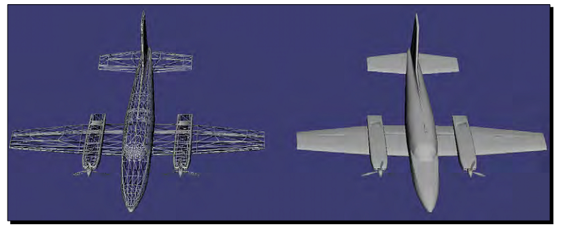

### What just happened?

具有OpenGL多边形模式的知识，我们可以很容易想像osg::PolygonMode类的setMode()方法所需要的参数。第一个参数可以是osg::PolygonMode::FRONT，BACK与FRONT\_AND\_BACK其中的一个，分别对应OpenGL的枚举GL\_FRONT，GL\_BACK与GL\_FRONT\_AND\_BACK。第二个参数可以是osg::PolygonMode::POINT，LINE与FILL，分别对应GL\_POINT，GL\_LINE与GL\_FILL。当封装OpenGL的渲染状态时，OSG并不需要更多的技巧。

多边形模式并没有相关联的模式，也就是，他不需要调用OpenGL的glEnable()/glDisable()函数，也不需要使用OSG状态集合的setMode()方法。

setAttributeAndMode()方法在这里也可以正确作用，但是在这种情况下开关值(ON/OFF)并不可用。

Inheriting render states
------------------------

节点的状态集将会影响当前节点及其子节点。例如，节点transformation1的osg::PolygonMode属性将会使得其所有子节点显示为轮廓图。然而，子节点的状态集可以覆盖父节点的状态集，也就是，渲染状态将会由父节点继承，除非子节点改变这一行为。下图显示了一个想像的场景图如何遍历不同的多边形模式状态：

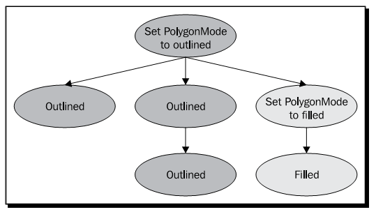

有时我们也许希望不同的行为。例如，在通常的3D编辑器软件中，用户可以由文件载入多个模型，并将其渲染为纹理，金属丝帧或是固体，而不论前一个模型的状态是什么。换句话说，编辑器中的所有子模型应继承统一的而不论他们之前被设置为何种状态。这在OSG中可以通过使用osg::StateAttribute::OVERRIDE标记来实现，例如：

    stateset->setAttribute( attr, osg::StateAttribute::OVERRIDE );

要设置渲染模式或是属性与模式，可以使用位或操作符：

    stateset->setAttributeAndModes( attr,
        osg::StateAttribute::ON|osg::StateAttribute::OVERRIDE );

回到3D编辑器软件的话题。想像一下我们使用鼠标指针选择一个模型；将会显示一个边框盒子来表示模型已被选中。选中的盒子不会被纹理/丝线边框/固体状态所影响，也就是，属性或状态并没有受到父节点覆盖的影响。OSG使用osg::StateAttribute::PROTECTED标记来支持该特性。

OSG还有第三个标记，osg::StateAttribute::INHERIT，用来表示当前的属性或模式应由父节点的状态集继承。在这种情况下，并不会真正使用所应用的属性或模式。

### Time for action - lighting the glider or not

在下面的简短示例中我们将显示OVERRIDE与PROTECTED标记的使用。根节点将会被设置为OVERRIDE，以强制其所有的子节点继承其属性或模式。同时，子节点会尝试通过使用或不使用PROTECTED标记来改变其继承性，从而会导致不同的结果。

1.  包含必需的头文件：

<!-- -->

    #include <osg/PolygonMode>
    #include <osg/MatrixTransform>
    #include <osgDB/ReadFile>
    #include <osgViewer/Viewer>

2.  创建两个osg::MatrixTransform节点并使其共享同一个滑翔机模型。毕竟，我们并不希望总是使用著名的Cessna。滑翔机在尺寸上很小，所以对于setMatrix()方法只需要一个很小的距离：

<!-- -->

    osg::ref_ptr<osg::Node> model = osgDB::readNodeFile(  
      "glider.osg" );
    osg::ref_ptr<osg::MatrixTransform> transformation1 = new 
    osg::MatrixTransform;
    transformation1->setMatrix(osg::Matrix::translate( 
      -0.5f, 0.0f, 0.0f));
    transformation1->addChild( model.get() );
    osg::ref_ptr<osg::MatrixTransform> transformation2 = new  
      osg::MatrixTransform;
    transformation2->setMatrix(osg::Matrix::translate( 
      0.5f, 0.0f, 0.0f));
    transformation2->addChild( model.get() );

3.  将两个变换节点添加到根节点：

<!-- -->

    osg::ref_ptr<osg::Group> root = new osg::Group;
    root->addChild( transformation1.get() );
    root->addChild( transformation2.get() );

4.  现在我们要为每一个节点的状态集合设置渲染模式。GL\_LIGHTING模式是一个著名的OpenGL枚举，可以用来打开或是禁止场景的全局灯光。注意，OVERRIDE与PROTECTED标记被分别设置到root与transformation2，且其开关值分别被设置为ON与OFF：

<!-- -->

    transformation1->getOrCreateStateSet()->setMode( GL_LIGHTING,
        osg::StateAttribute::OFF );
    transformation2->getOrCreateStateSet()->setMode( GL_LIGHTING,
        osg::StateAttribute::OFF|osg::StateAttribute::PROTECTED);
    root->getOrCreateStateSet()->setMode( GL_LIGHTING,
        osg::StateAttribute::ON|osg::StateAttribute::OVERRIDE );

5.  启动查看器：

<!-- -->

    osgViewer::Viewer viewer;
    viewer.setSceneData( root.get() );
    return viewer.run();

6.  位于屏幕左侧的节点transformation1并没有明显的变化。然而，transformation2则完全不同，尽管他与transformation1共享相同的载入模型：

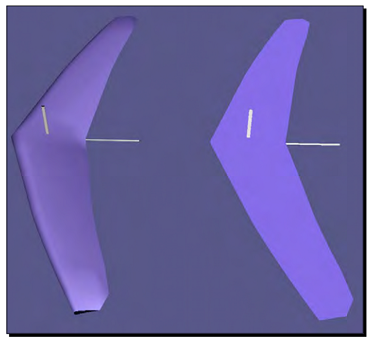

### What just happened?

我们可以首先通过下面的命令来看一下正常的滑翔机是什么样子的：

    # osgviewer glider.osg

在这个示例中，我们尝试修改transformation1与transformation2的GL\_LIGHTING模式来禁止其上的灯光。然而，我们已经为根节点打开了灯光模式，并且使用OVERRIDE标记以其所有的子节点来保持其灯光状态。

正如前面的示例中所示，节点transformation1不顾其自己的设置保持了灯光。然而，transformation2使用PROTECTED标记来阻止其受到根节点的影响。由于该节点关闭了其表面的“灯光”，所以他看起来有一些亮。这是因为几何现在是依据原始颜色数组来直接着色的，而没有对灯光的响应。

将osgDB::readNodeFile()的文件名修改为cessna.osg将会生成两个明亮模型，这是因为Cessna模型在子场景图中打开了GL\_LIGHTING模式，以覆盖前面的状态。这次我们知道如何禁止transformation2的灯光了吧？

Playing with fixed-function effects
-----------------------------------

通过使用osg::StateAttribute派生类，OSG几乎支持所有的OpenGL渲染属性与模式类型。下表是超过40个OSG封装主要OpenGL固定函数状态的组件的一部分：

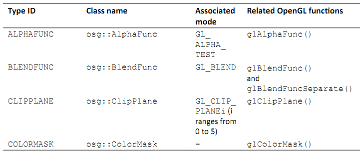

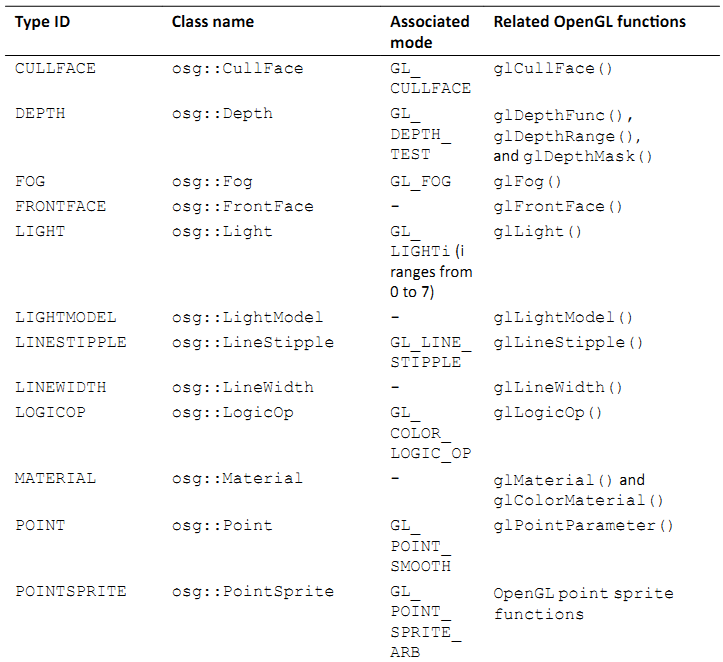

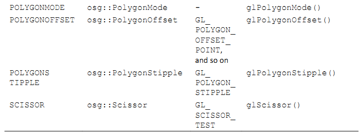

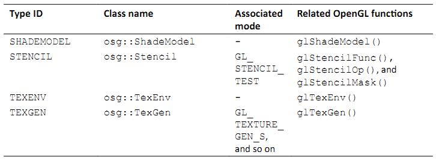

Type
ID列可以由状态集获取特定的属性。他被用作getAttribute()方法的参数，例如：

    osg::PolygonMode* pm = dynamic_cast<osg::PolygonMode*>(
        stateset->getAttribute(osg::StateAttribute::POLYGONMODE) );

如果我们之前已经为stateset设置了多边形模式属性，则上面的代码会获取一个正确的指针。否则，getAttribute()将会返回NULL。

上表中的关联模式列显示了当使用setAttributeAndModes()时OSG如何调用OpenGL模式。我们也可以通过使用getMode()方法来检测一个模式是打开还是关闭：

    osg::StateAttribute::GLModeValue value =
        stateset->getMode( GL_LIGHTING );

这里枚举GL\_LIGHTING被用来打开或是禁止整个场景中的光线。

相关OpenGL函数列表明在一个OSG属性类封装了哪一个OpenGL函数。一个OSG属性类总是包含一系列的方法来指定相关的函数参数－OpenGL开发者可以将其程序迁移到OSG，而无需过多的修改。

### Time for action - applying simple fog to models

我们将会以雾效果作为处理各种渲染属性与模式的理想示例。OpenGL接受一个线性与两个指数雾公式，这些参数也为osg::Fog类所支持。

1.  包含必需的头文件：

<!-- -->

    #include <osg/Fog>
    #include <osgDB/ReadFile>
    #include <osgViewer/Viewer>

2.  我们首先创建雾属性。使用线性模式，我们需要通过使用setStart()与setEnd()方法设置近距离与远距离。为了生成灰尘雾的效果，我们同时设置雾的颜色：

<!-- -->

    osg::ref_ptr<osg::Fog> fog = new osg::Fog;
    fog->setMode( osg::Fog::LINEAR );
    fog->setStart( 500.0f );
    fog->setEnd( 2500.0f );
    fog->setColor( osg::Vec4(1.0f, 1.0f, 0.0f, 1.0f) );

3.  我们载入一个名为lz.osg的示例地形模型，该模型位于由环境变量OSG\_FILE\_PATH所指示的数据目录内。我们所要做的唯一工作就是向节点的状态集合设置雾属性与关联模式。

<!-- -->

    osg::ref_ptr<osg::Node> model = osgDB::readNodeFile( "lz.osg" );
    model->getOrCreateStateSet()->setAttributeAndModes( fog.get() );

4.  启动查看器并操作场景，以便利地形与雾可以较好的展示：

<!-- -->

    osgViewer::Viewer viewer;
    viewer.setSceneData( model.get() );
    return viewer.run();

5.  当我们使用鼠标右键缩放场景时，地形模型将会以一种平滑的过程淡入与淡出。这是非常基本的环境效果，但有时结果依然是非常惊奇的：

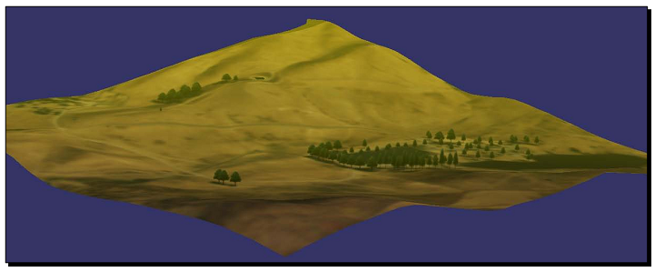

### What just happened?

OpenGL的glFog()函数支持各种模式参数的设置，例如GL\_FOG\_MODE，GL\_FOG\_DENSITY，GL\_FOG\_START与GL\_FOG\_END。在OSG中这些模式被重定义为setMode()，setDensity()，setStart()与setEnd()方法，每一个还有相对应的get\*()方法。

下面是实现雾效果的另外一个小技巧：开发者可以设置几何体每一个顶点的雾坐标，并将其用作计算中的距离值。除了指定雾坐标源之外，这可以通过osg::Geometry类的setFogCoordArray()与setFogCoordBinding()方法来实现：

    fog->setFogCoordinateSource( GL_FOG_COORD );

如果方法的参数被设置为GL\_FRAGMENT\_DEPTH，则在雾颜色的计算中会使用当前片段深度。

### Have a go hero - searching for more effects

还有更多将OpenGL函数与参数封装为公共类方法的OSG渲染属性类。要进行详细了解，我们可以阅读在预编译包中的API文档，或是查看头文件中的声明来了解如何使用。

有一些容易理解与使用的渲染属性，osg::ColorMask，osg::LineWidth与osg::ShadeModel。他们具有设置掩码，宽度与模式参数的内部方法，并且当关联到节点或可绘制元素的状态集合时立即产生效果。尝试这些渲染属性来了解一个我们是否能够仅通过API手册与类声明就可以掌握他们。

Lights and light sources
------------------------

类似OpenGL，OSG支持多达八个固定功能光源用于直接照明3D空间，并且不能够在对象上自动生成与转换阴影。光线通常起源于特定的光源，以直线前进，反射场景对象或是由场景对象分散，并最终为观察者的眼睛所接收。光源性质，表面材质性，以及几何法线均是实现完整光效果所必需的。

osg::Light类提供了精巧的方法用于光源属性上的操作，包括用于处理OpenGL光数目的setLightNum()与getLIghtNum()方法，用于周围环境的setAmbient()与getAmbient()方法，用于处理光组件混合的setDiffuse()与getDiffuse()方法。

OSG同时提供了osg::LightSource类用于向场景图添加光线。他有一个setLight()方法，并且应被用作只有一个光线属性的叶子节点。如果设置了相应的GL\_LIGHT1模式，则场景图中的其他所有节点都会受到光源节点的影响：

    osg::ref_ptr<osg::Light> light = new osg::Light;
    light->setLightNum( 1 );  // Specify light number 1
    ...
    osg::ref_ptr<osg::LightSource> lightSource = new osg::LightSource;
    lightSource->setLight( light.get() );  // Add to a light source node
    ...
    // Add the source node to the scene root and enable rendering mode GL_LIGHT1 to fit the light's set!
    root->addChild( lightSource.get() );
    root->getOrCreateStateSet()->setMode( GL_LIGHT1, 
        osg::StateAttribute::ON );

打开指定光线的另一个更为方便的解决方案是setStateSetMods()方法，通过该方法光源会自动将光线数目关联到场景根节点：

    root->addChild( lightSource.get() );
    lightSource->setStateSetModes( root->getOrCreateStateSet(), 
    osg::StateAttribute::ON );

有时我们也许会将子节点添加到osg::LightSource节点，但是这并不意味着照亮基于节点层次结构关系的子场景图。他可以被看作表示光源物理开关的几何体。

osg::LightSource节点可以被放置在osg::Transform节点下。然后点光可以依据当前的变换信息进行变换。我们可以通过设置osg::LightSource的引用帧来禁止该特性，例如：

    lightSource->setReferenceFrame( osg::LightSource::ABSOLUTE_RF );

其含义类似于osg::Transform类的setReferenceFrame()方法。

### Time for action - creating light sources in the scene

默认情况下，OSG自动打开第一道光（GL\_LIGHT0），从而为场景提供一个柔软的方向光。然而，这次我们将会自己创建多道光，并且随着变换父节点移动。注意，只有位置可以移动。方向光没有源点，因而不能放置在任何位置。

OpenGL与OSG均使用位置参数的第四部分来确定光是否为点光。也就是说，如果第四部分为0，则该光被看作方向光；否则为点光。

1.  包含必需的头文件：

<!-- -->

    #include <osg/MatrixTransform>
    #include <osg/LightSource>
    #include <osgDB/ReadFile>
    #include <osgViewer/Viewer>

2.  我们创建一个函数来为场景图创建光源。光源应用一个标号（由0到7），一个变换位置，以及一个颜色参数。之所以创建点光是因为位置向量的第四部分为1.0。然后我们将该光赋值给一个新创建的osg::LightSource节点，并将该光源添加到变换的osg::MatrixTransform节点，并返回该变换节点：

<!-- -->

    osg::Node* createLightSource( unsigned int num,
                                  const osg::Vec3& trans,
                                  const osg::Vec4& color )
    {
        osg::ref_ptr<osg::Light> light = new osg::Light;
        light->setLightNum( num );
        light->setDiffuse( color );
        light->setPosition( osg::Vec4(0.0f, 0.0f, 0.0f, 1.0f) );

        osg::ref_ptr<osg::LightSource> lightSource = new  
          osg::LightSource;
        lightSource->setLight( light );
        osg::ref_ptr<osg::MatrixTransform> sourceTrans =
            new osg::MatrixTransform;
        sourceTrans->setMatrix( osg::Matrix::translate(trans) );
        sourceTrans->addChild( lightSource.get() );
        return sourceTrans.release();
    }

3.  Cessna模型将会由我们的自定义光进行照射。我们会在创建光源之前将其由文件中载入：

<!-- -->

    osg::ref_ptr<osg::Node> model = osgDB::readNodeFile(  
      "cessna.osg" );
    osg::ref_ptr<osg::Group> root = new osg::Group;
    root->addChild( model.get() );

4.  现在创建两个光源节点并将其放置在场景中的不同位置：

<!-- -->

    osg::Node* light0 = createLightSource(
        0, osg::Vec3(-20.0f,0.0f,0.0f), osg::Vec4(  
      1.0f,1.0f,0.0f,1.0f) );
    osg::Node* light1 = createLightSource(
        1, osg::Vec3(0.0f,-20.0f,0.0f), osg::Vec4(0.0f,1.0f,1.0f,1.0f)
    );

5.  在这里0号光与1号光。所以我们将会打开根节点的GL\_LIGHT0与GL\_LIGHT1，意味着场景图中的所有节点将会由两个暖光源中受益：

<!-- -->

    root->getOrCreateStateSet()->setMode( GL_LIGHT0,
      osg::StateAttribute::ON );
    root->getOrCreateStateSet()->setMode( GL_LIGHT1,
      osg::StateAttribute::ON );
    root->addChild( light0 );
    root->addChild( light1 );

6.  现在让我们启动查看器：

    > osgViewer::Viewer viewer; viewer.setSceneData( root.get() );
    > return viewer.run();

7.  我们将会看到Cessna的一侧为黄光照射，而其前面则由青光照射。这正是我们在示例源中所期望的！

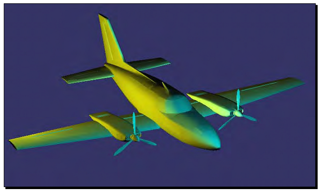

### What just happened?

osg::LightSource类是一种特殊类型的节点，该节点会影响允许其关联渲染模式的所有节点，而无论这些节点是否为光源的子节点。有时这会让人感到奇怪，但是可以通过位置状态的概念进行解释。也就是，渲染状态使用当前的模型－视图矩阵来放置其自己。

OpenGL中的典型位置状态包括glLight()函数（点光），glClipPlane()函数与glTexGen()函数（GL\_EYE\_LINEAR模式）。这些状态应在空间变换中定位；否则其展示会随着每次所应用的不同的模型视图矩阵而发生较大的变化。

OSG使用三个osg::Group派生节点：osg::LightSource，osg::ClipNode与osg::TexGenNode来绑定这些特殊状态。他们均有一个setReferenceFrame()方法来使用绝对引用帧，并且可以被添加到空间中确定位置的变换节点。唯一的区别在于osg::LightSource与osg::TexGenNode会影响允许相关模式的所有节点，但是osg::ClipNode仅会裁剪具有特定裁剪面板的子节点。

### Pop quiz - lights without sources

我们也可以将osg::Light看作普通的渲染属性。例如，将一个光对象应用到根节点将会影响其子图。然而，如果我们不使用光源将会有明显的区别。区别是什么呢？当光作为头顶光（headlight）或是天空光（skylight）时呢？

The Image class
---------------

在上一章中我们已经了解了如何创建一个方块并填充颜色。然而另一个方法在其上应用纹理映射（通常是位图或栅格图像）。这并不会影响表面的顶点，而只会修改最终的像素数据，大多数情况下，这是用于表示对象细节更为有效和合适的方法。

OSG提供了多个纹理属性与模式用于纹理映射操作，我们将会在下一节进行介绍。在这之前，我们需要探讨osg::Image类，该类存储OpenGL纹理对象载入与使用的图像数据。

由磁盘载入图像的最好方法是使用osgDB::readImageFile()函数。这非常类似于osgDB::readNodeFile()函数，该函数将模型载入为场景节点。假定我们有一个名为picture.bmp的位图文件，下面的代码会将其载入为图像对象用于纹理映射使用：

    osg::ref_ptr<osg::Image> image =
        osgDB::readImageFile( "picture.bmp" );

如果图像载入成功，也就是，图像指针是可用的，那么我们就可以使用一些公共方法来读取图像的属性：

-   公共方法s()，t()与r()返回图像的宽度，高度与深度。
-   公共方法data()将原始图像数据作为unsigned
    char\*指针返回。为了读取或是修改图像像素数据我们可以直接在指针上进行操作。

data()指针中每一个无符号字符元素的含义是与图像的像素格式与数据类型相关联的，这可以通过getPixelFormat()与getDataType()方法。这两个值与OpenGL
glTexImage\*()函数的格式与类型参数具有相同的含义。例如，一个像素格式为GL\_RGB与数据类型GL\_UNSIGNED\_BYTE的图像对象将会使用三个独立的无符号字符元素来表示每一个RGB组件，从而形成一个完整的像素，如下图所示：

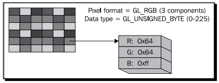

我们也可以分配一个新的图像对象并将我们自己的图像对象放置在该对象中：

    osg::ref_ptr<osg::Image> image = new osg::Image;
    image->allocateImage( s, t, r, GL_RGB, GL_UNSIGNED_BYTE );
    unsigned char* ptr = image->data();
    ...  // Operate on the ptr variable directly!

这里s，t与r表示图像的尺寸，而GL\_RGB与GL\_UNSIGNED\_BYTE被用作像素格式与数据类型的示例设置。内部缓冲区数据将会在调用allocateImage()方法之后分配，并且会在图像不再为任何纹理对象引用时自动销毁。

我们可以深度更多的图像文件，例如.jpg，.png，.tif等。OSG通过文件I/O插件来管理大多数的图像格式，但是其中的一些插件需要依赖第三方库，所以如果我们使用默认设置由源码编译OSG，也许某些插件是不可用的。我们会在第10章中了解关于构建与使用文件读取器/写入器插件的更多内容。

The basis of texture mapping
----------------------------

要在我们的程序中使用基本的纹理映射，我们需要遵循下列步骤：

1.  设定指定几何体的纹理坐标
2.  为1D，2D，3D或是立方体映射纹理映射操作创建纹理属性对象
3.  为纹理属性指定一个或是多个图像
4.  将相应的纹理属性或模式关联到状态集，该状态将会被应用到相关的节点与可绘制元素

OSG定义了一个osg::Texture类来封装所有的纹理类型。其子类osg::Texture1D，osg::Texture2D，osg::Texture3D与osg::TextureCubMap可以表示不同的OpenGL纹理映射技术。

osg::Texture类最常用的方法是setImage()。该方法简单的将一个已分配的图像设置到纹理对象。例如：

    osg::ref_ptr<osg::Image> image =
        osgDB::readImageFile( "picture.bmp" );
    osg::ref_ptr<osg::Texture2D> texture = new osg::Texture2D;
    texture->setImage( image.get() );    

或者，我们也许会直接向构造函数传递图像对象：

    osg::ref_ptr<osg::Image> image =
        osgDB::readImageFile( "picture.bmp" );
    osg::ref_ptr<osg::Texture2D> texture =
        new osg::Texture2D( image.get() );

在纹理对象内部，图像变量是由智能指针来管理的。我们可以通过使用getImage()方法由纹理对象中读取该图像。

另一个重要事情是为osg::Geometry对象的每一个顶点设置纹理坐标。我们可以通过使用setTexCoordArray()方法将osg::Vec2Array或是osg::Vec3Array应用到几何体，从而使用当前2D或是一个大纹理中相应的数据构建所有帧。

当指定纹理坐标时，我们必须同时为多个纹理实现设置纹理映射单位。要在一个模型上使用单一的纹理，我们可以简单的指定纹理单位为0。例如，下面的代码几何体变量geom的纹理坐标数据设置为0：

    osg::ref_ptr<osg::Vec2Array> texcoord = new osg::Vec2Array;
    texcoord->push_back( osg::Vec2(...) );
    ...
    geom->setTexCoordArray( 0, texcoord.get() );

在这之后，我们可以将纹理属性添加到状态集，自动依据相关的模式（GL\_TEXTURE\_2D）进行切换，并将属性应用到几何体本身，或是包含其的节点：

    geom->getOrCreateStateSet()->setTextureAttributeAndModes(
        texture.get() );

注意，OpenGL在图像内存（视频卡内存）中管理图像数据，但是osg::Image对象会将载入的数据保存在系统内存中。结果就是相同图像数据的两份拷贝，一个为OpenGL所有，而另一个存储在osg::Image对象中。如果图像没有在多个纹理属性之间共享，那么可以在将其应用到OpenGL管线之后删除图像对象及其所占用的系统内存。osg::Texture类提供了一个setUnRefImageDataAfterApply()方法来执行该操作：

    texture->setUnRefImageDataAfterApply( true );

一旦OpenGL纹理对象被创建，内部管理的图像会被释放，而getImage()将会返回一个不正确的指针。这会使得查看器的运行更为高效。

### Time for action - loading and applying 2D textures

最常见的纹理映射技术是2D纹理映射。这会接受一个2D图像作为纹理并将其映射到一个或是多个几何体面。在这里osg::Texture2D类被用作特定纹理映射单元的纹理属性。

1.  包括必需的头文件：

<!-- -->

    #include <osg/Texture2D>
    #include <osg/Geometry>
    #include <osgDB/ReadFile>
    #include <osgViewer/Viewer>

2.  我们快速创建一个四边形，并调用setTexCoordArray()方法来将纹理坐标绑定到每个顶点。在这个示例中，纹理坐标数组仅影响纹理单位0，但总是可以在单位之间共享数组：

<!-- -->

    osg::ref_ptr<osg::Vec3Array> vertices = new osg::Vec3Array;
    vertices->push_back( osg::Vec3(-0.5f, 0.0f,-0.5f) );
    vertices->push_back( osg::Vec3( 0.5f, 0.0f,-0.5f) );
    vertices->push_back( osg::Vec3( 0.5f, 0.0f, 0.5f) );
    vertices->push_back( osg::Vec3(-0.5f, 0.0f, 0.5f) );
    osg::ref_ptr<osg::Vec3Array> normals = new osg::Vec3Array;
    normals->push_back( osg::Vec3(0.0f,-1.0f, 0.0f) );
    osg::ref_ptr<osg::Vec2Array> texcoords = new osg::Vec2Array;
    texcoords->push_back( osg::Vec2(0.0f, 0.0f) );
    texcoords->push_back( osg::Vec2(0.0f, 1.0f) );
    texcoords->push_back( osg::Vec2(1.0f, 1.0f) );
    texcoords->push_back( osg::Vec2(1.0f, 0.0f) );
    osg::ref_ptr<osg::Geometry> quad = new osg::Geometry;
    quad->setVertexArray( vertices.get() );
    quad->setNormalArray( normals.get() );
    quad->setNormalBinding( osg::Geometry::BIND_OVERALL );
    quad->setTexCoordArray( 0, texcoords.get() );
    quad->addPrimitiveSet( new osg::DrawArrays(GL_QUADS, 0, 4) );

3.  我们将由磁盘载入文件并将其赋值给2D纹理对象。文件格式.rgb是由SGI开发，通常用于存储2D纹理：

<!-- -->

    osg::ref_ptr<osg::Texture2D> texture = new osg::Texture2D;
    osg::ref_ptr<osg::Image> image =
        osgDB::readImageFile( "Images/lz.rgb" );
    texture->setImage( image.get() );

4.  将四边形添加到osg::Geode节点，然后将纹理属性添加到状态集合。注意，要将属性设置为与纹理坐标数组相同的纹理映射单位：

<!-- -->

    osg::ref_ptr<osg::Geode> root = new osg::Geode;
    root->addDrawable( quad.get() );
    root->getOrCreateStateSet()->setTextureAttributeAndModes(
        0, texture.get() );

5.  启动查看器并查看效果：

<!-- -->

    osgViewer::Viewer viewer;
    viewer.setSceneData( root.get() );
    return viewer.run();

6.  现在我们有一个应用了普通纹理的四边形几何体。尝试使用其他的图像文件来看一下我们是否可以在3D空间构建一个精彩的世界：

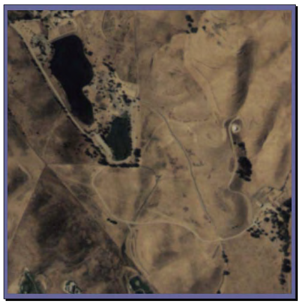

### What just happened?

2D纹理是一个颜色值的二维数组。每个值被称为texel（纹理元素），该元素由一个列值与一个值所构成的唯一地址。相对于纹理的中心（0，0），行被标记为s坐标，而列被标记为t坐标。被称为纹理坐标的地址应其所赋值的唯一顶点映射到对象坐标。这也就是我们为什么应设置几何体的纹理坐标数组并确保其与顶点数组具有相同尺寸的原因。

osg::Geometry类可以拥有以不同纹理映射单位表示的多个纹理坐标数组。要使其全部可用，我们需要通过使用setTextureAttributeAndModes()方法来为每一个单位设置osg::Texture属性。

osg::Texture2D类要求纹理坐标正规化为\[0,1\]，否则他会使用纹理封装来处理多余的部分。他会检测纹理的维度在尺寸上是否全部为2的幂次，例如64x64或256x512，并且在默认情况下会使用OpenGL的gluScaleImage()函数在内部缩放不是2的幂次的图像，这对于读取任意的图像非常方便，但是需要更多的系统时间并会占用较大的图形内存尺寸。还有一个定义我们是否需要强制调整图像大小的setResizeNonPowerOfTwoHint()方法。注意，非2幂次图像是由某些图形显示直接支持的。

osg::TextureRectangle类支持2D纹理，而不需要2的幂次维度。从而避免了重采样，并且需要更少的图形内存来存储图像数据。然而，他并没有用于纹理过滤的mipmaps，且纹理坐标必需是维度相关的。

### Have a go hero - making use of filters and rwapping modes

OpenGL已经设计有完美的机制来处理纹理封装与过滤。osg::Texture类也包含有封装的方法。

setWrap()方法需要两个参数：要应用于其上的纹理坐标轴以及要使用的封装模式。然后我们可以这玉色纹理的封装行为，例如：

    texture->setWrap( osg::Texture::WRAP_S, osg::Texture::REPEAT );
    texture->setWrap( osg::Texture::WRAP_R, osg::Texture::REPEAT );

如果位于坐标轴s与t上的纹理坐标超出了\[0,1\]范围，这会导致纹理被平铺。

类似的，setFilter()方法用来定义纹理对象的最小与最大过滤器。与OpenGL中的相应函数对比，现在我们是否可以理解setWrap()与setFilter()方法的用法与显示？OpenGL在线文档与红宝书对于理解这些主题将会非常有帮助。

Handling rendering order
------------------------

在开始解释如何在OSG中处理渲染顺序之前，我们最好理解什么是渲染顺序及其在OpenGL中如何作用。

OpenGL将顶点以及基元数据存储在各种缓冲区中，例如颜色缓冲区，深度缓冲区，模板缓冲区等。除了这些缓冲区之外，他不会记录以其他格式发送给他的顶点与三角形。所以OpenGL总是渲染新的几何体基元，而不会跟踪旧的，这就意味着这些基元以何种顺序被渲染是非常重要的。

借助于深度缓冲区，不透明的对象可以被正确渲染，而在简单情况下，这些对象的渲染顺序并没有关系，因为默认的深度测试会略过小于存储值的新来数据。

然而，当使用OpenGL混合机制时，例如，来实现透明与半透明效果，为了更新颜色缓冲区需要执行特殊的操作。不单是简单的覆盖，新像素与旧像素将会混合，同时考虑alpha值（总是颜色向量的第四个组成部分）或是其他元素。这就会导致渲染顺序将会影响最终结果的问题，如下图所示：

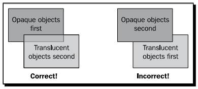

osg::StateSet类的setRenderingHint()方法将会通知OSG在需要时控制节点与可以绘制元素的渲染顺序。他只是简单的指示一个状态集是否为不透明或半透明，并会确保与透明状态关联的对象应在不透明对象之后渲染，而这些透明对象应依据每个对象的中心到人眼位置的距离而存储（也就是由远到近）。

为了指示一个节点或是可绘制元素是不透明的（实际上是默认情况），可以输入下面代码：

    node->getOrCreateStateSet()->setRenderingHint(
        osg::StateSet::OPAQUE_BIN );

而对于透明的节点或可绘制元素则使用下面的代码：

    node->getOrCreateStateSet()->setRenderingHint(
        osg::StateSet::TRANSPARENT_BIN );

### Time for action - achieving the translucent effect

我们将要实现一个将模型作视作玻璃的半透明效果。其他的场景对象可以通过glass对象进行显示。这可以通过OpenGL的混合机制来实现，但是在这个示例中计算场景对象的正确渲染顺序将会非常重要。

1.  包含必需的头文件：

<!-- -->

    #include <osg/BlendFunc>
    #include <osg/Texture2D>
    #include <osg/Geometry>
    #include <osgDB/ReadFile>
    #include <osgViewer/Viewer>

2.  我们将会继续通过一个预定义的纹理坐标数组来使用四边形几何体。他应被看作一个半透明对象，并且应在稍后应用渲染属性与模式：

<!-- -->

    osg::ref_ptr<osg::Vec3Array> vertices = new osg::Vec3Array;
    vertices->push_back( osg::Vec3(-0.5f, 0.0f,-0.5f) );
    vertices->push_back( osg::Vec3( 0.5f, 0.0f,-0.5f) );
    vertices->push_back( osg::Vec3( 0.5f, 0.0f, 0.5f) );
    vertices->push_back( osg::Vec3(-0.5f, 0.0f, 0.5f) );
    osg::ref_ptr<osg::Vec3Array> normals = new osg::Vec3Array;
    normals->push_back( osg::Vec3(0.0f,-1.0f, 0.0f) );
    osg::ref_ptr<osg::Vec2Array> texcoords = new osg::Vec2Array;
    texcoords->push_back( osg::Vec2(0.0f, 0.0f) );
    texcoords->push_back( osg::Vec2(0.0f, 1.0f) );
    texcoords->push_back( osg::Vec2(1.0f, 1.0f) );
    texcoords->push_back( osg::Vec2(1.0f, 0.0f) );

3.  要小心设置四边形的颜色数组。要将其与其他的场景对象混合，在这里我们要将alpha部分设置小于1.0的值：

<!-- -->

    osg::ref_ptr<osg::Vec4Array> colors = new osg::Vec4Array;
    colors->push_back( osg::Vec4(1.0f, 1.0f, 1.0f, 0.5f) );

4.  再次创建四边形几何体：

<!-- -->

    osg::ref_ptr<osg::Geometry> quad = new osg::Geometry;
    quad->setVertexArray( vertices.get() );
    quad->setNormalArray( normals.get() );
    quad->setNormalBinding( osg::Geometry::BIND_OVERALL );
    quad->setColorArray( colors.get() );
    quad->setColorBinding( osg::Geometry::BIND_OVERALL );
    quad->setTexCoordArray( 0, texcoords.get() );
    quad->addPrimitiveSet( new osg::DrawArrays(GL_QUADS, 0, 4) );
    osg::ref_ptr<osg::Geode> geode = new osg::Geode;
    geode->addDrawable( quad.get() );

5.  如同我们在前面示例中所做的，将纹理应用到四边形：

<!-- -->

    osg::ref_ptr<osg::Texture2D> texture = new osg::Texture2D;
    osg::ref_ptr<osg::Image> image =
        osgDB::readImageFile( "Images/lz.rgb" );
    texture->setImage( image.get() );

6.  使用osg::BlendFunc类来实现混合效果。其作用与OpenGL的glBlendFunc()完全相同：

<!-- -->

    osg::ref_ptr<osg::BlendFunc> blendFunc = new osg::BlendFunc;
    blendFunc->setFunction( GL_SRC_ALPHA, GL_ONE_MINUS_SRC_ALPHA );

7.  向状态集合添加混合函数属性与纹理属性：

<!-- -->

    osg::StateSet* stateset = geode->getOrCreateStateSet();
    stateset->setTextureAttributeAndModes( 0, texture.get() ); 
    stateset->setAttributeAndModes( blendFunc );

8.  现在我们来看一下场景是否被正确渲染。试着将几何体模型与一个载入的滑翔机模式添加到场景图中，并看一下会发生什么。

<!-- -->

    osg::ref_ptr<osg::Group> root = new osg::Group;
    root->addChild( geode.get() );
    root->addChild( osgDB::readNodeFile("glider.osg") );
    osgViewer::Viewer viewer;
    viewer.setSceneData( root.get() );
    return viewer.run();

9.  与前面的示例相比，现在的四边形当然是半透明的。然而，在场景视图中有一些不合理的地方。被四边形切割的滑翔机，其中的一个机翼在半透明面之下。这是由于滑翔机与四边形错误的渲染顺序所致。由于OpenGL中的深度测试，后者的渲染并不正确：

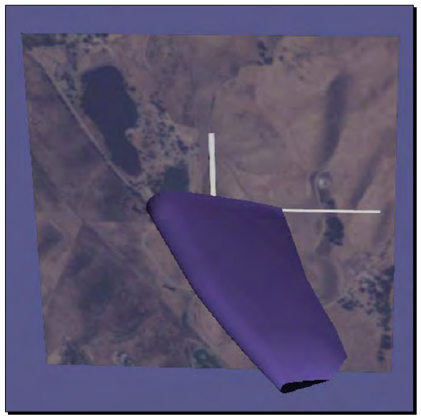

10. 我们是否还记得解决该问题的setRenderingHint()方法？现在让我们在第7步中添加一行来指示四边形是透明的，并使得OSG以正确的顺序存储与渲染：

<!-- -->

    stateset->setRenderingHint( osg::StateSet::TRANSPARENT_BIN );

11. 现在一切正常了：

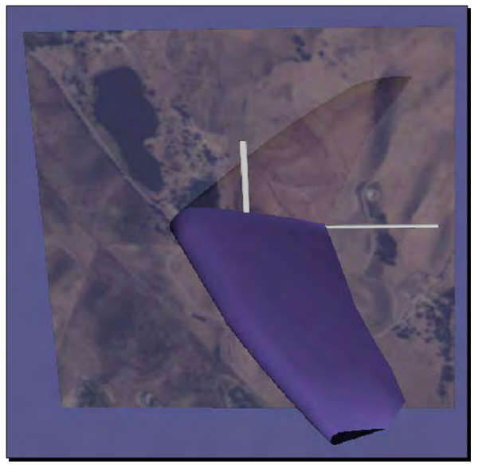

### What just happened?

在绘制遍历中，GL\_SRC\_ALPHA与GL\_ONE\_MINUS\_SRC\_ALPHA枚举会使用下面的等式来确定混合颜色：

    R = srcR * srcA + dstR * (1 - srcA)
    G = srcG * srcA + dstG * (1 - srcA)
    B = srcB * srcA + dstB * (1 - srcA)

这里，\[srcR,srcG,srcB\]是要渲染的半透明四边形的颜色值，而\[dstR,dstG,dstB\]是要覆盖的屏幕颜色值，实际上现在是由不透明的滑翔机模型填充的。最终的颜色\[R,G,B\]是根据不透明颜色向量的alpha部分srcA来计算的，因而与新颜色值和前一个颜色混合来生成半透明效果。

setRenderingHint()方法可以很好的控制渲染顺序，但是大量使用效率并不高。通过每一帧的深度存储所有的透明对象需要更多的系统时间，而且如果有大量的数据需要存储则会导致大量的资源计算。开发者需要随时保持平衡。

Understanding graphics shaders
------------------------------

OpenGL shading language(GLSL)最初是作为OpenGL
1.4的扩展而引入的，以允许顶点与帧级别渲染管线中的可编程性。现在GLSL通常被包含在OpenGL
2.0中，为开发者提供开发图像阴影器（图像软件指令块）的功能来计算更为真实的渲染效果，而不是仅仅使用固定功能状态。

在本书中详细介绍GLSL及其在OpenGL中的实现是不可能的。然而，如果我们有兴趣设计不同的阴影器并将其应用到场景图中时，有一些可以遵循的步骤。

首先，编写我们自己的阴影器，类似于C程序。这些被看作字符串集合被传递给硬件，所以仅是按需创建或是由文本文件读取。

我们所指定的也许不会超过在OpenGL管线中所处理的一个顶点阴影器，一个几何体阴影器以及一个帧阴影器（每一步仅有一个main()函数）。这些将会完全替换固定功能，例如雾，光以及纹理映射，这些需要在我们的阴影器源码中重新实现。

阴影器需要OpenGL
API来编译并执行他们。顶点阴影器可以为每一个顶点应用变换；帧阴影器计算来自光栅的单个像素的颜色；而几何体阴影器会由已存在的顶点与基元数据重新生成几何体。

OSG使用osg::Shader类来定义包含源码字符串的阴影器对象。setShaderSource()方法被用来由std::string变量指定源码，而loadShaderSourceFromFile()方法将会由磁盘读取源码文件。除此之外，开发者可以由已存在的字符串vertText直接构建阴影器对象，如下所示：

    osg::ref_ptr<osg::Shader> vertShader =
        new osg::Shader( osg::Shader::VERTEX, vertText );

输入参数osg::Shader::VERTEX表示顶点阴影器。我们也可以使用枚举GEOMETRY或是FRAGMENT来代替，以指定几何体阴影器或帧阴影器。例如：

    osg::ref_ptr<osg::Shader> fragShader = new osg::Shader( 
    osg::Shader::FRAGMENT, fragText );

    osg::ref_ptr<osg::Shader> geomShader = new osg::Shader(  
        osg::Shader::GEOMETRY );
    geomShader->loadShaderSourceFromFile( "source.geom" );

在这里我们假定文件source.geom已被载入并包含我们的几何体阴影器。

osgDB::readShaderFile()函数也许更适合由文件读取，因为他会依据文件扩展名（.vert，.frag或是.geom）自动检测阴影器类型。他会返回一个完全形成的正确类型与数据的osg::Shader实例，例如：

    osg::Shader* fragShader =  osgDB::readShaderFile("source.frag");

在所有的阴影器被设置并准备好使用以后，我们可以使用osg::Program类与addShader()方法来包含该阴影器并将GLSL渲染属性与模式设置到状态集。在阴影器起效果之后，大多数其他的固定功能状态将会变得不可用，包括光，材质，雾，纹理映射，纹理坐标生成以及纹理环境。

下面的代码片段将所有上面的阴影器添加到一个osg::Program对象并将其关联到一个已存在节点的状态集：

    osg::ref_ptr<osg::Program> program = new osg::Program;
    program->addShader( vertShader.get() );
    program->addShader( fragShader.get() );
    program->addShader( geomShader.get() );
    node->getOrCreateStateSet()->setAttributeAndModes( program.get() );

Using uniforms
--------------

在一个典型的阴影器中有三种类型的输入与输出：uniforms，vertex
attributes与varyings。uniforms与vertex
attributes在阴影器执行过程中是只读的，但是可以由宿主OpenGL或OSG程序所设置。他们实际上是用于阴影器与用户程序之间交互的全局GLSL变量。

varyings用于由一个阴影器向另一个阴影器传递数据。他们对于外部程序是不可见的。

OSG使用osg::Uniform类来定义GLSL
uniform变量。其构造函数有一个名字与一个初始化值参数，该参数必须与阴影器源码中的定义相匹配，例如：

    float length = 1.0f;
    osg::ref_ptr<osg::Uniform> uniform =
        new osg::Uniform( "length", length );

我们也许会将该uniform对象添加一个状态集，该状态集已经通过使用addUniform()方法与一个osg::Program对象相关联：

    stateset->addUniform( uniform.get() );

同时，在阴影器源码中必有一个变量定义，例如：

    uniform float length;

否则，uniform变量在OSG程序或阴影器中会不可用。

uniform可以是任意的基本类型，或是组合类型，例如布尔型，浮点型，整型，2D/3D/4D向量，矩阵以及各处纹理取样器。osg::Uniform类通过构造函数与set()方法接受所有的基本类型。同时他还提供了更多的数据类型，例如osg::Matrix2与osg::Matrix3来2x2与3x3矩阵。为了绑定纹理取样器，用在阴影器中表示特定的纹理，osg::Uniform对象唯一的工作就是通过使用unsigned
int值指定纹理映射单位，例如：

    osg::ref_ptr<osg::Uniform> uniform = new osg::Uniform(  
      "texture", 0 );

当然，我们应已经使得osg::Texture对象的单位为0，同时在阴影器源中定义了取样器uniform：

    uniform sampler2D texture;

在这里我们假定2D纹理将会用来改变阴影器的执行行为。

### Time for action - implementing a cartoon cow

卡通阴影是一种非常简单的在色调之间突然发生变化的非真实效果。要实现一个卡通阴影器，我们只需要将顶点传递给顶点阴影器中内建的gl\_Position变量，然后使用帧阴影器中的法线与光线方法进行计算并选择。之后，我们将其应用到一个载入的模型之上，例如，一个漂亮的牛上。

1.  包含必需的头文件：

<!-- -->

    #include <osg/Program>
    #include <osgDB/ReadFile>
    #include <osgViewer/Viewer>

2.  我们将会使用字符串来编写顶点阴影器源。除了设置gl\_Position，他会将一个法线变化变量传递给帧阴影器：

<!-- -->

    static const char* vertSource = {
        "varying vec3 normal;\n"
        "void main()\n"
        "{\n"
        "    normal = normalize(gl_NormalMatrix * gl_Normal);\n"
        "    gl_Position = ftransform();\n"
        "}\n"
    };

3.  帧阴影器使用四个color
    uniforms来表示卡通阴影中的色调。他会依据点积（dot
    product）的几何解释计算法线变化与光位置之间的余弦角。注意，当使用阴影器时固定功能光状态会失去其效果，但是光属性依然可用，并可以由内建的GLSL
    uniforms中读取：

<!-- -->

    static const char* fragSource = {
        "uniform vec4 color1;\n"
        "uniform vec4 color2;\n"
        "uniform vec4 color3;\n"
        "uniform vec4 color4;\n"
        "varying vec3 normal;\n"
        "void main()\n"
        "{\n"
        "    float intensity = dot(vec3(gl_LightSource[0].position), normal);\n"
        "    if (intensity > 0.95) gl_FragColor = color1;\n"
        "    else if (intensity > 0.5) gl_FragColor = color2;\n"
        "    else if (intensity > 0.25) gl_FragColor = color3;\n"
        "    else gl_FragColor = color4;\n"
        "}\n"
    };

4.  我们将创建两个阴影器对象并将其添加到程序属性：

<!-- -->

    osg::ref_ptr<osg::Shader> vertShader =
        new osg::Shader( osg::Shader::VERTEX, vertSource );
    osg::ref_ptr<osg::Shader> fragShader =
        new osg::Shader( osg::Shader::FRAGMENT, fragSource );
    osg::ref_ptr<osg::Program> program = new osg::Program;
    program->addShader( vertShader.get() );
    program->addShader( fragShader.get() );

5.  读取cow模型，并将属性与模式应用到状态集合。在用户程序中要定义四个uniform变量，所以在这里为了将值绑定到uniforms，我们需要四次使用addUniform()方法：

<!-- -->

    osg::ref_ptr<osg::Node> model = osgDB::readNodeFile( "cow.osg" );
    osg::StateSet* stateset = model->getOrCreateStateSet();
    stateset->setAttributeAndModes( program.get() );
    stateset->addUniform(
        new osg::Uniform("color1", osg::Vec4( 
          1.0f, 0.5f, 0.5f, 1.0f)) );
    stateset->addUniform(
        new osg::Uniform("color2", osg::Vec4( 
          0.5f, 0.2f, 0.2f, 1.0f)) );
    stateset->addUniform(
        new osg::Uniform("color3", osg::Vec4( 
          0.2f, 0.1f, 0.1f, 1.0f)) );
    stateset->addUniform(
        new osg::Uniform("color4", osg::Vec4( 
          0.1f, 0.05f, 0.05f, 1.0f)) );

6.  全部完成！现在启动查看器：

<!-- -->

    osgViewer::Viewer viewer;
    viewer.setSceneData( model.get() );
    return viewer.run();

7.  这次我们将会看到一个完全不同的cow模型。看起来是由一个孩子或是喜剧艺术家绘制的。这种技术广泛应用于计算机游戏与动画电影中：

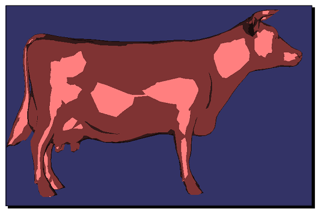

### What just happened?

卡通阴影的基本算法是：如果我们有一个复制到光线方向的法线，则使用最明亮的解调（color1）。当面法线与光线之间的夹角增加时，则会使用一系列的暗解调（color2,color3与color4），事实上为所选择的解调提供了强度值。

阴影器源码是由下列网站http://www.lighthouse3d.com 的一个很好的GLSL
tutorial修改而来的。

所有四个色调被声明为帧阴影器中的uniform
4D向量，并作为用户程序中的osg::Vec4变量被传递给osg::Uniform对象。

### Pop quiz - replacements of built-in uniforms

osg::Geometry类使用stVertexAttribute()与setVertexAttribBinding()方法将顶点属性绑定阴影器，要为这些方法提供每一个顶点。GLSL内建的顶点属性包括gl\_Position，gl\_Normal与gl\_MultiTexCoord\*变量。然后，我们也可以指定我们自己的顶点属性，例如正切或顶点权重。

试着在顶点阴影器中声明一个属性，并使用osg::Geometry的顶点属性数组。另一个我们需要执行的重要任务就是借助于osg::Program的addBindAttribLocation()方法绑定外部属性数组与GLSL属性。他有一个name与index参数，前一个指示阴影器源码中的属性名，而后一个要对应于setVertexAttribArray()的输入索引值。

Working with the geometry shader
--------------------------------

几何体阴影器包含在OpenGL
3.2核心中，并以低版本被用作扩展，GL\_EXT\_geometry\_shader4，其应在阴影器源码中被声明。

几何体阴影器引入了一些新的连接基元，可以被用作osg::PrimitiveSet派生类的参数。他同时要求设置更多的参数来操纵阴影器操作，包括：

1.  GL\_GEOMETRY\_VERTICES\_OUT\_EXT：阴影器将会发射的顶点数目
2.  GL\_GEOMETRY\_INPUT\_TYPE\_EXT：发送到阴影器的基元类型
3.  GL\_GEOMETRY\_OUTPUT\_TYPE\_EXT：由阴影器发射的基元类型

osg::Program类使用setParameter()方法为这些参数设置值。例如，要表示将由阴影器发射100个顶点到渲染管线中的组合处理器基元，我们可以使用：

    program->setParameter( GL_GEOMETRY_VERTICES_OUT_EXT, 100 );

### Time for action - generating a Bezier curve

OpenGL在几年前就提供了用于生成Bezier与NURBS曲线与面的函数，但是他们的表现并不像我们所希望的那样好。今天的几何体阴影器可以一种更为使得与高效的方法完成相同的工作。以Cubic
Bezier曲线的生成为例。给定两个端点，以及阴影器的两个控制点，则他会使用起始与结束于两个不同的端点，并且朝向控制点的特定段来生成一条光滑的曲线。

1.  包含必需的头文件。我们需要修改输出线的宽度，所以在这里我们使用osg::LineWith类：

<!-- -->

    #include <osg/Program>
    #include <osg/LineWidth>
    #include <osgDB/ReadFile>
    #include <osgViewer/Viewer>

2.  顶点阴影器总是需要的。但这次他仅是将顶点传输给后续的阴影器：

<!-- -->

    static const char* vertSource = {
        "#version 120\n"
        "#extension GL_EXT_geometry_shader4 : enable\n"
        "void main()\n"
        "{ gl_Position = ftransform(); }\n"
    };

3.  几何体阴影器源是这个示例中的关键。他由内建的gl\_Position变量读取端点与控制点，重新组合，并使用EmitVertex()函数发射新顶点。uniform变量segments被用来控制生成曲线的平滑：

<!-- -->

    static const char* geomSource = {
        "#version 120\n"
        "#extension GL_EXT_geometry_shader4 : enable\n"
        "uniform int segments;\n"
        "void main(void)\n"
        "{\n"
        "    float delta = 1.0 / float(segments);\n"
        "    vec4 v;\n"
        "    for ( int i=0; i<=segments; ++i )\n"
        "    {\n"
        "        float t = delta * float(i);\n"
        "        float t2 = t * t;\n"
        "        float one_minus_t = 1.0 - t;\n"
        "        float one_minus_t2 = one_minus_t * one_minus_t;\n"
        "        v = gl_PositionIn[0] * one_minus_t2 * one_minus_t +\n"
        "            gl_PositionIn[1] * 3.0 * t * one_minus_t2 +\n"
        "            gl_PositionIn[2] * 3.0 * t2 * one_minus_t +\n"
        "            gl_PositionIn[3] * t2 * t;\n"
        "        gl_Position = v;\n"
        "        EmitVertex();\n"
        "    }\n"
        "    EndPrimitive();\n"
        "}\n"
    };

4.  我们将会通过osg::Geometry类创建几何体阴影器的输入基元。他包含一个名为GL\_LINES\_ADJACENCY\_EXT的新基元类型，给出了阴影器的gl\_PositionIn变量的维度：

<!-- -->

    osg::ref_ptr<osg::Vec3Array> vertices = new osg::Vec3Array;
    vertices->push_back( osg::Vec3(0.0f, 0.0f, 0.0f) );
    vertices->push_back( osg::Vec3(1.0f, 1.0f, 1.0f) );
    vertices->push_back( osg::Vec3(2.0f, 1.0f,-1.0f) );
    vertices->push_back( osg::Vec3(3.0f, 0.0f, 0.0f) );
    osg::ref_ptr<osg::Geometry> controlPoints = new osg::Geometry;
    controlPoints->setVertexArray( vertices.get() );
    controlPoints->addPrimitiveSet(
        new osg::DrawArrays(GL_LINES_ADJACENCY_EXT, 0, 4) );
    osg::ref_ptr<osg::Geode> geode = new osg::Geode;
    geode->addDrawable( controlPoints.get() );

5.  我们要设置阴影器的参数。他有segments+1个要发射的顶点，接收GL\_LINES\_ADJACENCY\_EXT类型，并输出所得到的曲线，如下面的代码所示：

<!-- -->

    int segments = 10;
    osg::ref_ptr<osg::Program> program = new osg::Program;
    program->addShader(
        new osg::Shader(osg::Shader::VERTEX, vertSource) );
    program->addShader(
        new osg::Shader(osg::Shader::GEOMETRY, geomSource) );
    program->setParameter( GL_GEOMETRY_VERTICES_OUT_EXT, segments+1 );
    program->setParameter( GL_GEOMETRY_INPUT_TYPE_EXT,
                           GL_LINES_ADJACENCY_EXT );
    program->setParameter( GL_GEOMETRY_OUTPUT_TYPE_EXT,   
                           GL_LINE_STRIP );

6.  默认线宽为1.0。设置线宽有助于我们分辨输出的曲线：

<!-- -->

    osg::ref_ptr<osg::LineWidth> lineWidth = new osg::LineWidth;
    lineWidth->setWidth( 2.0f );

7.  向状态集合设置所有的渲染属性，并且不要忘记向阴影的使用添加uniform：

<!-- -->

    osg::StateSet* stateset = geode->getOrCreateStateSet();
    stateset->setAttributeAndModes( program.get() );
    stateset->setAttribute( lineWidth.get() );
    stateset->setMode( GL_LIGHTING, osg::StateAttribute::OFF );
    stateset->addUniform( new osg::Uniform("segments", segments) );

8.  一切就绪。现在启动查看器：

<!-- -->

    osgViewer::Viewer viewer;
    viewer.setSceneData( geode.get() );
    return viewer.run();

9.  我们会在看到屏幕中显示一条Bezier曲线。试着修改uniform
    segments的值。更大的值会使得曲线更为平滑与完整，但是却会占用更多的资源，从而导致更低的渲染效率。

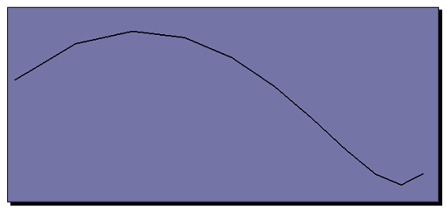

### What just happened?

几何体阴影器定义了一个新的基元类型GL\_LINE\_STRIP\_ADJACENCY\_EXT，表示相连的点划线。第一个与最后一个顶点提供了相连信息，但是并不作为线段可见。所以，我们使用这两个额外的顶点作为Bezier曲线的端点，而其他的顶点作为控制点。这实际上就是我们由GLSL变量gl\_PositionIn\[0\]到gl\_PositionIn\[3\]所读取的。

Cubic Bezier曲线可以依据下面的等式计算获得：

    P(t) = (1-t)^3 *P0 + 3*t*(1-t)^2*P1 + 3*t^2*(1-t)*P2 + t^3*P3

因子t可以设置为范围0到1之间的任何值。

### Have a go hero - having fun with shaders

有些人认为阴影器是全能的，而有些人则不这样认为。但是不会有人否认阴影器使得我们的开发更为有趣。已经有一些使用图像阴影器的真实的海洋，大气，光，特征动画
等的成功实现。现在确实有一个使用阴影器替换固定功能管线的任务，从而为我们的程序提供大量的优势。

OSG提供了对阴影语言的完全支持，尽管这些是随着OpenGL4而引入的。他也通过名为osgNV的第三方工程支持NVIDIA
Cg。等不及把玩阴影器了？除了我们自己的探索，还有一些很好的使用阴影器的开源工程，我们可以参考：

-   osgCompute与osgCUDA工程被用于使用GPU并行流处理器进行计算：http://www.cg.informatik.uni-siegen.de/svt/osgcompute/
-   osgNV工程可以支持NVIDIA Cg语言：http://osgnv.sourceforge.net/
-   osgOcean工程被用于真实海洋的模拟：http://code.google.com/p/osgocean/
-   osgPPU工程使用后处理技术实现了各种效果：http://projects.tevs.eu/osgppu

Summary
-------

正如我们在本章中所了解到的，借助于osg::StateSet类以及osg::StateAttribute子类集合，在管线中的骨架准备好之后，然后，图像渲染可以被应用来添加光，纹理，碰撞映射，或是其他对象的可编程效果。在本章中，我们详细介绍了操作渲染状态与属性的技术，特别是通过使用固定功能管线与OpenGL
shading language实现真实渲染效果的两种不同方法。

在本章中，我们特别探讨了：

-   控制与继承存储在节点与可绘制元素的osg::StateSet对象中的渲染属性与模式。
-   通过使用不同的OSG渲染状态类，例如osg::PolygonModel，osg::Fog与osg::BlendFunc，实现固定功能渲染效果。当渲染透明与半透明对象时要注意状态集合的渲染顺序。
-   如何通过使用osg::LightSource节点创建并控制osg::Light。
-   如何通过使用osg::Image类及相关联的osg::Texture子类，特别是管理与渲染2D纹理的osg::Texture2D类，来实现纹理映射。
-   图像阴影器的概念及其实现者类：osg::Shader与osg::Program。

