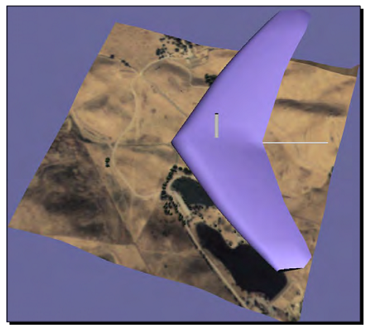
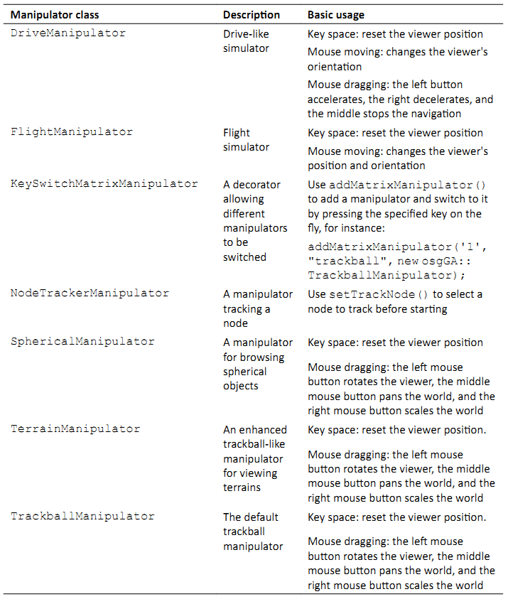
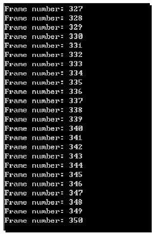
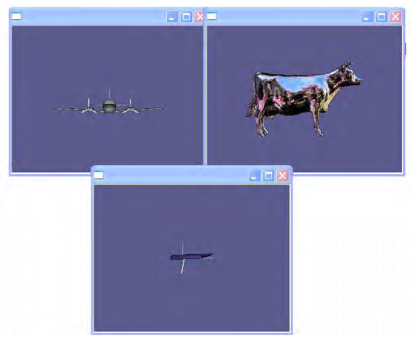
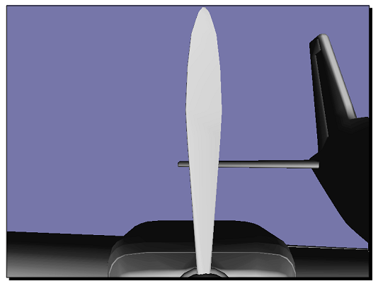
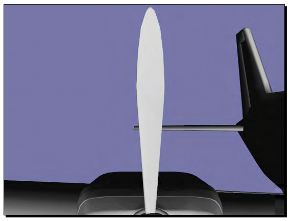
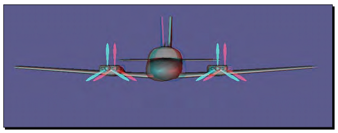
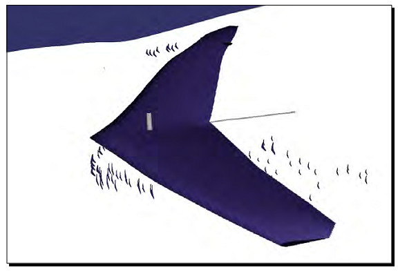
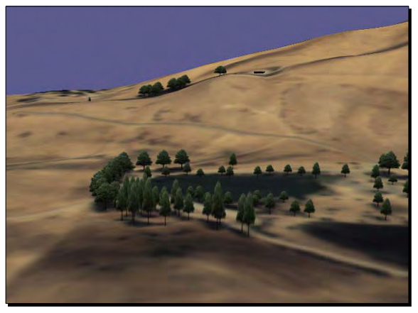

Chapter 7: Viewing the World
============================

查看器对场景的观察是3D世界变换为2D图像的结果，这是由渲染引擎实时完成的。假定放置了一个虚拟相机来观察并记录3D及其动态变化，然后其移动，角度，聚焦距离变化以及不同的镜头类型将会改变渲染结果，而这正是我们改变在场景上所见内容的真正方法。

本章主要关注于：

-   理解OpenGL中所定义的坐标系统的概念
-   修改视图点与方向，投影与最终视口
-   如果存在多个相机改变并控制渲染顺序
-   如何创建单一与复合查看器
-   如何管理全局显示设置并生成易于使用的立体可视效果
-   如何将渲染场景用作纹理对象－所谓的渲染到纹理（RTT）

From world to screen
--------------------

当在3D世界中绘制一个点，一条线或是一个复杂的多边形，我们的最终目标就是在平面上进行显示。也就是，我们将会表示的3D对象将会被转换为2D窗口中的像素集合。在此过程中，有三个主要的矩阵被用来确定不同坐标系统之间的变换。这三个矩阵通常被称为模型（model），视图（view）与投影矩阵。

模型矩阵被用来描述世界中对象的特定位置。他可以将顶点由对象的局部坐标系统转换为世界坐标系统。两个坐标系都是右手的。

接下来要通过使用视图矩阵将整个世界转换为视图空间。假定我们有一个相同放置在世界的中心位置；相机变换矩阵的反转被真正用作视图矩阵。在右手视图坐标系统中，OpenGL定义了相机总是位置原点（0，0，0）并且面向Z轴的负方向。所以，所以我们可以在相机的屏幕上表示世界。

注意，在OpenGL中并没有单独的模型矩阵与视图矩阵。然而，他定义了一个模型－视图矩阵来由对象的局部空间转换为视图空间，这是两个矩阵的组合。所以，要将局部空间中的顶点V转换为视图空间中的Ve，我们可以使用：

    Ve = V * modelViewMatrix

接下来的重要工作是确定3D对象如何映射到屏幕上（透视或是直角），并计算对象被渲染的截面。投影矩阵被用来使用六个切面面板：左，右，下，上，近，远，在世界坐标系统中指定截面。OpenGL同时提供了一个额外的gluPerspective()函数来确定具有相机镜头参数的视图域。

所得到的结果坐标系统（被称为法线设备坐标系统，normalized device
coordinate
system）的范围在每个坐标轴上由-1到+1，并且现在为变为左手系。作为最后一步，我们将所有的结果数据投影到视口（窗口），定义最终图像映射所在的矩形范围，以及窗口坐标的z值。在之后，3D场景被渲染到我们2D屏幕上的一个矩形区域中。最后，屏幕坐标Vs可以通过使用所谓的MVPW矩阵表示3D世界中的局部顶点V，也就是：

    Vs = V * modelViewMatrix * projectionMatrix * windowMatrix

Vs依然是一个表示具有深度值的2D像素位置。

通过反转这一映射过程，我们可以由一个2D屏幕点（Xs，Ys）获得一条3D空间的线。这是因为2D点实际上可以被看作两个点：一个位于近切面板（Zs=0）上，而另一个位于远帖面板（Zs=1）上。

这里MVPW的转置矩阵被用来获取“非投影”工作的结果：

    V0 = (Xs, Ys, 0) * invMVPW
    V1 = (Xs, Ys, 1) * invMVPW

The Camera class
----------------

OpenGL开发者经常使用glTranslate()与glRotate()来移动场景，使用glLookAt()来移动相机，尽管他们都可以使用glMultMatrix()函数来代替。事实上，这些函数实际上做的是相同的事情－为由世界空间到视图空间的变换数据计算模型－视图矩阵。类似的，OSG提供了osg::Transform类，当放置在场景图中时，该类可以为当前模型－视图矩阵添加或是设置其自己的矩阵，但是我们通常使用osg::MatrixTransform与osg::PositionAttitudeTransform子类在模型矩阵上进行操作，并使用osg::Camera子类处理视图矩阵。

osg::Camera类是核心OSG库中最重要的类之一。他可以用场景图的组合节点，但是他不仅仅是一个普通的节点。其主要功能可以划分为四类：

首先，osg::Camera类处理视图矩阵，投影矩阵以及视口，这会影响其所有子节点并将其投影到屏幕上。相关的方法包括：

1.  公共方法setViewMatrix()与setViewMatrixAsLookAt()通过使用osg::Matrix变量或是典型的眼/中心/上（eye/center/up）变量设置视图矩阵。
2.  公共方法setProjectionMatrix()接受osg::Matrix参数以指定投影矩阵。
3.  其他一些方便方法，包括setProjectionMatrixAsFrustum()，setProjectionMatrixAsOrtho()，setProjectionMatrixAsOrtho2D()与setProjectionMatrixAsPerspective()，用来使用不同的截面参数设置透视或直角投影矩阵。他们的作用类似于OpenGL投影函数（glOrtho()，gluPerspective()等）。
4.  公共方法setViewPort()可以使用osg::Viewport对象定义矩形窗口。

下面的代码片段显示了如何设置相机节点的视图与投影矩阵，并将其视口设置为(x,y)-(x+w,y+h)：

    camera->setViewMatrix( viewMatrix );
    camera->setProjectionMatrix( projectionMatrix );
    camera->setViewport( new osg::Viewport(x, y, w, h) );

我们可以随时通过相应的get\*()方法获取osg::Camera对象的当前视图与投影矩阵以及视口。例如：

    osg::Matrix viewMatrix = camera->getViewMatrix();

为了获取视图矩阵的位置与方向，可以使用下面代码：

    osg::Vec3 eye, center, up;
    camera->getViewMatrixAsLookAt( eye, center, up );

其次，osg::Camera封装了OpenGL函数，例如glClear()，glClearColor()与glClearDepth()，并清空帧缓冲区，以及在当在每一帧中重新将场景绘制到屏幕时预先设置其值。主要方法包括：

1.  setClearMas()方法设置要清空
    的缓冲区。默认为GL\_COLOR\_BUFFER\_BIT|GL\_DEPTH\_BUFFER\_BIT。
2.  setClearColor()方法通过使用osg::Vec4变量以RGBA格式设置清理颜色。

类似的，还有setClearDepth()，setClearStencil()与setClearAccum()方法，以及由相机获取设置值的get\*()方法。

第三类包含与相机相关联的OpenGL图像环境管理。我们将会在第9章进行探讨。

最后，相机可以将一个纹理对象关联到内部缓冲区组件（颜色缓冲区，深度缓冲区等），并在该纹理内直接渲染子场景图。然后所得到的纹理可以映射到其他场景的表面上。这种技术被称为渲染器到纹理或纹理烘焙，在本章稍后将会介绍。

Rendering order of cameras
--------------------------

在任意场景图中至少有一个主相机节点。他是由osgViewer::Viewer类创建并管理的，并且可以通过getCamera()方法读取。在启动模拟之前，他会自动添加根节点作为其子节点。默认情况下，其他相机，无论是直接还是间接添加到根节点的，都会共享与主相机相关联的图像环境，并且会在相同的渲染窗口上依次绘制其子场景。

osg::Camera类提供了一个setRenderOrder()方法来精确控制相机的渲染顺序。他有一个顺序枚举以及一个可选的顺序数参数。第一个枚举可以是PRE\_RENDER或POST\_RENDER，指示通常的渲染顺序。第二个是一个整数用来以级联顺序对相同类型的相机排序。默认设置为0。

例如，下面的代码将会强制OSG首先渲染camera1，然后是camera2（具有较大的顺序数），在这两个相机与主相机完成之后是camera3：

    camera1->setRenderOrder( osg::Camera::PRE_RENDER );
    camera2->setRenderOrder( osg::Camera::PRE_RENDER, 5 );
    camera3->setRenderOrder( osg::Camera::POST_RENDER );

如果一个相机首先被渲染（PRE\_RENDER），其缓冲区中的渲染结果将会被清空并为下一个相机所覆盖，而查看也许不能看到其子场景。这对于渲染器到纹理的处理情况非常有用，因为我们希望子场景对于场景不可见，并且在开始主场景之前更新所关联的纹理对象。

另外，如果一个相机被稍后渲染（POST\_RENDER），他也许会清除缓冲区中的当前颜色与深度值。我们可以通过使用较少的缓冲区掩码调用setClearMask()来避免该问题。一个典型示例就是即时显示（head-up
display，HUD）的实现。

### Time for action - creating an HUD camera

即时显示可以渲染数据而无需用户偏离其正常的视点。他被广泛用于3D场景中，用于显示重要的2D文本，计算机游戏数据以及战机与战场基础等。这次我们将会设计一个HUD相机，其中包含一个在任何时刻都要放在其他场景对象前面的模型。

1.  包含必需的头文件：

<!-- -->

    #include <osg/Camera>
    #include <osgDB/ReadFile>
    #include <osgViewer/Viewer>

2.  由磁盘文件中载入两个模型。lz.osg被用作演示地形，而glider.osg将会被放置在HUD相机之下。也就是，他对于观看查看器的用户总是可见的；而无论场景图的其他部分如何变化：

<!-- -->

    osg::ref_ptr<osg::Node> model = osgDB::readNodeFile("lz.osg");
    osg::ref_ptr<osg::Node> hud_model = osgDB::readNodeFile("glider.osg");

3.  HUD相机及其子节点必须在常规的场景完成在屏幕上的绘制之后才被渲染。他会覆盖所有当前的像素数据，而不论其位置与深度。这也正是我们使用GL\_DEPTH\_BUFFER\_BIT来清除深度缓冲区的原因。在这里并没有设置GL\_COLOR\_BUFFER\_BIT，以确保颜色缓冲区被正确保存。

<!-- -->

    osg::ref_ptr<osg::Camera> camera = new osg::Camera;
    camera->setClearMask( GL_DEPTH_BUFFER_BIT );
    camera->setRenderOrder( osg::Camera::POST_RENDER );

4.  HUD相机不应被查看器或是其他的父节点所影响，所以他需要被变化到绝对引用帧，并且被设置为一个自定义固定的视图矩阵。滑翔机模式也被添加到相机节点，以作为要显示的内容：

<!-- -->

    camera->setReferenceFrame( osg::Camera::ABSOLUTE_RF );
    camera->setViewMatrixAsLookAt(
        osg::Vec3(0.0f,-5.0f,5.0f), osg::Vec3(), 
    osg::Vec3(0.0f,1.0f,1.0f)
    );
    camera->addChild( hud_model.get() );

5.  我们向根节点添加HUD相机以及一个常规的载入模型：

<!-- -->

    osg::ref_ptr<osg::Group> root = new osg::Group;
    root->addChild( model.get() );
    root->addChild( camera.get() );

6.  现在，像通常一样启动查看器：

<!-- -->

    osgViewer::Viewer viewer;
    viewer.setSceneData( root.get() );
    return viewer.run();

7.  我们将会看到演示地形（常规场景）的渲染以及在用户控制下的操作。然而，滑翔机（后渲染的场景）总是位于所有其他场景对象之上，而其位置与方向不会受到鼠标或键盘输入的影响。

### What just happened?

我们创建了一个包含滑翔机模型并作为子场景图进行渲染的额外相机。渲染顺序被设置为POST\_RENDER，也就是，该相机将会在主相机已完成其场景渲染之后出现。换句话说，他总会在主相机的渲染结果的上面绘制其子场景图（颜色缓冲区与深度缓冲区）。

额外相机的目的就是实现一个覆盖主场景的HUD场景。他清除了深度缓冲区来确保该相机所绘制的所有像素数据可以通过深度测试。然而，颜色缓冲区并没有被清除，保存屏幕上主场景未覆盖的像素数据。这也正是我们进行如下设置的原因：

    camera->setClearMask(GL_DEPTH_BUFFER_BIT);  // No color buffer bit

### Pop quiz - changing model positions in the HUD camera

我们刚才所创建的HUD相机使用其自己的视图矩阵来配置其视图坐标中的子场景图位置与朝向，但是他并没有预设置的投影矩阵。我们是否知道其实际是什么吗？我们是否了解如何HUD相机的投影矩阵使用滑翔机模型填充整个场景？而我们如何显示一个upside-down的模型？

Using a single viewer
---------------------

OSG支持单一查看器类osgViewer::Viewer来保存单个场景图的视图。他使用setSceneData()方法来管理场景图的根节点，并使用run()来启动模拟循环，这样场景就会被一次次渲染。从而帧缓冲区被每一个渲染循环的结果所更新，从而被称为一帧。

除了这些，查看器同时还包含一个osg::Camera对象作为主相机，我们已经在前面进行了讨论。相机的视图矩阵是由查看器的内部osgGA::CameraManipulator对象进行控制的。同时，用户输入事件也由查看器通过osgGA::GUIEventHandler处理器接收并处理。查看器甚至可以被设置为全屏幕模式，在一个窗口，或是在球形显示上。我们将会在本章以及接下来的章节中逐步开始解释这些概念。

Digging into the simulation loop
--------------------------------

由run()方法所定义的模拟循环总是要执行三种类型的任务：指定主相机的操作吕在，设置相关联的图像环境，并在循环中渲染帧。

操作器可以读取键盘与鼠标事件，并相应的调整主相机的视图矩阵来浏览场景图。他是通过使用setCameraManipulator()方法来设置的，其参数必须是一个osgGA::CameraManipulator()子类。例如：

    viewer.setCameraManipulator( new osgGA::TrackballManipulator );

这会向查看器对象添加一个具有自由行为的经典轨迹球操作器。因为在查看器内部相机操作器是被作为智能指针保存的，我们可以在任何时候使用setCameraManipulator()方法赋值一个新的操作器。在osgGA名字空间中定义的一些内建操作器可以在下表中找到：

这里要小心的是，要声明并使用一个操作器，我们必须添加osgGA库作为我们的工程依赖。这可以通过我们的工程属性或是通过使用CMake脚本来实现。

查看器的图像环境以及可能的线程与资源都是在realize()方法被初始化的。他会在第一帧被渲染之前被自动调用。

在这之后，查看器进入循环。每次他使用frame()方法来渲染一帧，并且检测渲染过程是否应使用done()方法停止并退出。该过程可以通过下面几行代码进行描述：

    while ( !viewer.done() )
    {
        viewer.frame();
    }

这是查看器类所使用的默认渲染模式。如果图形卡的vsync选项被打开，帧速率会与监视器的刷新速率同步以避免浪费系统资源。但是OSG支持另一种按需渲染模式。如下配置查看器变量：

    viewer.setRunFrameScheme( osgViewer::Viewer::ON_DEMAND );

现在，frame()方法将只会在场景图修改，更新或是用户输入事件时才会被调用，直到模式被改回默认值CONTINUOUS。

另外，osgViewer::Viewer类同时包含一个使用帧速率数作为参数的setRunMaxFrameRate()方法。这会设置一个最大帧速率来控制查看器运行以强制渲染帧而无需太多的假定。

### Time for action - customizing the simulation loop

我们已经非常熟悉了osgViewer::Viewer类的run()方法。他被多次用于启动一个默认模拟循环来将场景图载入到查看器并在每一帧上执行更新，裁剪与绘制遍历。

但是run()方法实际上做了什么呢？是否能够添加某些帧前事件或帧后事件以用于特定目的呢？在这个示例中，我们将会使用C++
while语句来自定义模拟循环，同时显示每一个帧执行之后的帧数。

注意，自定义的模拟循环并不会由即时渲染机制（on-demand rendering
scheme）与最大帧速率设置中获益。只有在使用run()方法时他们才可用。

1.  包含必需的头文件：

<!-- -->

    #include <osgDB/ReadFile>
    #include <osgGA/TrackballManipulator>
    #include <osgViewer/Viewer>
    #include <iostream>

2.  载入模型并将其设置为查看器的场景数据：

<!-- -->

    osg::ref_ptr<osg::Node> model = osgDB::readNodeFile( "lz.osg" );
    osgViewer::Viewer viewer;
    viewer.setSceneData( model.get() );

3.  我们需要为查看器设置操作器；否则，我们不能够浏览场景，包括缩放，旋转等控制操作。在这里，向查看器设置一个新的跟踪球操作器。他允许用户点击并拖拽屏幕上某一点，使得对象跟随其旋转。osgGA::TrackballManipulator是run()方法内部所用的默认操作器：

<!-- -->

    viewer.setCameraManipulator( new osgGA::TrackballManipulator );

4.  然后我们在while循环中运行查看器。其条件会每次通过done()方法进行测试以检测查看器是否完成。循环体包含frame()方法，该方法会执行一帧来更新，裁剪并渲染场景图，而std::cout语句输出当前的帧号：

<!-- -->

    while ( !viewer.done() )
    {
        viewer.frame();
        std::cout << "Frame number: " <<
            viewer.getFrameStamp()->getFrameNumber() << std::endl;
    }
    return 0;

5.  启动查看器并查看控制台输出。我们将会在每一帧执行之后看到一个指示帧号的字符串列表。除此之外，run()方法与自定义的模拟循环之间并没有区别。

### What just happened?

在这里我们提出了帧前与帧后事件的概念，并且简单的认为他们会在frame()方法之前与之后确定执行。这种定义实际上是不精确的。

OSG使用多线程来管理不同相机的用户更新，裁剪与绘制，特别在存在多个场景，多处理器与多图形设备的情况下。frame()方法只是启动一个新的更新/裁剪/绘制遍历任务，但是并不会处理线程同步。在这种情况下，frame()这前与之后的代码会被认为是不稳定与不安全的，因为在读取与写入场景图时，他们也许会与其他的处理线程冲突。所以，这里所描述的方法并不推荐用于未来的开发。在下一章中我们将会介绍一些常用的方法来动态修改场景数据。

另一个有趣的问题是viewer.run()方法会在何时返回？当然，开发者可以使用编程的方式通过查看器的setDone()方法设置done标记。OSG系统会检测当前图像上下文环境（例如，渲染窗口）是否已关闭，或者是否按下Esc按键，后者也会改变done标记。setKeyEventSetsDone()方法甚至可以设置哪一个按键将会担当该职责，是默认的Esc（或是设置为0来关闭该特性）。

### Have a go hero - viewing in a non-full screen window

osgViewer::Viewr类可以进行快速设置以工作在非全屏模式下。默认全屏显示实际上是一个覆盖整个屏幕的窗口。要生成具有特定左上坐标，宽度与调蓄的窗口，setUpViewInWindow()方法将会非常合适。另一个选项是环境变量OSG\_WINDOW，该变量可以像下面这样定义（在UNIX系统下，请使用export命令）：

    # set OSG_WINDOW=50 50 800 600

这可以有四个或五个参数：前四个是所创建窗口的左上坐标与尺寸，而最后一个定义了在多屏幕环境下的工作屏幕。默认屏幕标号0表示第一个屏幕被用来包含渲染窗口。如果我们多个计算机监视器，可以尝试使用其他的无符号整数。

除此之外，setUpViewOnSingleScreen()方法通过使用整数参数来在其他屏幕上设置全屏窗口。这是通过OSG中所支持的圆形显示来进行演示的。试着使用指定的参数使用setUpViewFor3DSphericalDisplay()方法。我们可以在API文档与osgViewer头文件中找到更多的信息。

Using a composite viewer
------------------------

尽管osgViewer::Viewer类仅管理一个场景图上的一个视图，还有一个osgViewer::CompositeViewer类，支持多个视图与多个场景。该类具有相同的方法，例如run()，frame()与done()，来管理渲染过程，但是还支持通过使用addView()与removeView()方法添加与删除独立场景视图，以及通过使用getView()方法获取指定索引处的视图对象。这里的视图对象是由osgViewer::View类定义的。

osgViewer::View类是osgViewer::Viewer类的超类。他接受设置根节点作为场景数据，并添加相机操作器与事件处理器来使用用户事件。osgViewer::View与osgViewer::Viewer之间的区别在于前者不能被直接用作单个查看器，也就是，他没有run()或frame()方法。

要向复合查看器添加创建的view对象，可以使用下面的代码：

    osgViewer::CompositeViewer multiviewer;
    multiviewer.addView( view );

### Time for action - rendering more scenes at one time

多查看器在表示复杂场景时非常有用，例如，使用主视图渲染宽广区域，以及一个鹰眼区域，或是显示相同场景的前，侧，上及透视图。在这里我们将会创建三个单独的窗口，包含三个不同的模型，每一个都可以进行单独操作。

1.  包含必需的头文件：

<!-- -->

    #include <osgDB/ReadFile>
    #include <osgViewer/CompositeViewer>

2.  我们设计一个函数来创建一个新的osgViewer::View对象并将其应用到已存在的节点。setUpViewInWindow()方法在这里被用来生成非全屏视图：

<!-- -->

    osgViewer::View* createView( int x, int y, int w, int h,
                                 osg::Node* scene )
    {
        osg::ref_ptr<osgViewer::View> view = new osgViewer::View;
        view->setSceneData( scene );
        view->setUpViewInWindow( x, y, w, h );
        return view.release();
    }

3.  接下来由磁盘文件读取三个模型。这些模型将会被添加到不同的视图并在不同的窗口中渲染：

<!-- -->

    osg::ref_ptr<osg::Node> model1 = osgDB::readNodeFile("cessna.osg");
    osg::ref_ptr<osg::Node> model2 = osgDB::readNodeFile("cow.osg");
    osg::ref_ptr<osg::Node> model3 = osgDB::readNodeFile("glider.osg");

4.  在特定位置处的320x240窗口内创建三个视图：

<!-- -->

    osgViewer::View* view1 = createView(50, 50, 320, 240, model1);
    osgViewer::View* view2 = createView(370, 50, 320, 240, model2);
    osgViewer::View* view3 = createView(185, 310, 320, 240, model3);

5.  组合查看器的使用非常容易理解：将所有的视图添加到该查看器，并向单个查看一样启动循环。当然，在这个示例中while循环也是有用：

<!-- -->

    osgViewer::CompositeViewer viewer;
    viewer.addView( view1 );
    viewer.addView( view2 );
    viewer.addView( view3 );
    return viewer.run();

6.  现在我们有多个窗口，同时渲染多个场景。这些窗口中的每一个都可以通过点击右上角的关闭按钮来关闭。而我们也可以通过在键盘上按下Esc按键关闭所有的窗口并退出程序。

### What just happened?

在osgViewer::CompositeViewer与多个相机之间有一些类似之处。也可以创建三个osg::Camera节点，向其中添加不同的子场景，将其关联到不同的图形环境（渲染窗口），从而实现与前面的图像相同的效果。总之，每一个osgViewer::View对象有一个osg::Camera节点，该节点可以用来管理其子场景及其关联窗口。其实际作用类似于容器。

然而，osgViewer::View类也处理操作器与用户事件。所以，在一个组合查看器中，每一个osgViewer::View对象存有其自己的操作器与事件处理器（这会在第9章中进行讨论）。然而，相机集合很难与单独的用户输入进行交互。这也正是我们选择使用组合查看器与少量对象来表示多个场景的原因。

### Have a go hero - different views of the same scene

在上面的示例中，我们向视图对象添加了三个不同的载入模型，因而渲染了不同的场景。然而，也可以将相同的根节点添加到所有视图。例如：

    view1->setSceneData( root.get() );
    view2->setSceneData( root.get() );
    view3->setSceneData( root.get() );

毕竟，如果我们希望设计相同场景的前面，侧面，顶面，可以试着向每一个视图的主相机添加一个视图矩阵与一个投影矩阵，并确保操作器已被禁用，因为他会依据用户接口事件重置我们的矩阵配置：

    view1->getCamera()->setViewMatrix();
    view1->getCamera()->setProjectionMatrix();
    view1->setCameraManipulator( NULL );  // Set the manipulator to null!
    // Avoid using default manipulator, too!
    view1->getCamera()->setAllowEventFocus( false );

这里，setAllowEventFocus()方示指示相机是否可以接受用户输入与事件。这会在第9章中进行讨论。

现在，当设计场景的前视图，侧视图与顶视图时，我们是否知道视图与投影矩阵应是什么？提醒大家，通过getBound()方法获取的根节点边界圆，非常有助于指定视图点与投影范围。

### Pop quiz - another way to display the smae scene in different views

在一个或是多个视图中显示相同场景的另一个方法是使用osg::Camera节点。通过setViewport()方法设置到不同的区域，我们可以无重叠的在一个渲染窗口中安排相机视图。我们知道如何设计这样的场景图来实现该目的吗？

Changing global display settings
--------------------------------

OSG管理一个为相机，查看器以及其他场景元素所需要全局显示设置集合。他通过osg::DisplaySettings类使用单例模式来声明所有这些元素的窗口的唯一实例。所以我们可以在程序中的任意获取显示设置实例：

    osg::DisplaySettings* ds = osg::DisplaySettings::instance();

osg::DisplaySettings实例设置所有新创建的渲染设备所需要的属性，主要是渲染窗口的OpenGL图像环境。其特征包括：

1.  使用setDoubleBuffer()方法设置双缓冲区或单缓冲。默认为打开。
2.  使用setDepthBuffer()方法设置是否使用深度缓冲区。默认为打开。
3.  通过一系列的方法，例如setMinimumNumAlphaBits()等，为OpenGL
    alpha缓冲区，stencil缓冲区与accumulation缓冲区设置位。默认全为0。
4.  通过setNumMultiSmaples()方法设置使用多样本缓冲区以及样本数量。默认为0。
5.  打开stereo渲染并配置stereo模式与eye映射参数。

在下面的章节中，我们将会了解到特定的特性结构，这些特性中的某些可以为不同的图像环境进行单独设置。然而，同时，我们将会首先关注于如何在场景查看器上使用全局显示设置。

### Time for action - enabling global multisampling

多重采样是一种反走样技术类型。他无需执行更多的处理就可以改善最终的结果质量。为了实现多重采样光栅化，用户程序应该设置一个采样数。注意，并不是所有的图形卡都支持多重采样扩展，所以该示例在某些系统与平台上会失败。

1.  包含必需的头文件：

<!-- -->

    #include <osgDB/ReadFile>
    #include <osgViewer/Viewer>

2.  设置多重采样数。依据特定的图形设备，可用值通常包括2，4与6：

<!-- -->

    osg::DisplaySettings::instance()->setNumMultiSamples( 4 );

3.  载入模型并使用标准查看器进行渲染。由osg::DisplaySettings单例所管理的多重采样属性现在已经开始起作用了：

<!-- -->

    osg::ref_ptr<osg::Node> model = osgDB::readNodeFile("cessna.osg" );
    osgViewer::Viewer viewer;
    viewer.setSceneData( model.get() );
    return viewer.run();

4.  Cessna模型推进器的近距离查看（没有应用setNumMultiSamples()方法）如下面的截图所示。我们可以很清楚的看到推进器边缘的走样错误：

5.  现在多重采样明显降低了渲染模型的变形，并且依据全局显示设置属性提高了最终结果的光滑水平。这会影响当前程序中所创建的所有查看器：

### What just happened?

多重采样技术允许程序使用每个像素指定的采样数来创建帧缓冲区，其中包含必需的颜色，尝试以及裁剪信息。这需要更多的显卡内存但是会得到更好的渲染效果。在WGL（OpenGL的窗口界面到Win32的实现）中，这实际上是由两个像素格式属性来确定的：WGL\_SAMPLE\_BUFFERS\_ARB与WGL\_SAMPLES\_ARB。

OSG有一个内部图形环境管理器osg::GraphicsContext。其子类osgViewer::GraphicsWindowWin32，管理Windows下的渲染窗口的配置与创建，会将这两个属性应用到封装的wglChoosePixelFormatARB()函数，并允许整个场景的多重采样。

osg::DisplaySettings的作用实际上类似于各种显示属性的默认值集合。如果没有某个特定对象的单独设置，则默认值会起作用；否则，osg::DisplaySettings实例不会起作用。

我们会在第9章中讨论用于创建图形环境的单独设置以及osg::GraphicsContext类。

Stereo visualization
--------------------

我们已经体验到了立体3D电影与图像的魔力。一个很好的盒子就是James
Cameron的Avatar，这为我们带来了超出想像的奇异世界。浮雕图像是表现立体可视化最简单与最流行的方法。其他实现包括NVIDIA的方块缓冲，水平或垂直分割，水平或垂直交织等。幸运的是，OSG支持大多数这些常见的立体技术，并且通过很少的命令就可以在查看器中立即实现其中的一个：

    osg::DisplaySettings::instance()->setStereoMode( mode );
    osg::DisplaySettings::instance()->setStereo( true );

方法setStereoMode()方法由枚举集合中选择一个立体模式，而setStereo()方法允许或禁止该模式。OSG中可用的立体模式有：ANAGLYPHIC，QUAD\_BUFFER（NVIDIA的方块缓冲），HORIZONTAL\_SPLIT，VERTICAL\_SPLIT，HORIZONTAL\_INTERLACE，VERTICAL\_INTERLACE与CHECKERBOARD（位于DLP投影器上）。我们也可以使用LEFT\_EYE或是RIGHT\_EYE来指明屏幕被用于左眼还是右眼。

osg::DisplaySettings类还有其他一些额外方法来指示特定的立体参数，例如人眼分割。查看API文档与头文件可以了解更为详细的内容。

### Time for action - rendering anaglyph stereo scenes

我们将会应用OSG内部的浮雕立体模式来实现简单快速的立体3D效果。在开始编程并渲染场景之前，我们必须准备一幅3D红/青眼镜观察效果：

在大多数情况下，眼镜的左眼是红色的，而右眼是青色的。这是最常用的浮雕效果，具有有限的颜色感知。

1.  包含必需的头文件：

<!-- -->

    #include <osgDB/ReadFile>
    #include <osgViewer/Viewer>

2.  我们直接操作全局显示设置。需要完成三个步骤：将立体模式切换为ANAGLYPHIC，使用setEyeSeparation()方法设置合适的眼分离（由左眼到右眼的距离），允许立体可视化：

<!-- -->

    osg::DisplaySettings::instance()->setStereoMode(osg::DisplaySettings::ANAGLYPHIC );
    osg::DisplaySettings::instance()->setEyeSeparation( 0.05f );
    osg::DisplaySettings::instance()->setStereo( true );

3.  然后，我们可以像平时一样构建并渲染我们的场景图。在这里我们将会使用Cessna模型作为一个简单的示例：

<!-- -->

    osg::ref_ptr<osg::Node> model = osgDB::readNodeFile("cessna.osg" );
    osgViewer::Viewer viewer;
    viewer.setSceneData( model.get() );
    return viewer.run();

4.  最终的结果与前面的示例完全不同。现在戴上眼镜来看一下是否有尝试感知：

### What just happened?

在ANAGLYPHIC模式下，最终的渲染效果总是由两个颜色层构成，并有一个小的偏移来生成深度效果。眼镜的每只眼会看到略微不同的图片，而其组合则生成了一个立体图像，从而会被我们的大脑认为是三维场景。

OSG通过二次渲染机制支持浮雕立体模式。第一次使用红通道颜色掩码渲染左眼图像，第二次使用青通道渲染右眼图像。颜色掩码是由渲染属性osg::ColorMask来定义的。他很容易通过使用下面的代码应用到状态集合与可绘制元素：

    osg::ref_ptr<osg::ColorMask> colorMask = new osg::ColorMask;
    colorMask->setMask( true, true, true, true );
    stateset->setAttribute( colorMask.get() );

立体模式通常会导致场景图被多次渲染，这会导致降低帧速率的副作用。

Rendering to textures
---------------------

渲染到纹理技术允许开发者其于已渲染场景的子场景外观创建纹理。然后这些纹理可以通过纹理映射应用到接下来的场景图中。他们可以被用来随时创建完美的特殊效果，或是可以被存储用于后续的延时阴影，多次渲染以及其他的高级渲染算法。

要动态实现纹理应用，通常要遵循下面三个步骤：

1.  为渲染纹理
2.  将场景渲染到纹理
3.  使用纹理

我们在应用纹理之前需要创建一个空的纹理对象。OSG可以通过指定其大小来创建一个空的osg::Texture对象。setTextureSize()方法定义了2D纹理的宽度与高度，以及3D纹理的深度参数。

将场景图渲染到一个新创建的纹理的关键是osg::Camera类的attach()方法。这会接受纹理对象作为参数，以及缓冲区组件参数，从而表明了帧缓冲区的哪一部分将会渲染到纹理。例如，要将一个相机的子场景的颜色缓冲区关联到纹理，我们可以使用：

    camera->attach( osg::Camera::COLOR_BUFFER, texture.get() );

其他可用的缓冲区组件包括DEPTH\_BUFFER，STENCIL\_BUFFER与COLOR\_BUFFER0到COLOR\_BUFFER15（依据图形卡的多渲染目标输出）。

继续设置相机的合适视图与投影矩阵，一个满足纹理尺寸的视口，以及设置纹理作为节点或是可绘制元素的属性。纹理将会使用每一帧中的相机渲染结果进行更新，随着视图矩阵与投影矩阵的变化而动态变化。

注意，查看器的主相机不适合关联纹理。否则，实际的窗口就不会有任何输出，从而使得一片黑。当然，如果我们正在执行脱屏渲染并且不在乎任何可视化效果，我们可以忽略这一点。

Frame buffer, pixel buffer, and FBO
-----------------------------------

另一个要关注的焦点是如何使得已渲染的缓冲区图像转换为纹理对象。一个直接的方法是使用glReadPixels()方法来由帧缓冲区返回像素数据，并将结果应用到glTexImage\*()方法。这很容易理解与使用，但总会将数据拷贝到纹理对象，这是极其慢的。

为了改善效率，glCopyTexSubImage()将会是更好的方法。然而，我们还可以优化该过程。直接将场景渲染到目标而不是缓冲区是一个好主意。为此有两种主要的解决方案：

1.  像素缓冲区（简写为pbuffer）扩展可以使用像素格式描述符创建一个不可见的渲染缓冲区，这等同于一个窗口。他会在使用之后被销毁，就如同渲染窗口的操作一样。
2.  帧缓冲区对象（简写为FBO），在节省存储空间方面有时会优于像素缓冲区，可以添加程序创建的帧缓冲区并向其重定渲染输出。他可以输出到一个纹理对象或是一个渲染缓冲区对象，后者只是一个简单的数据存储对象。

OSG支持使用不同的渲染目标实现：直接由帧缓冲区拷贝，像素缓冲区或FBO。他使用osg::Camera类的setRenderTArgetImplementation()方法来从中选择一个解决方案，例如：

    camera->setRenderTargetImplementation( osg::Camera::FRAME_BUFFER );

这表明Camera的渲染结果将会使用glCopyTexSubImage()方法渲染到关联的纹理。事实上，这是所有相机节点的默认设置。

其他重要的实现包括PIXEL\_BUFFER与FRAME\_BUFFER\_OJBECT。

### Time for action - drawing aircrafts on a loaded terrain

在这一节中，我们将会整合我们在前面所学的内容来创建一个略微复杂的示例，该示例会使用osg::NodeVisitor实用程序标识场景图中的所有纹理对象，将其替换为新创建的共享纹理，并将新纹理绑定到渲染到纹理（render-to-texture）相机。我们希望纹理不仅显示一幅静态图像，从而自定义的模拟循环被用来在调用frame()方法之前使子场景图动起来。

1.  包含必需的头文件：

<!-- -->

    #include <osg/Camera>
    #include <osg/Texture2D>
    #include <osgDB/ReadFile>
    #include <osgGA/TrackballManipulator>
    #include <osgViewer/Viewer>

2.  第一个任务是查找被应用到载入模型的所有纹理。我们需要由osg::NodeVisitor基类派生一个FindTextureVisitor类。这会管理稍后被用于渲染到纹理操作的纹理对象。每次我们在场景图中找到一个已有的纹理，我们就使用所管理的纹理进行替换。该操作在replaceTexture()方法中实现：

<!-- -->

    class FindTextureVisitor : public osg::NodeVisitor
    {
    public:
        FindTextureVisitor( osg::Texture* tex ) : _texture(tex)
        {
            setTraversalMode(  
        osg::NodeVisitor::TRAVERSE_ALL_CHILDREN );
        }    
        virtual void apply( osg::Node& node );
        virtual void apply( osg::Geode& geode );
        void replaceTexture( osg::StateSet* ss );    
    protected:
        osg::ref_ptr<osg::Texture> _texture;
    };

3.  在apply()方法中，在每一个节点与可绘制元素上调用replaceTexture()来检测是否有存储的纹理。不要忘记在每个方法体最后调用traverse()来在场景图中继续：

<!-- -->

    void FindTextureVisitor::apply( osg::Node& node )
    {
        replaceTexture( node.getStateSet() );
        traverse( node );
    }
    void FindTextureVisitor::apply( osg::Geode& geode )
    {
        replaceTexture( geode.getStateSet() );
        for ( unsigned int i=0; i<geode.getNumDrawables(); ++i )
        {
            replaceTexture( geode.getDrawable(i)->getStateSet() );
        }
        traverse( geode );
    }

4.  该用户方法使用getTextureAttribute()由输入状态集合获取单位为0的纹理，并使用所管理的纹理进行替换。因为状态集合是由节点或可绘制元素的getStateSet()方法获取的，而不是由一定会返回已有状态集合或是新创建状态集合的getOrCreateStateSet()方法获取的，这里的输入指针有可能为空：

<!-- -->

    void replaceTexture( osg::StateSet* ss )
    {
        if ( ss )
        {
            osg::Texture* oldTexture = dynamic_cast<osg::Texture*>(
               ss->getTextureAttribute(0,osg::StateAttribute::TEXTURE)
            );
            if ( oldTexture ) ss->setTextureAttribute(  
        0,_texture.get() );
        }
    }

5.  载入两个模型作为场景图。lz.osg模型被作为主场景，而滑翔机被看作是将要渲染到纹理的子场景图，并绘制在主场景中的模型的表面上：

<!-- -->

    osg::ref_ptr<osg::Node> model = osgDB::readNodeFile("lz.osg");
    osg::ref_ptr<osg::Node> sub_model = osgDB::readNodeFile("glider.osg");

6.  创建一个新的纹理对象。这不同于前面所创建的2D纹理并将图像应用于其中的示例。这次我们应指定纹理大小，内部格式以及其他属性：

<!-- -->

    int tex_width = 1024, tex_height = 1024;
    osg::ref_ptr<osg::Texture2D> texture = new osg::Texture2D;
    texture->setTextureSize( tex_width, tex_height );
    texture->setInternalFormat( GL_RGBA );
    texture->setFilter( osg::Texture2D::MIN_FILTER, osg::Texture2D::LINEAR );
    texture->setFilter( osg::Texture2D::MAG_FILTER, osg::Texture2D::LINEAR );

7.  使用FindTextureVisitor来定位lz.osg模型中的所有纹理，并使用新的空白纹理对象进行替换：

<!-- -->

    FindTextureVisitor ftv( texture.get() );
    if ( model.valid() ) model->accept( ftv );

8.  现在是创建渲染到纹理相机的时候了。我们设置其具有与所指定的纹理大小相同的视口，并在开始渲染子场景之时清除背景颜色与缓冲区：

<!-- -->

    osg::ref_ptr<osg::Camera> camera = new osg::Camera;
    camera->setViewport( 0, 0, tex_width, tex_height );
    camera->setClearColor( osg::Vec4(1.0f, 1.0f, 1.0f, 0.0f) );
    camera->setClearMask( GL_COLOR_BUFFER_BIT|GL_DEPTH_BUFFER_BIT );

9.  强制相机在主场景之前渲染，并且使用高效的FBO来实现渲染到纹理技术。这个示例中的关键语句是将颜色缓冲区与纹理对象绑定的语句，这会引起纹理对象的持续更新，一次次重新绘制子场景图：

<!-- -->

    camera->setRenderOrder( osg::Camera::PRE_RENDER );
    camera->setRenderTargetImplementation(osg::Camera::FRAME_BUFFER_OBJECT );
    camera->attach( osg::Camera::COLOR_BUFFER, texture.get() );

10. 设置相机到绝对位置，并将载入的滑翔机模型设置到其子场景图：

<!-- -->

    camera->setReferenceFrame( osg::Camera::ABSOLUTE_RF );
    camera->addChild( sub_model.get() );

11. 初始化查看器并向其设置一个默认操作器：

<!-- -->

    osgViewer::Viewer viewer;
    viewer.setSceneData( root.get() );
    viewer.setCameraManipulator( new osgGA::TrackballManipulator );

12. 最后一步是设置滑翔机动画。我们还没有学习任何OSG中的动画功能，但是我们已经知道模拟循环可以进行自定义来添加某些帧前与帧后事件。我们将会在每一帧中简单修改渲染到纹理相机的视图矩阵，就如同使得滑翔机滑翔一样。这是通过修改查看视图矩阵的上方面来完成的：

<!-- -->

    float delta = 0.1f, bias = 0.0f;
    osg::Vec3 eye(0.0f,-5.0f, 5.0f);
    while ( !viewer.done() )
    {
        if ( bias<-1.0f ) delta = 0.1f;
        else if ( bias>1.0f ) delta = -0.1f;
        bias += delta;
        camera->setViewMatrixAsLookAt( eye, osg::Vec3(),

        viewer.frame();
    }
    return 0;

13. 现在让我们执行该程序。一个具有黑色背景的巨大滑翔机显示在地形表面上，配合一些小的滑翔机。所有的滑翔机可以快速向左右旋转，这是将父camera节点子场景图渲染为共享纹理的结果：

14. 如果我们忘记原始场景是什么样的，下面的图会有助于我们回想起来。我们将会看到地形背景与树纹理都已为纹理关联的子场景的颜色缓冲区所替换。这也是非凡的场景被生成作为该示例最终结果的原因：

### What just happened?

我们刚刚在主相机之下创建了一个子相机，就如同我们在Creating and HUD
camera示例中所做的那样。然而，这次他并没有在场景上生成任何结果。在主相机之前（由于PRE\_RENDER设置），渲染到纹理相机在每一帧中被遍历并执行。他将子场景渲染到一个纹理对象，然后被应用到主场景图中所有相关状态集合中。共享对象机制与FBO的使得一切操作具有较高的效率。

注意，在自定义模拟循环中所调用的setViewMatrixAsLookAt()方法并不如我们所希望的那样安全，这是由于OSG后端中的多线程管道。这仅是演示如何实现动态纹理的一个临时实现。在接下来的第8章中，我们将会介绍节点回调，而在第9章中，我们将会解释事件处理器，这两者会以一种线程安全的方式解决该问题。

### Have a go hero - saving scene to an image file

无论是否相信，OSG也可以将osg::Image对象关联到相机，并将帧缓冲区数据保存到图像对象的data()指针中。然后，我们可以通过与osgDB::readImageFile()方法相对应的osgDB::writeImageFile()方法将图像数据保存到磁盘文件：

    osg::ref_ptr<osg::Image> image = new osg::Image;
    image->allocateImage( width, height, 1, GL_RGBA, GL_UNSIGNED_BYTE );
    camera->attach( osg::Camera::COLOR_BUFFER, image.get() );
    // After running for a while
    osgDB::writeImageFile( *image, "saved_image.bmp" );

这里，width与height参数也通过setViewport()方法设置到camera。现在，我们是否可以在退出程序时将场景图像保存到一个位图文件呢？

Summary
-------

本章主要关于借助于osg::Camera类观察与变换3D世界。在本章中，我们同时介绍了如何使用osgViewer::Viewer与osgViewer::CompositeViewer，这两个类封装了相机，操作器以及使其联合工作的立体支持。

在本章中，我们特别探讨了：

-   如果设置视口，视图以及相机节点的投影矩阵，如何通过使用osg::Camera定义相机的渲染顺序。
-   通过使用osgViewer::Viewer与osgViewer::CompositeViewer的单个查看器与组合查看器的实现。
-   通过使用osg::DisplaySettings对全局显示设置以及立体可视化的管理。
-   通过使用帧缓冲区，像素缓冲区与FBO实现缓冲到纹理技术的不同方法。

