Chapter 8: Animating Scene Objects
==================================

OSG提供了一系列的工具集支持实时动画的实现，包括变换动画，关键帧动画，骨骼动画以及几乎所有我们可以在本章中发现的其他动画。在本章中我们将会首先解释场景对象动画的基本概念，然后介绍大多数常用场景动画类型的实现细节，从而可以应用到各种场景。

在本章中我们将会讨论：

-   回调的概念并使用回调
-   在不同的条件下实现简单的动画
-   如何创建简单的路径动画
-   如何构建复杂的关键帧以及动画管道系统
-   如何使用预先设置的骨骼系统生成特征动画
-   如何实现渲染状态与纹理动画

Taking references to functions
------------------------------

在上一章中，我们尝试了将子场景图动态渲染到纹理。一个不推荐的方法就是在后帧事件（post-frame
events）中更新渲染到纹理（render-to-textures）相机的视图矩阵，其主要问题在于多线程环境。后帧事件也许会独立的裁剪或绘制线程相重叠，从而导致数据访问冲突。

为了避免数据访问冲突的出现，我们可以考虑为更新遍历部署动画功能引用，并由OSG决定执行顺序以及何时依据引用调用这些功能。传递给可执行代码段的引用就被称为回调。

在更新遍历中被触发的回调被称为更新回调。还有分别在事件遍历与裁剪遍历中执行的事件回调与裁剪回调。OSG并没有使用函数的地址作为其引用，而是提供了其自己的执行操作的实现，被称为算符。为了自定义执行代码，我们必须重写回调算符的关键操作符与方法，并将其关联到相应的场景对象，例如，节点或是可绘制元素。

List of callbacks
-----------------

在OSG场景图与后端有多种回调类型。其中，osg::NodeCallback类是更新，事件与裁剪回调的一个重要实现。他只能被关联到节点。对于可绘制元素，我们有osg::Drawable::UpdateCallback，osg::Drawable::EventCallback与osg::Drawable::CullCallback来实现相同的目的。

osg::NodeCallback类有一个虚operator()方法用于用户重写以自定义其执行代码。为了使其工作，我们必须使用setUpdateCallback()或addUpdateCallback()方法将回调对象关联到场景图中的特定节点。然而，operator()方法会在每帧的更新遍历中被自动调用。

下表提供了OSG中所定义的主要回调的一个简要介绍，其中的每一个都有一个可以为用户子类重写的虚方法，以及一个到属性的关联来表明他被关联到特定类的相应方法。

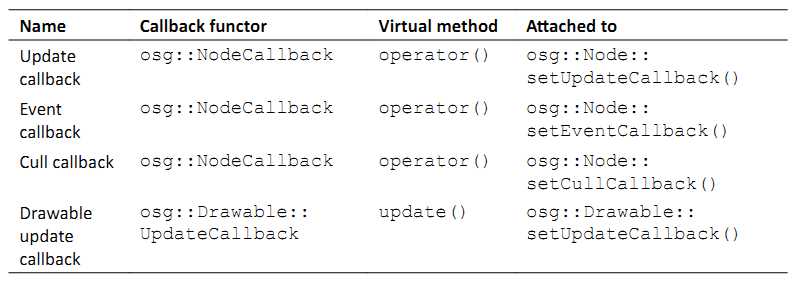

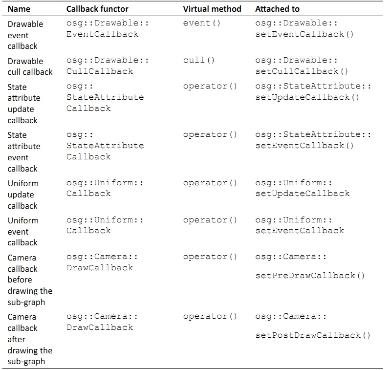

### Time for action - switching nodes in the update traversal

我们是否还记得在第5章中我们设计了一动画开关节点？他由osg::Switch派生，但是通过重写traverse()虚方法，依据一个内部计数器，自动改变其前两个子节点的状态。

现在我们要重做相同的任务，但是这次使用更新回调机制。这需要由osg::NodeCallback基类派生一个自定义类，并且重写operator()来执行回调实现中的操作。

1.  包含必需的头文件：

<!-- -->

    #include <osg/Switch>
    #include <osgDB/ReadFile>
    #include <osgViewer/Viewer>

2.  声明SwitchingCallback类。他是一个基于osg::NodeCallback的派生类，很快将会用作场景节点的更新，事件与裁剪回调。唯一要实现的虚方法是operator()。该方法会在场景图的更新，事件或裁剪遍历中被自动调用。另外，我们同时初始化成员变量\_counter作为内部计数器：

<!-- -->

    class SwitchingCallback : public osg::NodeCallback
    {
    public:
        SwitchingCallback() : _count(0) {}
        virtual void operator()( osg::Node* node,  
                                 osg::NodeVisitor* nv );

    protected:
        unsigned int _count;
    };

3.  operator()有两个输入参数：与回调相关联的节点，以及在遍历中调用函数的节点访问器。要实现两个子节点状态切换动画，我们需要将节点指针转换为osg::Switch类型。在这里使用static\_cast&lt;&gt;，因为我们确定相关联的节点是开关节点。同时，traverse()方法应在特定的位置处执行，以确保更新遍历访问器能继续遍历场景图。

<!-- -->

    void SwitchingCallback::operator()( osg::Node* node,
                                        osg::NodeVisitor* nv )
    {
        osg::Switch* switchNode = static_cast<osg::Switch*>( node );
        if ( !((++_count)%60) && switchNode )
        {
            switchNode->setValue( 0, !switchNode->getValue(0) );
            switchNode->setValue( 1, !switchNode->getValue(1) );
        }
        traverse( node, nv );
    }

4.  接下来的步骤已经在第5章中介绍过了。载入显示两个显示不同Cessna状态的模型，并将其放置在switch节点之下，该节点将会被用在自定义更新回调SwitchingCallback中：

<!-- -->

    SwitchingCallback:
    osg::ref_ptr<osg::Node> model1 = osgDB::readNodeFile(  
      "cessna.osg" );
    osg::ref_ptr<osg::Node> model2= osgDB::readNodeFile("cessnafire.
    osg");
    osg::ref_ptr<osg::Switch> root = new osg::Switch;
    root->addChild( model1.get(), false );
    root->addChild( model2.get(), true );

5.  不要忘记将更新回调关联到节点。如果我们厌倦了在每一帧中执行该回调，仅需要向setUpdateCallback()方法传递一个NULL参数。如果回调对象的引用计数减少到0，则该对象会被删除：

<!-- -->

    root->setUpdateCallback( new SwitchingCallback );

6.  现在启动查看器：

<!-- -->

    osgViewer::Viewer viewer;
    viewer.setSceneData( root.get() );
    return viewer.run();

7.  渲染结果完全类似于第5章中的Animating the switch
    node示例。Cessna将会交替处于完整与燃烧状态。与重写一个新节点类型相比，使用回调的解决方案对场景图影响更少，而且可以很容易的在运行时移除回调或是替换为其他的回调。

### What just happened?

目前为止我们已经处理了神奇的traverse()方法用于两个目的：通过重写traverse()方法自定义节点以用于我们自己的执行代码；调用osg::NodeVisitor类的traverse()方法以在实现节点访问器时继续遍历。尽管这两个操作具有不同的参数，他们实际上表示相同的处理管线。

首先，节点访问器的traverse()方法有一个osg::Node参数，简单调用traverse()虚方法并传递其自身作为参数。

其次，节点的遍历方法必须要实现的结束处调用超类的traverse()方法。然而他将确定是否有要使用当前访问器对象（使用子节点的accept()方法）遍历的子节点。

最后，访问器依次调用apply()虚方法来接收各种节点类型作为其参数，然后实现自定义的访问行为。因为每一个apply()方法必须调用访问器的traverse()方法来结束其自身，循环会回到第一步，直到整个场景图遍历完成。整个过程可以通过下面的图来解释：

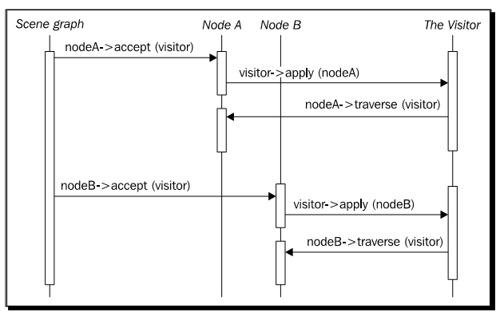

回调的operator()方法以第三种形式调用其traverse()方法，使用访问器与节点作为参数。然而，没有必要担心其复杂性，因为他所执行的唯一操作就是调用访问器的traverse()方法并继续遍历。如果我们在回调方法中调用失败，回调会简单停止并立即由当前节点返回。

### Pop quiz - adding or setting callbacks

除了setUpdateCallback()之外，addUpdateCallback()方法也可以用来将回调关联到场景节点。他会将新回调对象添加到主回调对象之后，从而使得在一个节点中存在多个回调成为可能。我们喜欢哪一种方式呢？我们能否确定在主回调对象的operator()方法中，嵌套回调将会何时执行呢？

Avoding confilicting modifications
----------------------------------

我们以一种非常简单而容易的方法讨论了OSG的多线程实现与线程安全。处理结构的理论超出了本书的范围。但是了显示维护场景对象数据多新性的重要性，我们需要简要讨论一个线程模型。

OSG可以使得绘制遍历，也就是将数据传送给OpenGL管线，在一个单独的线程中运行。他必须与每一帧中的其他绘制遍历相同步，但是绘制遍历的部分可以与来自下一帧的更新遍历相重叠，从而改善渲染效率并减少帧延迟。这意味着osgViewer::Viewer的frame()方法会在绘制工作依然处于活动状态时返回。那么更新回调中的数据变化也许会与未完成的渲染操作相冲突，从而导致不可预期的行为，甚至崩溃。

OSG在setDataVariance()方法中提供了解决方法，该方法属于osg::Object类，这是所有场景对象的基类。这可以设置为三个枚举值之一：UNSPECIFIED（默认），STATIC与DYNAMIC。场景图中的DYNAMIC对象必须在绘制遍历的开始进行处理。也就是，渲染后端应确保所有节点以及被指定为DYNAMIC的场景对象在下一帧的更新与裁剪遍历开始之前已完成绘制。然而，STATIC对象，在更新与绘制过程中会保持不变，从而会被稍后渲染且不会阻塞帧速率。

默认情况下，所有新分配的对象都被指定为UNSPECIFIED，包括节点，可绘制元素，状态集以及属性。这允许OSG预测数据变化。另一方面，我们总是可以重置该值并使其由下一帧开始工作，例如：

    node->setDataVariance( osg::Object::DYNAMIC );

### Time for action - drawing a geometry dynamically

动态修改几何体的顶点与基元属性是很常见的。我们可以改变每个顶点的位置，法线，颜色与纹理坐标，以及每一帧相关的基元，以实现各种动画类型。在修改过程中，关注数据的变化是很重要的，因为绘制遍历也许会与更新顶点与基元的更新遍历同时运行，从而会导致冲突甚至是崩溃。

在这个示例中，我们将会使用在第4章中所创建的四边形几何体。我们会简单的修改其最后一个顶点，并使其围绕X轴旋转，从而生成一个简单的动画效果。

1.  包含必需的头文件：

<!-- -->

    #include <osg/Geometry>
    #include <osg/Geode>
    #include <osgViewer/Viewer>

2.  四边形的创建对于我们非常熟悉。指定顶点，法线以及颜色数组，并添加基元集合来表示要安排的所有顶点，并使用GL\_QUAD类型进行渲染。最后，返回新分配的几何体对象：

<!-- -->

    osg::Geometry* createQuad()
    {
        osg::ref_ptr<osg::Vec3Array> vertices = new osg::Vec3Array;
        vertices->push_back( osg::Vec3(0.0f, 0.0f, 0.0f) );
        vertices->push_back( osg::Vec3(1.0f, 0.0f, 0.0f) );
        vertices->push_back( osg::Vec3(1.0f, 0.0f, 1.0f) );
        vertices->push_back( osg::Vec3(0.0f, 0.0f, 1.0f) );    
        osg::ref_ptr<osg::Vec3Array> normals = new osg::Vec3Array;
        normals->push_back( osg::Vec3(0.0f,-1.0f, 0.0f) );    
        osg::ref_ptr<osg::Vec4Array> colors = new osg::Vec4Array;
        colors->push_back( osg::Vec4(1.0f, 0.0f, 0.0f, 1.0f) );
        colors->push_back( osg::Vec4(0.0f, 1.0f, 0.0f, 1.0f) );
        colors->push_back( osg::Vec4(0.0f, 0.0f, 1.0f, 1.0f) );
        colors->push_back( osg::Vec4(1.0f, 1.0f, 1.0f, 1.0f) );    
        osg::ref_ptr<osg::Geometry> quad = new osg::Geometry;
        quad->setVertexArray( vertices.get() );
        quad->setNormalArray( normals.get() );
        quad->setNormalBinding( osg::Geometry::BIND_OVERALL );
        quad->setColorArray( colors.get() );
        quad->setColorBinding( osg::Geometry::BIND_PER_VERTEX );
        quad->addPrimitiveSet( new osg::DrawArrays(GL_QUADS, 0, 4) );
        return quad.release();
    }

3.  借助于osg::Drawable::UpdateCallback，我们可以很容易获取每一帧要修改的几何体指针。唯一要覆盖的方法是update()，该方法有一个节点访问器与一个可绘制元素指针作为参数。其超类，osg::Drawable::UpdateCallback，类似于osg::NodeCallback类，不同的是可绘制元素的回调不必遍历到所有子节点（没有子节点的可绘制元素）。

<!-- -->

    class DynamicQuadCallback : public osg::Drawable::UpdateCallback
    {
    public:
        virtual void update( osg::NodeVisitor*, osg::Drawable* 
    drawable );
    };

4.  在update()方法的实现中，我们使用static\_cast&lt;&gt;操作符读取所创建四边形几何体的顶点数组。如果DynamicQuadCallback类不仅被应用于osg::Geometry，而是同时应用于其他自定义的可绘制元素，则dynamic\_cast&lt;&gt;关键字也许更为安全。然后，我们使用osg::Quat四元数类快速围绕原点(0,0,0)旋转数组中的最后一个顶点。退出方法之前的最后一步工作是重新计算当前几何体的显示列表对象与边界盒子，当任何一个顶点被修改时，这些元素需要进行更新：

<!-- -->

    void DynamicQuadCallback::update( osg::NodeVisitor*,
                                      osg::Drawable* drawable )
    {
        osg::Geometry* quad = static_cast<osg::Geometry*>( drawable );
        if ( !quad ) return;    
        osg::Vec3Array* vertices = static_cast<osg::Vec3Array*>(
            quad->getVertexArray() );
        if ( !vertices ) return;    
        osg::Quat quat(osg::PI*0.01, osg::X_AXIS);
        vertices->back() = quat * vertices->back();

        quad->dirtyDisplayList();
        quad->dirtyBound();
    }

5.  我们将几何体定义为DYNAMIC，从而OSG后端的绘制遍历会自动指示动态对象来执行稳健的场景图遍历。另外，可绘制元素的修改回调是通过osg::Drawable类的setUpdateCallback()方法指定的：

<!-- -->

    osg::Geometry* quad = createQuad();
    quad->setDataVariance( osg::Object::DYNAMIC );
    quad->setUpdateCallback( new DynamicQuadCallback );

6.  现在将四边形几何体添加到osg::Geode节点，并将根节点关联到查看器：

<!-- -->

    osg::ref_ptr<osg::Geode> root = new osg::Geode;
    root->addDrawable( quad );
    osgViewer::Viewer viewer;
    viewer.setSceneData( root.get() );
    return viewer.run();

7.  这次四边形动起来了。借助于osg::Quat类，其第四个顶点围绕X轴旋转。这要比仅是在屏幕上显示一个静态的图像动态得多：

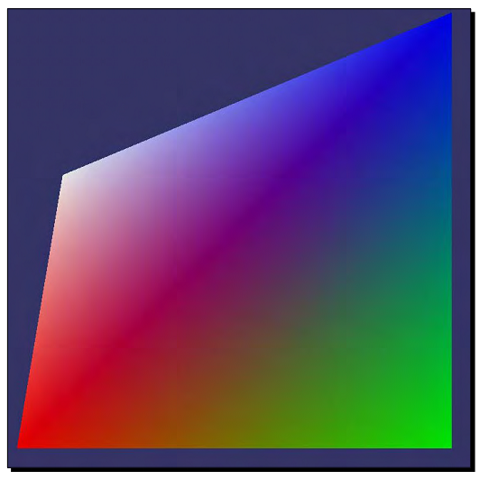

### What just happened?

试着移除setDataVariance()行并看一下会发生什么。奇怪的是示例依然能够正确运行，就如同他没有受到线程模型的影响。这是因为UNSPECIFIED对象能够确定他们是否在回调中被动态修改，并自动将数据变化重置为DYNAMIC。

试着将枚举DYNAMIC修改为STATIC，而我们会发现渲染会闪烁且在控制中中有OpenGL错误消息"invalid
operation"。这实际上是由线程冲突引起的。

如果没有调用dirtyDisplayList()方法，OSG将会忽略所有动态可绘制元素的变化并利用显示列表命令来存储前一个顶点与基元数据。同时，如果没有调用dirtyBound()方法，OSG不会知道边界盒子是否适合可绘制元素的尺寸，并且会在执行视图裁剪时出现错误。

### Have a go hero - dirtying geometry objects

为了进行正确渲染，我们需要调用dirtyDisplayList()方法来激活可绘制元素数据的更新。但是一个重要的先决条件是可绘制元素应支持显示列表模式，这是可绘制元素的默认行为，并且可以通过setUseDisplayList()方法打开或关闭。

当使用VBO模型时，OSG允许使用更好的机制，这会更为高效。打开setUseVertexBufferOjbects()并禁止setUseDisplayList()可以起作用。我们将会发现在该情况下dirtyDisplayList()方法没有起作用。通过执行dirty()方法可以污染数组数据，例如：

    osg::Vec3Array* vertices = ;
    // Dynamically modify the vertex array data
    vertices->dirty();

看一下我们的修改是否起作用，并在污染相同的几何体时标识两种策略之间的区别。事实上，在这里显示列表不起作用是因为他会在每一帧中重新生成。所以，对于渲染变化的几何体数据，我们更喜欢VBO。

Understanding ease motions
--------------------------

假定有一列火车在15分钟内由A站运行到B站。我们将会在更新回调中通过修改列车的变换矩阵来模拟这一场景。最简单的方法是将位于A站的火车放置在时间点0处，而位于B站的火车位于时间点15（分钟）处，并在变换过程中进行移动。在这里将会着重使用的方法是线性插值。该方法会在两个相邻采样点P0与P1之间绘制一条直线，并且返回直线上的相应点P，从而可以用来表示节点的变换与缩放操作。通常可以使用下面的形式进行表达：

    P = (1 - t) * P0 + t * P1

这里t是一个0到1之间的数。

不幸的是，列车的运动通常更为复杂。他由站点A出发，慢慢加速，以平滑的速度运行，减速，最终停靠在站点B。在这种情况下，线性插值总是有些不自然。

所以我们有简单的方法，或是简单的函数。这些是用来在两点这宰插值的数学函数。为了获得更为自然的效果，一个简单的函数通常不会生成非线性的结果。osgAnmination库定义了大量内建的简单函数。其中的每一个至少有两个参数：起如值（通常为0）与过程（通常为1），并生成该范围\[起始值，起始值+过程\]之内的结果。他们可以被应用起始（InMotion），结束（OutMotion）或同时应用到直动画的起始与结束（InOutMotion）。我们将会在下表中列出这些函数：

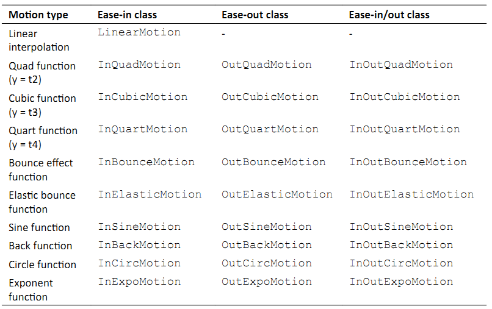

要创建一个线性插值运动对象，我们可以输入：

    // Start value is 0.0, and duration time is 1.0.
    osg::ref_ptr<osgAnimation::LinearMotion> motion =
        new osgAnimation::LinearMotion(0.0f, 1.0f);

OSG源码中的examples/osganimationeasemotion文件有助于我们以图形方式理解这些简单运动。要了解详细内容可以尝试编译并运行。

Animating the transformation nodes
----------------------------------

路径动画是图形程序中最广为使用的动画。他们可以用来描述运动的汽车，飞机，旋转的球，或是相机运动。路径应总是被首先设置，包括位置，旋转以及不同关键时刻节点的缩放值。当模拟循环运行时，使用为位置与缩放向量使用线性插值以及为旋转四元数据使用球形插值的方法计算每一帧的变换状态。这里内部使用osg::Quat的slerp()方法。

OSG提供了osg::AnimationPath类来封装时间变化变换路径。他有一个insert()方法可以用来在指定的时间点播放一个控制点。控制点由osg::AnimationPath::ControlPoint类所声明，接受一个位置值，一个可选的旋转与缩放值以构建动画路径。例如：

    osg::ref_ptr<osg::AnimationPath> path = new osg::AnimationPath;
    path->insert(t1, osg::AnimationPath::ControlPoint(pos1,rot1,scale1));
    path->insert(t2, …);

这里，t1与t2是以秒计的时间节点，而rot1是一个表示对象旋转的osg::Quat变量。

除此之外，我们可以使用setLoopMode()方法设置动画的循环模式。默认值为LOOP，也就是动画将会在设定好的路径上连续运行。这个参数可以修改为NO\_LOOPING（运行一次）或是SWING(创建一个往复路径)以用于其他目的。

然后，我们将osg::AnimationPath对象关联到内建的osg::AnimationPathCallback对象，该类实例上派生自osg::NodeCallback，并帮助开发者以直观的方式控制其动画场景。

### Time for action - making use of the animation path

现在我们要使得我们的Cessna绕着一个圆运动。他将在一个圆心位于(0,0,0)的圆内运动。通过关键帧之间的线性插值，路径被用来持续更新模型的位置与朝向。为了实现动画时间线，唯一的工作就是添加控制点，包括位置，可选择的旋转以及缩放关键值。

1.  包含必需的头文件：

<!-- -->

    #include <osg/AnimationPath>
    #include <osg/MatrixTransform>
    #include <osgDB/ReadFile>
    #include <osgViewer/Viewer>

2.  创建动画路径。这实际上是XOY平面上具有指定半径的圆。time参数被用来指定完成一圈所需要的时间。osg::AnimationPath对象被设置为无限循环动画。他包含32个控制点来构成圆路径，这是由局部变量numSamples来定义的：

<!-- -->

    osg::AnimationPath* createAnimationPath( float radius, float time)
    {
        osg::ref_ptr<osg::AnimationPath> path = new 
    osg::AnimationPath;
        path->setLoopMode( osg::AnimationPath::LOOP );

        unsigned int numSamples = 32;
        float delta_yaw = 2.0f * osg::PI / ((float)numSamples - 1.0f);
        float delta_time = time / (float)numSamples;
        for ( unsigned int i=0; i<numSamples; ++i )
        {
            float yaw = delta_yaw * (float)i;
            osg::Vec3 pos( sinf(yaw)*radius, cosf(yaw)*radius, 0.0f );
            osg::Quat rot( -yaw, osg::Z_AXIS );
            path->insert( delta_time * (float)i,
                          osg::AnimationPath::ControlPoint(pos, rot));
        }
        return path.release();    
    }

3.  载入Cessna模型。我们将会注意到这次与之前的文件名之间有着明显的区别。在这里字符串"0,0,90.rot"看起来是多余的。这是一种伪载入器，作为文件名的一部分，但实际上是使模型cessna.osg绕Z轴旋转90度。我们会在第10章中进行详细讨论：

<!-- -->

    osg::ref_ptr<osg::Node> model =
        osgDB::readNodeFile( "cessna.osg.0,0,90.rot" );
    osg::ref_ptr<osg::MatrixTransform> root = new 
    osg::MatrixTransform;
    root->addChild( model.get() );

4.  将动画路径添加到osg::AnimationPathCallback对象，并将回调关联到节点。注意，动画路径仅影响osg::MatrixTransform与osg::PositionAttitudeTransform节点，在更新遍历中更新其变换矩阵或是位置与旋转属性：

<!-- -->

    osg::ref_ptr<osg::AnimationPathCallback> apcb = new 
    osg::AnimationPathCallback;
    apcb->setAnimationPath( createAnimationPath(50.0f, 6.0f) );
    root->setUpdateCallback( apcb.get() );

5.  现在简单启动查看器：

<!-- -->

    osgViewer::Viewer viewer;
    viewer.setSceneData( root.get() );
    return viewer.run();

6.  现在Cessna开始做圆周运动。其运动也许会超出屏幕范围，所以我们需要使用相机操作器来切换到一个比初始位置更好的查看位置。使用鼠标按钮来调整视图矩阵从而全面观看所创建的动画路径：

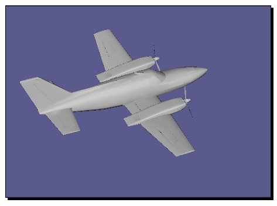

### What just happened?

osg::AnimationPath类使用getMatrix()方法依据指定时间点前与后的两个控制点来计算并返回运动变换矩阵。然而将其应用到主osg::MatrixTransform，osg::PositionAttitudeTransform或osg::Camera节点以使其沿着路径运行。这是由osg::AnimationPathCallback类完成的，该类实际上是用于特定目的的更新回调。

如果osg::AnimationPathCallback对象被关联到其他类型的节点，而不是前面所描述的变换节点，则他会变得无效。同时也不建议将动画路径回调用作事件或裁剪回调，因为这会导致不可预料的结果。

### Have a go hero - more controls over the animation path

动画必须能够被停止，重置与快进，从而使得用户的控制更为容易。osg::AnimationPathCallback类提供了reset()，setPause()，setTimeMultiplier()与setTimeOffset()方法来实现这些常见的操作。例如，要重置当前的动画路径，在任意时刻调用apcb：

    apcb->setPause( false );
    apcb->reset();

为了将时间偏移设置为4.0s，并且以2x倍速度快速前进动画，可以使用：

    apcb->setTimeOffset( 4.0f );
    apcb->setTimeMultiplier( 2.0f );

现在是我们是否明白应如何创建我们自己的路径动画层了吗？

Changing rendering states
-------------------------

渲染状态也可以进行动画。通过修改一个或是多个渲染属性可以生成大量的效果，包括渐进与渐出，大气的密度与变化，雾，修改光柱的方向等。我们可以很容易在更新回调中实现状态动画。我们可以由重载方法的参数中获取属性对象，或是仅将对象作为用户定义回调的成员变量。记住要使用智能指针来确保成员变量在不再被引用时会被自动销毁。

简单运动类可以用来改善动画质量。我们必须使用起始值与过程参数来分配一个简单运动对象，并使用间隔时间进行更新。例如：

    osg::ref_ptr<osgAnimation::LinearMotion> motion =
        new osgAnimation::LinearMotion(0.0, 10.0);
    motion->update( dt );
    float value = motion->getValue();

这会使用由0.0到10.0范围内的X轴创建一个线性运动对象。getValue()方法在当前的X值上使用特定的公式，并获取相应的Y值。

如果我们希望在我们的工程中使用简单运动以及更多的功能，我们砖雕要将osgAnimation库作为依赖添加进来。

我们已经体验过使用osg::BlendFunc类与渲染顺序来使得场景对象半透明。被称为alpha值的颜色向量的第四个组成部分会为我们提供技巧。但是如果我们有一个连续变化的alpha值时会发生什么呢？当alpha为0时将会完全透明（不可见），而当为1.0时则会完全不透明。因而由0.0到1.0的动画过程将会导致对象逐渐对查看者可见，也就是淡入效果。

更新回调可以用在该任务中。创建一个基于osg::NodeCallback的类并将其设置给将要淡入的类没有任何问题。但是状态属性回调，osg::StateAttributeCallback，在该示例中也可用。

在这里，osg::Material类被用来提供每一个几何顶点的alpha位，而不仅是设置颜色数组。

1.  包含必需的头文件：

<!-- -->

    #include <osg/Geode>
    #include <osg/Geometry>
    #include <osg/BlendFunc>
    #include <osg/Material>
    #include <osgAnimation/EaseMotion>
    #include <osgDB/ReadFile>
    #include <osgViewer/Viewer>

2.  要实例化osg::StateAttributeCallback，我们需要重写operator()方法，并利用其参数：状态属性本身与进行遍历的访问器。这里的另一个任务是使用立体函数在动画曲线的进入出位置声明一个简单运动插值器：

<!-- -->

    class AlphaFadingCallback : public osg::StateAttributeCallback
    {
    public:
        AlphaFadingCallback()
        { _motion = new osgAnimation::InOutCubicMotion(0.0f, 1.0f); }    
        virtual void operator()(osg::StateAttribute*,  
                                osg::NodeVisitor*);

    protected:
        osg::ref_ptr<osgAnimation::InOutCubicMotion> _motion;
    };

3.  在operator()中，我们将会获取场景对象的材质属性，该属性可以被用来模拟透明与半透明效果。这需要两步：首先，使用自定义的时间值差量更新简单运动对象；然后，获取0到1之间的运动结果，并将其应用到材质的混合颜色的alpha部分：

<!-- -->

    void AlphaFadingCallback::operator()( osg::StateAttribute* sa,
                                          osg::NodeVisitor* nv )
    {
        osg::Material* material = static_cast<osg::Material*>( sa );
        if ( material )
        {
            _motion->update( 0.005 );

            float alpha = _motion->getValue();
            material->setDiffuse( osg::Material::FRONT_AND_BACK,
                                  osg::Vec4(0.0f, 1.0f, 1.0f, alpha));
        }
    }

4.  这就是我们在osg::StateAttribute回调中的全部操作。现在，在示例的主函数中，我们要创建一个四边形并将回调应用于其材质。我们可以拷贝第4章与第6章中的代码来自己创建四边形几何体。OSG支持一个更为方便的名为osg::createTextureQuadGeometry()函数。他需要一个角点，一个宽度向量以及一个高度向量，并返回一个使用预设顶点，法线与纹理坐标数据的新创建的osg::Geometry对象：

<!-- -->

    osg::ref_ptr<osg::Drawable> quad = osg::createTexturedQuadGeomet
    ry(
        osg::Vec3(-0.5f, 0.0f, -0.5f),
        osg::Vec3(1.0f, 0.0f, 0.0f), osg::Vec3(0.0f, 0.0f, 1.0f)
    );
    osg::ref_ptr<osg::Geode> geode = new osg::Geode;
    geode->addDrawable( quad.get() );

5.  配置材质属性并没有什么特别的。如果有使用OpenGL
    glMaterial()的经验，我们可以很容易想见osg::Material类是如何使用类似的成员方法设置周边与混合颜色的。此时需要注意的是将AlphaFadingCallback对象关联到材质，并使其在每一帧的所有更新遍历中起作用：

<!-- -->

    osg::ref_ptr<osg::Material> material = new osg::Material;
    material->setAmbient( osg::Material::FRONT_AND_BACK,
                          osg::Vec4(0.0f, 0.0f, 0.0f, 1.0f) );
    material->setDiffuse( osg::Material::FRONT_AND_BACK,
                          osg::Vec4(0.0f, 1.0f, 1.0f, 0.5f) );
    material->setUpdateCallback( new AlphaFadingCallback );

6.  将材质属性及相关的模式添加到geode的状态集合。同时，我们需要使能OpenGL混合函数来实现我们的淡入效果，并且确保透明对象以顺序方式进行渲染：

<!-- -->

    geode->getOrCreateStateSet()->setAttributeAndModes(   
      material.get() );
    geode->getOrCreateStateSet()->setAttributeAndModes(
        new osg::BlendFunc(GL_SRC_ALPHA, GL_ONE_MINUS_SRC_ALPHA) );
    geode->getOrCreateStateSet()->setRenderingHint(
        osg::StateSet::TRANSPARENT_BIN );

7.  将四边形添加到根节点。我们同时添加滑翔机模型作为参考模型，其中的一半为四边形所覆盖，从而指示四边形是否淡入淡出：

<!-- -->

    osg::ref_ptr<osg::Group> root = new osg::Group;
    root->addChild( geode.get() );
    root->addChild( osgDB::readNodeFile("glider.osg") );

8.  现在启动查看器：

<!-- -->

    osgViewer::Viewer viewer;
    viewer.setSceneData( root.get() );
    return viewer.run();

9.  出入立体简单运动使得alpha的变以一种平滑的方式出现。我们将会发现他更适合于实现真实的动画而不是简单的线性插值运动。现在，我们是否知道如何使用相同的结构实现淡出效果呢？这两种效果被经常用于表示动态模型与大城市场景构建中：

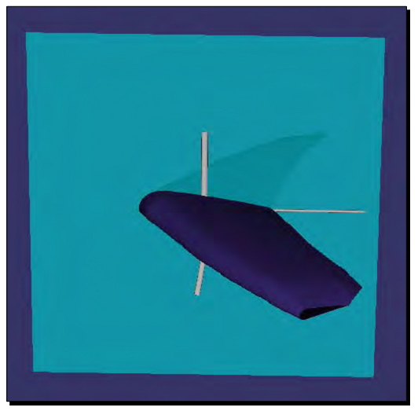

### What just happened?

osgAnimation::InOutCubicMotion类基于时间的立体形式生成值。结果曲线如下图所示：

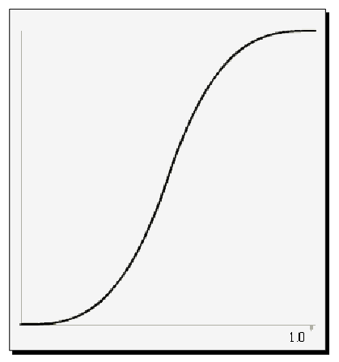

假定当前的时间值为t（位于X轴），运动对象会依据立体形式返回Y值。他会由零加速至半路，然后减速到零。这使得对象看起来更为自然，而不仅使用简单的常速。试着将其以及更多的简单运动应用到材质值，以及osg::MatrixTransform节点的路径动画（在自定义的节点回调中修改其矩阵）。

### Pop quiz - choosing the alpha setter and the callback

除了osg::Material类与osg::Geometry的颜色数组之外，还有哪些可以设置顶点的alpha值呢？除了osg::StateAttributeCallback之外，我们知道还有哪些回调可以用来控制淡入效果呢，例如，节点与可绘制元素回调？我们是否能以最简单的方式修改上面的示例来实现淡出效果呢？

### Have a go hero - animating in graphics shaders

在图形阴影器中使用状态动画会很酷。在大多数情况下，他要比固定管线更容易控制，并为我们提供各种效果的自由想像，例如海浪，波纹，火焰，阴影以及复杂的实际效果。

osg::Uniform类可以使用setUpdateCallback()方法以及osg::Uniform::Callback派生对象来定义其自己的更新回调。其虚方法operator()有两个输入参数：uniform指针与遍历访问器。使用set()方法来修改uniform值（必须与之前的类型相同）并且查看是否可以在图形阴影器中工作。

Playing movies on textures
--------------------------

如果我们能够在3D世界中观察影片或是存储影片内容将会非常有趣。我们可以将一个大的方块几何体放置为电影屏幕，并将一个动态2D纹理与其表面相关联。纹理包含构成影像的一系列图像。图像序列可以随时添加新的图像是所必需要，该图像可以来自文件或是微型相机。

OSG使用osg::ImageStream类来支持图像流，该类管理数据缓冲区中的子图像。他可以被派生从而由视频文件或是网络读取数据。事实上，OSG已经有一些内建的插件支持AVI，MPG，MOV以及其他文件格式的载入与播放。我们将会在第10章进行详细描述。

在这里，我们将会介绍另一个osg::ImageSequence类，该类存储多个图像对象并依次渲染。他具有下列的公共方法：

1.  addImage()方法向序列添加一个osg::Image对象。同时还有setImage()与getImage()方法操作指定索引处的子图像，以及getNumImages()方法统计子图像的数量。
2.  addImageFile()与setImageFile()方法可以将图像对象压入子图像列表的结尾处。但是无需指定指针，这两个方法都接受一个文件名参数，从而由磁盘读取子图像。
3.  setLength()方法设置以秒计的图像序列总时间。该时间在动画过程中每一个子图像之间平均分配的。
4.  setTimeMultiplier()方法设置时间乘数。默认为1.0，而更大的值指示序列应快进。
5.  play()，pause()，rewind()与seek()方法为开发者提供了对序列的基本控制。seek()方法接受一个时间参数，该参数应小于总时间长度。

### Time for action - rendering a flashing spotlight

渲染动态纹理的关键是提供多个图像作为源，并依次进行绘制。这些图像可以由一个视频文件获取，或是由开发者与艺术人员创建。在下面的示例中，我们将会使用变量的半径创建一系列的点光，并将其输出到osg::Image对象，然后使用osg::ImageSequence类将其关联到纹理属性来在特定的模型上生成闪烁效果。

1.  包含必需的头文件：

<!-- -->

    #include <osg/ImageSequence>
    #include <osg/Texture2D>
    #include <osg/Geometry>
    #include <osg/Geode>
    #include <osgViewer/Viewer>

2.  点光可以定义为将光束投影在空间上的一系列点。他通常生成围绕中心点的一个晕轮，而且可以被修改来使用不同的颜色与强度范围。这里，函数createSpotLight()使用中心颜色，背景颜色与强度参数简单生成一个osg::Image对象。size参数被用来定义图像本身的最终大小。在这里，data()方法接受列与行索引，并返回一个相对应的起始地址用于赋值：

<!-- -->

    osg::Image* createSpotLight( const osg::Vec4& centerColor,
                                 const osg::Vec4& bgColor,
                                 unsigned int size, float power )
    {
        osg::ref_ptr<osg::Image> image = new osg::Image;
        image->allocateImage( size, size, 1, GL_RGBA,  
                              GL_UNSIGNED_BYTE );    
        float mid = (float(size)-1) * 0.5f;
        float div = 2.0f / float(size);
        for( unsigned int r=0; r<size; ++r )
        {
            unsigned char* ptr = image->data(0, r);
            for( unsigned int c=0; c<size; ++c )
            {
                float dx = (float(c) - mid)*div;
                float dy = (float(r) - mid)*div;
                float r = powf(1.0f - sqrtf(dx*dx+dy*dy), power);
                if ( r<0.0f ) r = 0.0f;            
                osg::Vec4 color = centerColor*r + bgColor*(1.0f - r);
                *ptr++ = (unsigned char)((color[0]) * 255.0f);
                *ptr++ = (unsigned char)((color[1]) * 255.0f);
                *ptr++ = (unsigned char)((color[2]) * 255.0f);
                *ptr++ = (unsigned char)((color[3]) * 255.0f);
            }
        }
        return image.release();
    }

3.  通过使得的createSpotLight()函数，我们可以使用不同的强度值快速生成多个图像。然后我们将所有这些图像添加到osg::ImageSequence对象用于统一管理：

<!-- -->

    osg::Vec4 centerColor( 1.0f, 1.0f, 0.0f, 1.0f );
    osg::Vec4 bgColor( 0.0f, 0.0f, 0.0f, 1.0f );
    osg::ref_ptr<osg::ImageSequence> sequence = new  
      osg::ImageSequence;
    sequence->addImage( createSpotLight(centerColor, bgColor, 64,  
      3.0f) );
    sequence->addImage( createSpotLight(centerColor, bgColor, 64,  
      3.5f) );
    sequence->addImage( createSpotLight(centerColor, bgColor, 64,  
      4.0f) );
    sequence->addImage( createSpotLight(centerColor, bgColor, 64,  
      3.5f) );

4.  由于osg:ImageSequence是由osg::Image类派生的，他可以直接关联一个纹理作为数据源。这使得在模型表面持续显示图像成为可能：

<!-- -->

    osg::ref_ptr<osg::Texture2D> texture = new osg::Texture2D;
    texture->setImage( imageSequence.get() );

5.  再次使用osg::createTextureQuadGeometry()函数生成一个四边形。这被用来表示最终的图像序列。如果所有的图像均是由一个视频源中获取，他甚至是可以被看作是在电影中用于显示电影的屏幕。

<!-- -->

    osg::ref_ptr<osg::Geode> geode = new osg::Geode;
    geode->addDrawable( osg::createTexturedQuadGeometry(
        osg::Vec3(), osg::Vec3(1.0,0.0,0.0), osg::Vec3(0.0,0.0,1.0))  
      );
    geode->getOrCreateStateSet()->setTextureAttributeAndModes(
        0, texture.get(), osg::StateAttribute::ON );

6.  我们需要配置osg::ImageSequence对象来确定总长度（以秒计），并开始以顺序方式播放序列。这也可以在一个更新回调中完成：

<!-- -->

    imageSequence->setLength( 0.5 );
    imageSequence->play();

7.  启动查看器：

<!-- -->

    osgViewer::Viewer viewer;
    viewer.setSceneData( geode.get() );
    return viewer.run();

8.  我们可以看到一个点光在四边形中心闪烁。这是因为我们将具有不同半径的点光图像应用到序列，并循环播放（默认情况）。现在我们可以基于这个基本实现想像一些更为真实的效果：

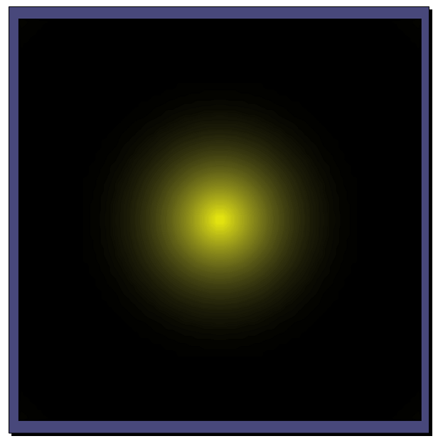

### What just happened?

osg::ImageSequence类在每一帧中由存储的图像更新当前的渲染数据。他使用setImage()方法来配置维度，格式以及像素数据，同时会污染自身－这会使得保存有图像的所有纹理对象更新图形内存并向渲染管线输出新数据。这并不高效，因为如果切换频繁，这会导致较高的CPU-GPU带宽使用的增加。

另一个有趣的地方是addFileName()与setFileName()方法。这两个方法使用磁盘上的图像文件来构成图像序列，并且在默认情况下所有这些文件一次载入。这可以通过setMode()方法进行修改。该方法接受下列参数中的一个：

1.  PRE\_LOAD\_ALL\_IMAGES会导致默认行为
2.  PAGE\_AND\_RETAIN\_IMAGES将会按需由文件载入图像
3.  PAGE\_AND\_DISCARD\_USED\_IMAGES会当影片重置时移除所有使用的图像并重新载入

所以，如果强制以分页机制载入图像，在启动循环之间设置模式：

    imageSequence->setMode( osg::ImageSequence::PAGE_AND_RETAIN_IMAGES );

Creating complex key-frame animations
-------------------------------------

现在我们可以进一步探讨osgAnimation库了。除了简单的运动实现，osgAnimation支持更多通用的动画特性，包括固体动画，变形动画，骨骼动画，基本的动画管理器以及时间线高度器。他定义了大量的概念与模板类，这些类看起来非常复杂，但是可以为开发者提供极大的灵活性来构建他们自己的高级动画。

具有了使用动画路径的基础之后，我们可以快速地理解osgAnimation的重要概念，并且由一个实现了与动画路径示例相同效果的示例入手。

动画的基本元素是关键帧。这定义了所有平滑动画的结束点。osg::AnimationPath使用ControlPoint类来创建位置，旋转与缩放值的关键帧。

一个关键帧通常需要两个参数：时间点以及要实现的时间。osgAnimation::TexmplateKeyframe&lt;&gt;类被用来定义osgAnimation库中的一个普通关键帧，而osgAnimation::TemplateKeyframeContainer&lt;&gt;类管理一个相同数据类型的关键帧列表。他派生自std::vector类并且继承了所有的vector方法，例如push\_back()，pop\_back()与迭代器。所以，要向一个位置关键帧添加到相应的容器对象，我们可以使用：

    osgAnimation::TemplateKeyframe<osg::Vec3> kf(0.0, osg::Vec3());
    osgAnimation::TemplateKeyframeContainer<osg::Vec3>* container =
        new osgAnimation::TemplateKeyframeContainer<osg::Vec3>;
    container->push_back( keyframe );

这里，osg::Vec3是关键帧与容器的模板参数。为了简化代码，我们可以简单的将模板类名替换为osgAnimation::Vec3KeyFrame与osgAnimation::Vec3KeyFrameContainer，也就是：

    osgAnimation::Vec3KeyframeContainer* container =
        new osgAnimation::Vec3KeyframeContainer;
    container->push_back( osgAnimation::Vec3Keyframe(0.0, osg::Vec3()) );

容器对象实际上由osg::Referenced派生，所以他也可以由智能指针进行管理。然后可以使用一个采样器使用定义了插值方法的算符在关键帧容器中插入元素。

osgAnimation::TemplateSampler&lt;&gt;定义了底层采样器模板。他包含一个内部插值器对象以及一个具有相同模板参数的osgAnimation::TemplateKeyframeContainer&lt;&gt;。采样器也具有别名。例如，osgAnimation::Vec3LinearSampler定义了一个包含osg::Vec3数据与线性插值器的采样器。其公共方法getOrCreateKeyframeContainer()可以随时返回一个正确的3D向量关键帧容器。

下表列出了osgAnimation名字空间内的采样器类型及其相关联的容器与关键帧类：

为了将关键帧添加到一个指定的采样器对象，只需要输入：

    // Again, assume it is a 3D vector sampler
    sampler->getOrCreateKeyframeContainer()->push_back(
        osgAnimation::Vec3Keyframe(0.0, osg::Vec3()) );  // Frame at 0s
    sampler->getOrCreateKeyframeContainer()->push_back(
        osgAnimation::Vec3Keyframe(2.0, osg::Vec3()) );  // Frame at 2s

Channels and animation managers
-------------------------------

现在是处理满是关键帧的采样器的时候了。osgAnimation::TemplateChannel&lt;&gt;类接受一个特定的采样器类作为参数，并表示采样器与目标的关联。通道的名字是通过setName()方法设置的，而其所查找的目标是由setTargetName()方法所定义的。

目标对象经常是osgAnimation内建更新回调。他们应使用setUpdateCallback()方法关联到特定节点。osgAnimation::UpdateMatrixTransform就是一个典型。他更新宿主osg::MatrixTransform节点，并使用每一帧的通道结果修改变换矩阵。我们可以在下面的示例中看到其用法。

一个包含3D向量采样器的通道可以替换为osgAnimation::Vec3LinearChannel类，而具有球形四元数据采样器的类被称为osgAnimation::QuatSphericalLinearChannel，等等。

在完成设计所有的关键帧与动画通道以后，构建我们动画场景的最后一步就是为所有通道声明管理器类。在此之前，我们定义osgAnimation::Animation类来包含一系列的动画通道，就如同他们位于相同的层。通道可以使用addChannel()方法被添加到动画对象。

osgAnimation::BasicAnimationManager类是所有动画对象的最终管家。他通过registerAnimation()，unregisterAnimation()与getAnimationList()方法管理osgAnimation::Animation对象，并通过playAnimation()，stopAnimation()与isgPlaying()方法控制一个或多个动画对象的播放状态。同时他也是一个更新回调，但是为了提供对整个场景图动画的完全控制，他应被设置到根节点。

整个过程可以通过下图进行描述：

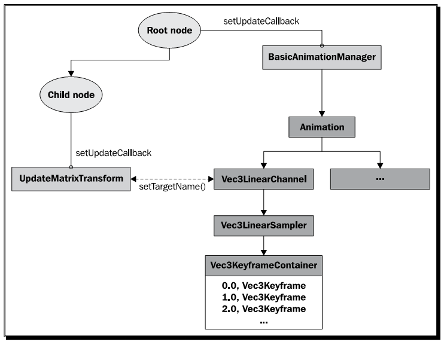

### Time for action - managing animation channels

为了实现与我们已经完成的动画路径示例相同的动画效果，我们需要创建两个通道，一个为位置动画目标，而另一个旋转动画目标。

围绕原点生成圆路径的createAnimationPath()函数可以被重用。但是并不能将位置与旋转值组合到一个控制点结构中，这两种类型的关键帧应被添加到属于不同动画通道的单独容器中。

1.  包含必需的头文件：

<!-- -->

    #include <osg/MatrixTransform>
    #include <osgAnimation/BasicAnimationManager>
    #include <osgAnimation/UpdateMatrixTransform>
    #include <osgAnimation/StackedTranslateElement>
    #include <osgAnimation/StackedQuaternionElement>
    #include <osgDB/ReadFile>
    #include <osgViewer/Viewer>

2.  createAnimationPath()的算法依然有用。唯一的区别在于所计算的值应被放置在不同类型的关键帧中（VecKeyFrame与QuatKeyFrame），然后添加到输入容器中：

<!-- -->

    void createAnimationPath( float radius, float time,
        osgAnimation::Vec3KeyframeContainer* container1,
        osgAnimation::QuatKeyframeContainer* container2 )
    {
        unsigned int numSamples = 32;
        float delta_yaw = 2.0f * osg::PI/((float)numSamples - 1.0f);
        float delta_time = time / (float)numSamples;
        for ( unsigned int i=0; i<numSamples; ++i )
        {
            float yaw = delta_yaw * (float)i;
            osg::Vec3 pos( sinf(yaw)*radius, cosf(yaw)*radius, 0.0f );
            osg::Quat rot( -yaw, osg::Z_AXIS );
            container1->push_back(
                osgAnimation::Vec3Keyframe(delta_time * (float)i, pos));
            container2->push_back(
                osgAnimation::QuatKeyframe(delta_time * (float)i, rot));
        }
    }

3.  在主函数中，我们首先声明一个“位置动画”通道与一个“旋转动画”通道（QuatSphericalChannel可以实现与osg::Quat的slerp()方法相同的效果）。其名字应是唯一的，而目的名字应与其更新器相同。否则，通道将不会被正确识别：

<!-- -->

    osg::ref_ptr<osgAnimation::Vec3LinearChannel> ch1 =
        new osgAnimation::Vec3LinearChannel;
    ch1->setName( "position" );
    ch1->setTargetName( "PathCallback" );
    osg::ref_ptr<osgAnimation::QuatSphericalLinearChannel> ch2 =
        new osgAnimation::QuatSphericalLinearChannel;
    ch2->setName( "quat" );
    ch2->setTargetName( "PathCallback" );

4.  如前面所描述的，通道的关键帧容器将会在createAnimationPath()函数中接收正确的动画数据：

<!-- -->

    createAnimationPath( 50.0f, 6.0f,
        ch1->getOrCreateSampler()->getOrCreateKeyframeContainer(),
        ch2->getOrCreateSampler()->getOrCreateKeyframeContainer() );

5.  现在我们来创建一个osg::Animation对象来包含这两个通道并定义其通用行为。setPlayMode()方法与osg::AnimationPath的setLoopMode()方法等同：

<!-- -->

    osg::ref_ptr<osgAnimation::Animation> animation = new 
    osgAnimation::Animation;
    animation->setPlayMode( osgAnimation::Animation::LOOP );
    animation->addChannel( ch1.get() );
    animation->addChannel( ch2.get() );

6.  动画已完成设置，但还没有被关联到任何场景元素。因为他将要影响变换节点，在这里我们需要创建一个变换更新器目标，来匹配动画的所有通道。其元素与通道通过相同的名字字符串处于一对一的关系：

<!-- -->

    osg::ref_ptr<osgAnimation::UpdateMatrixTransform> updater =
        new osgAnimation::UpdateMatrixTransform("PathCallback");
    updater->getStackedTransforms().push_back(
        new osgAnimation::StackedTranslateElement("position") );
    updater->getStackedTransforms().push_back(
        new osgAnimation::StackedQuaternionElement("quat") );

7.  Cessna借助于伪载入器被载入，并被位于osg::MatrixTransform父节点之下。变换动画可以应用于其上的变换父节点将会接受更新器作为更新回调。在这里数据变化确保动画处理总是安全的：

<!-- -->

    osg::ref_ptr<osg::MatrixTransform> animRoot= new 
    osg::MatrixTransform;
    animRoot->addChild( osgDB::readNodeFile("cessna.osg.0,0,90.rot") 
    );
    animRoot->setDataVariance( osg::Object::DYNAMIC );
    animRoot->setUpdateCallback( updater.get() );

8.  因为我们只有一个要插入的动画对象，一个基本管理器就足够了。下一步是创建一个osgAnimation::BasicAnimationManager对象并向其注册动画：

<!-- -->

    osg::ref_ptr<osgAnimation::BasicAnimationManager> manager =
        new osgAnimation::BasicAnimationManager;
    manager->registerAnimation( animation.get() );

9.  管理器也是一个更新回调，所以将其关联到场景图的根节点：

<!-- -->

    osg::ref_ptr<osg::Group> root = new osg::Group;
    root->addChild( animRoot.get() );
    root->setUpdateCallback( manager.get() );

10. 现在播放动画。当然，我们也可以将下面的代码放在一个自定义回调中：

<!-- -->

    manager->playAnimation( animation.get() );

11. 启动查看器：

<!-- -->

    osgViewer::Viewer viewer;
    viewer.setSceneData( root.get() );
    return viewer.run();

12. 结果与动画路径完全相同。使用如此多的对象实现这样的一个简单的动画似乎有一些复杂。我们这里介绍这个示例仅是演示osgAnimation元素的整体结构，并希望能够激发更多的灵感。

### What just happened?

这里osgAnimation::UpdateMatrixTransform对象是两个动画通道的目标，因为其名字PathCallback是在构造函数中设置，也被用于通道的setTargetName()方法。

但是这并不够。更新器应该知道每一个通道将会执行哪一个动作，并将通道链接到正确的动作处理器。例如，osgAnimation::Vec3LinearChannel对象可以被用来表示3D位置，或是实现旋转的欧拉角。要判断他将会被应用于实际任务，我们需要将某些堆叠的元素压入更新，每一个元素与一个预定义的通道相关联。这是通过添加到由getStackedTransforms()方法所返回的列表来实现的，该列表间接派生于std::vector。

可用的堆叠元素包含StackedTranslateElement（变换动作），StackedScaleElement（缩放动作），StackedRotateAxisElement（欧拉旋转动作），StackedQuaternionElement（四元数旋转操作）以及StackedMatrixElement（矩阵赋值操作）。所有这些类定义在osgAnimation名字空间中，并且被链接到相同名字的通道。

Loading and rendering characters
--------------------------------

osgAnimation库具有实现特征动画的特定类。osgAnimation::Bone与osgAnimation::Skeleton类被用来构建场景图中的完整骨骼。osgAnimation::UpdateBone类定义了如何由动画通道更新骨骼。

不幸的是，在OSG中构建我们自己的特征并不容易，特别是完全从头开始时。一个较为简单的方法就是由文件载入特征模式并在我们的OSG程序中进行播放。Collada
DAE是一个初学者可以用来创建并保存动画特征的格式。我们可以在https://collada.org找到更多关于开放标准与工具的信息。

Autodesk FBX也是一个很好的文件格式，但是他只能为商业软件所支持。

OSG可以通过osgDB::readNodeFile()函数同时读取两种格式，假定我们有第三方库并且编译了相应的OSG插件。要详细了解如何实现可以参考第10章。

### Time for action - creating and driving a character system

现在我们要载入并播放已有的OSG人物，bignathan，动画。这是由osgAnimation作者创建的，并包含一系列的滑稽动画。在这里要执行的主要操作是由根节点获取动画管理器，列出所有可用的动画，并在其中播放特定的动画。

1.  包含必需的头文件：

<!-- -->

    #include <osgAnimation/BasicAnimationManager>
    #include <osgDB/ReadFile>
    #include <osgViewer/Viewer>
    #include <iostream>

2.  我们要为程序配置两个参娄。参数--animation指定要在程序中播放的动画，而--listall在控制台列出所有可用的动画：

<!-- -->

    osg::ArgumentParser arguments( &argc, argv );
    bool listAll = false;
    std::string animationName;
    arguments.read( "--animation", animationName );
    if ( arguments.read("--listall") ) listAll = true;

3.  确保载入bignathan.osg；否则，我们不能继续该示例。他应位于由环境变量OSG\_FILE\_PATH所定义的示例数据目录中。我们可以通过运行安装器或是通过查找OSG网站来获取：

<!-- -->

    osg::ref_ptr<osg::Node> model =  
      osgDB::readNodeFile("bignathan.osg");
    if ( !model ) return 1;

4.  试着由根模型的更新回调中获取动画管理器：

<!-- -->

    osgAnimation::BasicAnimationManager* manager =
        dynamic_cast<osgAnimation::BasicAnimationManager*>
        ( model->getUpdateCallback() );
    if ( !manager ) return 1;

5.  现在迭代管理中所记录的所有动画。如果由命令行读取了--listall参数，则每个动画的名字也要输出到屏幕上。播放与--animation参数后的输入参数匹配的动画：

<!-- -->

    const osgAnimation::AnimationList& animations =
        manager->getAnimationList();
    if ( listAll ) std::cout << "**** Animations ****" << std::endl;
    for ( unsigned int i=0; i<animations.size(); ++i )
    {
        const std::string& name = animations[i]->getName();
        if ( name==animationName )
            manager->playAnimation( animations[i].get() );
        if ( listAll ) std::cout << name << std::endl;
    }
    if ( listAll )
    {
        std::cout << "********************" << std::endl;
        return 0;
    }

6.  启动查看器：

<!-- -->

    osgViewer::Viewer viewer;
    viewer.setSceneData( model.get() );
    return viewer.run();

7.  启动命令行。第一步是列出所有的动画并了解一下哪一个更为有趣。输入下面的命令并查看输出（假定可执行文件名为MyProject.exe）：

<!-- -->

    # MyProject.exe --listall

输出结果如下所示：

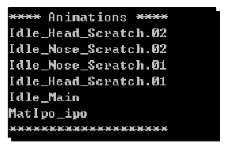

8.  使用--animation参数输入下面命令：

<!-- -->

    # MyProject.exe --animation Idle_Head_Scratch_01

9.  现在我们会看到一个一直在抓头的多边形男孩：

### What just happened?

也许我们更希望创建能够运动的人物，而不是将其载入OSG中并开始渲染。但是这超出了本书的范围。有大量的3D建模软件可供我们使用：Autodesk
3dsmax，Autodesk
Maya，Blender等。可以试着将我们的工作输出为FBX格式，或是我们可以选择通过某些导出工具，例如Cedric
Pinson的Blender
Exporter，将其转换为OSG原生格式：http://hg.plopbyte.net/osgexport/
。这是由Mercurial控制的，这是一个非常流行的源码控制管理工具。

除了osgAnimation中的人物解决方案以外，还有更多处理人物动画的第三方工程。其中一个就是所谓的Cal3D工程。这有一个名为osgCal2的OSG封装工程。建议我们可以查看下面的网站来了解一下他们是否更适合我们的程序：

-   <http://cal3d.sourceforge.net/>
-   <http://osgcal.sourceforge.net/>

### Have a go hero - analyzing the structure of your character

我们是否对bignathan的结构感兴趣？正如前面所介绍的，他应该是由osgAnimation::Bone与osgAnimation::Skeleton类构成的，这两者实际上是节点。所以，节点访问器可以用来分析场景图并了解一下他是如何组织与遍历的。

修改第5章中的访问器示例，并用来查看与操作人物文件中的所有骨骼节点。一个建议就是我们可以读取与每一个osgAnimation::Bone节点相关联的更新回调，而如果可能，将bignathan用作参数构建我们自己的biped。他们通常具有相同的骨架。

Summary
-------

OSG支持可以应用到3D程序中的所有动画类型。最常见的是在时间上变换，这可以通过修改空间状态或是3D对象的渲染来实现，而所谓的关键帧动画被设计用来通过在帧之间进行插值实现平滑运动。骨骼系统是特征动画的关键，其中mesh被用来配置预构建的骨骼。

在本章中我们介绍了OSG动画类的功能，特殊探讨了：

-   避免冲突修改的原因与方法，特别是当创建动态几何体时。
-   派生回调基类，包括osg::nodeCallback，osg::StateAttributeCallback等。
-   通过使用osg::AnimationPath与osg::AnimationPathCallback类在路径动画中插入变换值。
-   使用简单运动类，例如osgAnimation::LinearMotion与osgAnimation::InOutCubicMotion来实现自然运动效果。
-   使用osg::ImageSequence类生成动画纹理。
-   如何通过使用osgAnimation库以及动画通道与控制方法创建复杂通用的关键帧动画。

