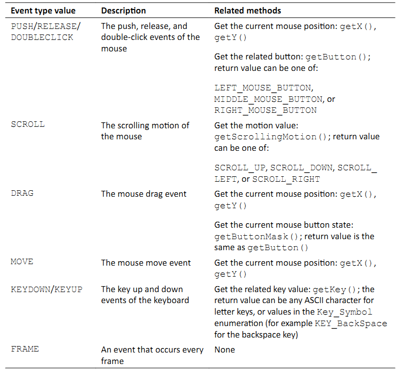
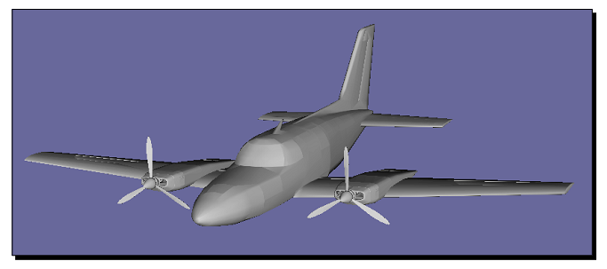
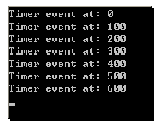
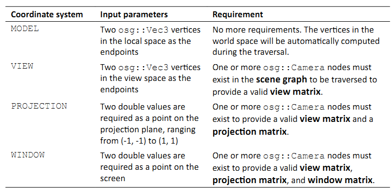
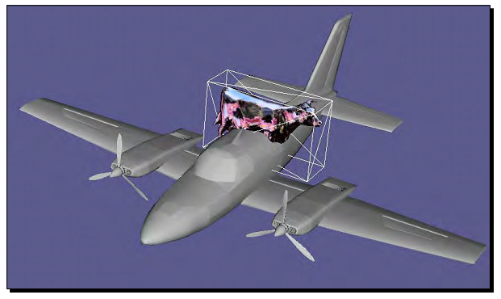
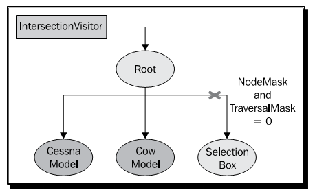
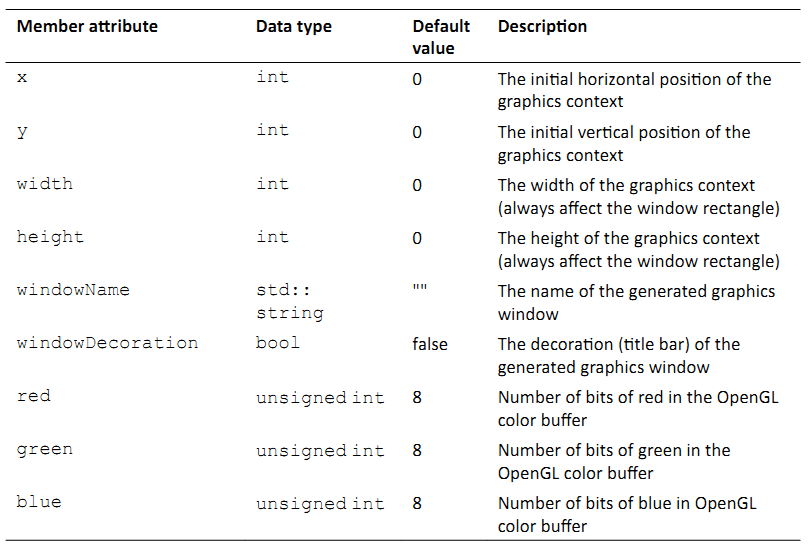
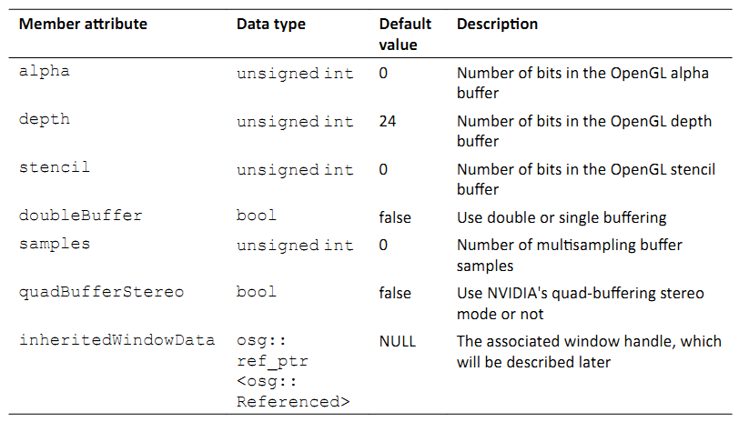
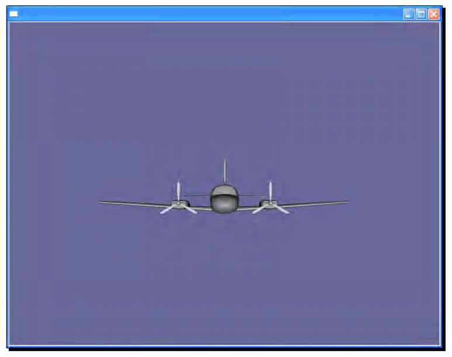
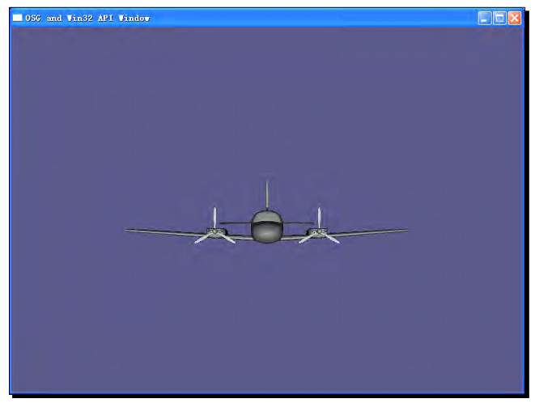

Chatper 9: Interacting with Outside Elements
============================================

OSG提供了一个集中各种不同窗口系统（MFC，Qt，GLUT等）实现方式的图形用户界面（GUI）抽象库。他处理GUI事件，其中最常见的就是与外围设备，例如鼠标与键盘，的用户实时交互。另外，osgViewer库封装了用于构建渲染环境的不同窗口系统的图形环境。这些构成了本章的主题：OSG如何与其他元素交互－例如，输入设备与窗口系统。

在本章中，我们将会介绍：

-   如何使用自定义事件处理器处理键盘与杂志事件
-   如何创建并处理用户定义事件
-   如何理解场景对象的交互测试
-   如何配置窗口特点从创建图形环境
-   如何将渲染的场景集成到窗口系统

Various events
--------------

图形用户界面（GUI）是一个接口对象类型，允许计算机用户通过所谓的GUI事件以多种方式与程序进行交互。存在多种可以用来相应用户操作响应的事件类型，例如，移动鼠标，点击鼠标按钮，按下键盘，调整窗口大小，以及事件等待直到最终期限。

在今天的GUI框架中，总是定义部件元素来接收用户动并将其传递给事件处理器对象。后者是由高层开发者编写来实现特定功能。例如，要在点击Browse按钮时弹出一个对话框，或是当按下S键时将当前文本编辑器的内容保存到文件。

不幸的是，大多数框架，包括Windows下的MFC与.NET，Linux下的GTK+，Mac
OSX下的Cocoa，以及如Qt和wxWidgets这样的跨平台系统，彼此之间不是兼容的。所以在OSG程序中直接使用非常不方便。相反，OSG为希望处理GUI事件的用户了一个基本接口，名为osgGA::GUIEventHandler。

事件处理器应使用查看器的addEventHandler()方法将其关联到场景查看器，并通过removeEventHandler()方法移除。这是一种在事件遍历过程中会被自动调用的回调类型，我们在第5章中对回调进行了介绍。

当继承osgGA::GUIEventHandler来实现我们自己的事件处理器时，最重要的工作是重写handle()方法。这个方法有两个参数：提供所接收事件的osgGA::GUIEventAdapter参数，以及用于回馈的osgGA::GUIActionAdapter参数。该方法可以写为如下形式：

    bool handle( const osgGA::GUIEventAdapter& ea,
                 osgGA::GUIActionAdapter& aa )
    {
        // concrete operations
    }

osgGA::GUIEventAdapter类将会在下一节进行介绍。osgGA::GUIActionAdapter允许处理器请求GUI执行某种动作以响应所接收的事件。大多数情况下，这实际上可以被看作查看器对象。这是因为osgViewer::Viewer类也是由osgGA::GUIActionAdapter派生。dynamic\_cast&lt;&gt;操作符可以用在这里以安全的方式执行转换：

    osgViewer::Viewer* viewer = dynamic_cast<osgViewer::Viewer*>(&aa);

这里，aa是osgGA::GUIEventHandler的handle()方法的输入参数。

Handling mouse and keyboard inputs
----------------------------------

osgGA::GUIEventAdapter类管理所有OSG所支持的事件类型，包括其设置与获取方法。getEventType()方法返回存储在事件适配器中的当前GUI事件。每次当handle()方法被调用时，我们需要首先对其进行检测以及确定事件类型并采用相应的对策。

下表显示了OSG中的主要事件类型，以及用来获取必需事件参数的相关方法：

还有另一个getModKeyMask()方法可以在用来在移动或点击鼠标或在键盘上按下键时用来获取当前的修饰符键。返回值是与相应值的位或结果，包括MODKEY\_CTRL，MODKEY\_SHIFT，MODKEY\_AT，等。所以我们可以使用下面的代码片段来检测Ctrl键是否被按下：

    if ( ea.getModKeyMask()&osgGA::GUIEventAdapter::MODKEY_CTRL )
    {
       // Related operations
    }

注意所有与上面获取方法相对应的设置方法，包括setEventType()，setX()，setY()等，并不适合用在handle()实现中。他们通常为OSG的底层图形窗口系统用来将新事件到事件队列中。

### Time for action - driving the Cessna

我们已经了解了如何通过osg::MatrixTransform节点来修改节点的变换矩阵。借助于osg::AnimationPath类与osgAnimation名字空间，我们可甚至可以在这些可变换的对象上创建动画效果。但是这对于交互场景来说并不够。我们进一步的要求是通过用户输入设备控制场景图节点。想像一下在现代的战争游戏中，我们有一个潜水艇，一辆坦克或是熟悉的Cessna。如要我们能够通过键盘，鼠标来模拟驱动这些设备，那才是真正令人激动的。

1.  包含必需的头文件：

<!-- -->

    #include <osg/MatrixTransform>
    #include <osgDB/ReadFile>
    #include <osgGA/GUIEventHandler>
    #include <osgViewer/Viewer>

2.  我们的任务是通过某些按键控制Cessna模型。要处理这些用户事件，我们需要声明一个ModelController类，该类派生自osgGA::GUIEventHandler基类，并重写handle()方法来确保所有的用户事件被作为osgGA::GUIEventAdapter对象传递进来。模型指针也被包含在处理器类中；否则没有办法来区别要控制哪一个模型：

<!-- -->

    class ModelController : public osgGA::GUIEventHandler
    {
    public:
        ModelController( osg::MatrixTransform* node ) 
    : _model(node) 
    {} 
        virtual bool handle( const osgGA::GUIEventAdapter& ea,
                             osgGA::GUIActionAdapter& aa );

    protected:
        osg::ref_ptr<osg::MatrixTransform> _model;
    };

3.  在handle()方法的实现中，我们要修改成员变量\_model的欧拉角，这可以变换表示Cessna或是其他模型的节点。特征按键w，s，a与d通过KEYDOWN事很描述战机的前进与旋转。当然，功能按键与浏览按键，包括KEY\_LEFT，KEY\_RIGHT等，也可以在这里使用：

<!-- -->

    bool ModelController::handle( const osgGA::GUIEventAdapter& ea,
                                  osgGA::GUIActionAdapter& aa )
    {
        if ( !_model ) return false;
        osg::Matrix matrix = _model->getMatrix();

        switch ( ea.getEventType() )
        {
        case osgGA::GUIEventAdapter::KEYDOWN:
            switch ( ea.getKey() )
            {
            case 'a': case 'A':
                matrix *= osg::Matrix::rotate(-0.1f, osg::Z_AXIS);
                break;
            case 'd': case 'D':
                matrix *= osg::Matrix::rotate(0.1f, osg::Z_AXIS);
                break;
            case 'w': case 'W':
                matrix *= osg::Matrix::rotate(-0.1f, osg::X_AXIS);
                break;
            case 's': case 'S':
                matrix *= osg::Matrix::rotate(0.1f, osg::X_AXIS);
                break;
            default:
                break;
            }
            _model->setMatrix( matrix );
            break;
        default:
            break;
        }
        return false;
    }

4.  在主函数中，我们首先载入Cessna模型并将其添加到osg::MatrixTransform父节点。父节点将会被用作被控对象，并传递给ModelController处理器实例：

<!-- -->

    osg::ref_ptr<osg::Node> model = osgDB::readNodeFile( "cessna.osg" 
    );
    osg::ref_ptr<osg::MatrixTransform> mt = new osg::MatrixTransform;
    mt->addChild( model.get() );
    osg::ref_ptr<osg::Group> root = new osg::Group;
    root->addChild( mt.get() );

5.  初始化模型控制器并传递变换节点作为参数：

<!-- -->

    osg::ref_ptr<ModelController> ctrler =
        new ModelController( mt.get() );

6.  我们并不希望在该示例中使用相机操作器，因为当使用键盘与鼠标时，他也会影响查看器的模型视图矩阵，并且混肴GUI事件的处理结果。所以，除了添加所创建的事件处理器之外，我们通过setAllowEventFocus()方法来阻止主相机接收任何用户事件，并由我们自己来设置合适的视图矩阵（因为现在操作器不能联系到相机）：

<!-- -->

    osgViewer::Viewer viewer;
    viewer.addEventHandler( ctrler.get() );
    viewer.getCamera()->setViewMatrixAsLookAt(
        osg::Vec3(0.0f,-100.0f,0.0f), osg::Vec3(), osg::Z_AXIS );
    viewer.getCamera()->setAllowEventFocus( false );

7.  现在启动查看器：

<!-- -->

    viewer.setSceneData( root.get() );
    return viewer.run();

8.  我们将会发现相机操作器（其默认行为类似于轨迹球）失去对主相机的控制，并且现在鼠标按钮不能浏览场景图。然而，现在按下四个按键将会影响Cessna模型。注意，这里的键盘事件仅作用于模型节点，而不会作用于整个场景图。我们可以向根节点添加另一个固定节点并看一下他是否会发生变化：

### What just happened?

事件处理器可以用于多种目的。在处理器回调中，我们可以移动并旋转可变换节点，记录动画路径，向父节点添加或是由父节点移除节点，计算帧速率与可用内存，以及执行其他我们所希望的操作。他是在事件遍历中触发的，因而他对于动态数据修改总是安全的。

这里一个有趣的问题是如何确定handle()方法的返回值。这里所要求的布尔值被用于指示事件是否已经被处理。如果返回true，OSG认为该用户事件不再为后续的处理器所需要，包括相机操作器。该事件将会被标记为“已处理”，并且在默认情况下会为其他的处理器或事件回调所忽略。在本书的大多数盒子中，我们并不希望该行为。所以在该示例以及后续示例中会毫无疑问的返回false。

### Pop quiz - handling events within nodes

类似于更新回调，OSG同时会使用setEventCallback()与addEventCallback()方法允许事件回调被发送到节点与可绘制元素，两个方法都会接受一个osg::NodeCallback指针作为唯一参数。要在重写的operator()方法中获取事件变量，我们仅需要将节点访问器转换为osg::EventVisitor指针：

    #include <osgGA/EventVisitor>

    void operator()( osg::Node* node, osg::NodeVisitor* nv )
    {
        std::list< osg::ref_ptr<osgGA::GUIEventAdapter> > events;
        osgGA::EventVisitor* ev = dynamic_cast<osgGA::EventVisitor*>(nv);
        if (ev) events = ev->getEvents();
        // Handle events with the node
    }

我们能够区别使用节点回调与事件处理器之间主要区别吗？使用自定义的事件回调在变换节点上重新生成该示例是否更好？

### Have a go hero - manipulating the cameras

无论是否相信，osgGA::CameraManipulator类也有一个名为handle()的虚方法。这实际上是由osgGA::GUIEventHandler派生，但是并不适合通过addEventHandler()方法添加到查看器。他通过调用getInverseMatrix()虚方法浏览主相机，该方法会计算操作器的逆矩阵，也就是视图矩阵，并在更新遍历中通过setViewMatrix()方法设置到主相机。所有的OSG操作器，包括用户自定义的操作器，都应重写该方法以确保他们能够正常工作。

osgGA::CameraManipulator类同时提供了setByMatrix()与getMatrix()虚方法，这两个方法可以重写为指定的矩阵或是获取矩阵。试着重写这些方法来生成我们自己的相机操作器。标准操作器，包括osgGA::TrackballManipulator，以及其他的操作器，可以作为该行为的参考。

Adding customized events
------------------------

OSG使用内部事件队列在先进先出（FIFO）列表中管理到来的GUI事件。列表头的事件将会被首先处理，然后由列表中删除。也就是，每一个所添加的事件处理器的handle()方法的执行次数与事件队列的大小相同。事件队列类，名为;osgGA::EventQueue，允许新事件在任何时刻使用addEvent()方法被压入。其参数是一个osgGA::GUIEventAdapter指针，该参数使用设置方法，如setEventType()与setButton()来定义其行为。

还有一些其他的osgGA::EventQueue类的方法可以被用来快速设置与添加新GUI事件。其中一个就是userEvent()方法，该方法使用用户数据指针作为参数来适配用户定义事件。这个用户数据可以用来表示任意的自定义事件类型，例如，在下一节中将要描述的计时器事件。

并没有必要创建一个全新的事件队列对象。查看器类已经定义了一个可以进行操作的事件队列：

    viewer.getEventQueue()->userEvent( data );

这里，变量data是一个由osg::Referenced派生的对象。在添加这个新事件之后，事件处理器将会接收一个USER事件，而开发者可以由处理器的getUserData()方法进行读取并执行所希望的操作。

### Time for action - creating a user timer

当内部计数器到达指定的时间间隔时会触发计时器事件。这常见于各种GUI系统中，并且允许用户设置一个自定义的计时器回调来接收计时消息并实现相关的操作。

现在我们在OSG中能够实现相同的任务。因为在osgGA::GUIEventAdapter类中并没有定义标准的计时器事件，我们需要利用USER事件类型以及额外的数据指针。

1.  包含必需的头文件：

<!-- -->

    #include <osg/Switch>
    #include <osgDB/ReadFile>
    #include <osgGA/GUIEventHandler>
    #include <osgViewer/Viewer>
    #include <iostream>

2.  首先定义TimerInfo结构来管理计时器事件的参数（主要是计时器的触发时机）。我们需要将这个osg::Referenced派生指针关联到userEvent()方法，因为他是区分不同自定义事件的唯一元素：

<!-- -->

    struct TimerInfo : public osg::Referenced
    {
        TimerInfo( unsigned int c ) : _count(c) {}
        unsigned int _count;
    };

3.  TimerHandler被用于处理计时器对象与计时器事件。我们希望在每次接收到该事件时在Cessna模型的正常与燃烧状态之间进行切换。在第5章与第8章中，这是通过自定义osg::Node类与更新回调来实现的。但是这次我们将会尝试使用以osg::Switch指针作为参数的事件处理器来实现：

<!-- -->

    class TimerHandler : public osgGA::GUIEventHandler
    {
    public:
        TimerHandler( osg::Switch* sw ) : _switch(sw), _count(0) {} 
        virtual bool handle( const osgGA::GUIEventAdapter& ea,
                             osgGA::GUIActionAdapter& aa );

    protected:
        osg::ref_ptr<osg::Switch> _switch;
        unsigned int _count;
    };

4.  在重写的handle()方法有两种类型的事件需要处理。FRAME事件会自动为每一帧所触发，并且可以用来管理与增加内部计数器，当时机成熟时会向事件队列发送userEvent()。在该示例中，我们假定计时器事件在计数到100时触发。另一个是USER事件，该事件除了作为“用户数据”来指示计时器及其计数的TimerInfo对象以外不包含任何其他信息。这里，我们将会输出计数值并在变量\_switch的子节点之间切换：

<!-- -->

    bool TimerHandler::handle( const osgGA::GUIEventAdapter& ea,
                               osgGA::GUIActionAdapter& aa )
    {
        switch ( ea.getEventType() )
        {
        case osgGA::GUIEventAdapter::FRAME:
            if (_count % 100 == 0 )
            {
                osgViewer::Viewer* viewer =
                     dynamic_cast<osgViewer::Viewer*>(&aa);
                if ( viewer )
                {
                    viewer->getEventQueue()->userEvent(
                        new TimerInfo(_count) );
                }
            }
            _count++;
            break;
        case osgGA::GUIEventAdapter::USER:
            if ( _switch.valid() )
            {
                const TimerInfo* ti =
                    dynamic_cast<const TimerInfo*>( ea.getUserData() 
    );
                std::cout << "Timer event at: " <<ti->_count<<  
                std::endl;

                _switch->setValue( 0, !_switch->getValue(0) );
                _switch->setValue( 1, !_switch->getValue(1) );
            }
            break;
        default:
            break;
        }
        return false;
    }

5.  在主函数中，我们简单创建一个切换节点，该节点包含一个正常的Cessna模型与一个燃烧的Cessna模型：

<!-- -->

    osg::ref_ptr<osg::Node> model1= osgDB::readNodeFile("cessna.osg");
    osg::ref_ptr<osg::Node> model2= osgDB::readNodeFile("cessnafire.osg");
    osg::ref_ptr<osg::Switch> root = new osg::Switch;
    root->addChild( model1.get(), false );
    root->addChild( model2.get(), true );

6.  将计时器事件发送与处理器添加到查看器，并启动：

<!-- -->

    osgViewer::Viewer viewer;
    viewer.setSceneData( root.get() );
    viewer.addEventHandler( new TimerHandler(root.get()) );
    return viewer.run();

7.  正如我们多次看到的，Cessna在完整与燃烧之间切换。另外，在控制台屏幕上会有消息输出，通知我们计时器何时被触发：

### What just happened?

在这里我们利用FRAME事件并将用户事件发送到事件队列。这会导致有些复杂的体系结构：事件的发送者与接收者是同一个TimerHandler类。这类似于发信人与接收人是同一个人。

事实上，我们可以避免该问题。发送用户事件的时机是由每一帧决定的。一个新用户事件可以在更新与裁剪遍历中的任何时刻被添加到事件队列。也就是，回调，自定义节点与可绘制元素都可以被用作事件发送器，而不仅仅是事件处理器本身。这使得获取与处理如操纵杆与数据手套这样的复杂事件成为可能。使用必要的信息声明一个名为JoyStickInfo或是DataGloveInfo的结构，设置其属性，在更新回调中使用结构实例发送用户事件，并在处理器中处理用户事件。这是我们利用用户事件机制所需要做的全部工作。

### Pop quiz - global and node-related events

我们已经在前面两个示例中渲染了两种事件处理器类型：控制节点朝向的ModelController，以及触发计时器事件的TimerHandler。所以，继续我们的讨论与问题：我们是否认事件回调适合重新实现计时器示例？而使用回调实现下一节中的选择示例呢（继续阅读然后再回到该问题）？

Picking objects
---------------

选取功能可以允许用户在已渲染场景的部分上移动鼠标并点击按钮。结果也许是3D世界中打开或是关闭门，或者射击入侵敌人的动作。要执行这些动作类型需要三个主要步骤。

首先，我们使用一个事件处理器来接收鼠标事件。例如，鼠标压入带有光标X与Y位置的事件，当然，这是选择操作最重要的因素。

其次，我们需要确定场景图的哪一部分位于鼠标光标之下。这可以通过使用osgUtil库的交集工具来实现。结果是一个包括选中的可绘制元素，其父节点路径，交集点等的交集集合。

最后，我们利用交集结果来实现我们选中对象或是使其飞翔的目的。

Intersection
------------

OSG有其自己的交集策略，该策略利用节点访问者机制来减少时间消耗。这种策略要比OpenGL的选择特性高效得多。osgUtil::IntersectionVisitor类是实现者。该类继承自osg::NodeVisitor类并且可以将节点的边界值与输入的交集相比对，并且快速略过在遍历过程中不相交的子场景图。

osgUtil::IntersectionVisitor对象使用osgUtil::Intersector派生对象作为其构建函数的参数。他可以配置为使用多种交集器进行相交测试，包括线段，面板与多边形。一个交集器可以作用在四种类型的坐标系统中，其中的每一个都具有不同的输入参数，并且使用不同的转换矩阵将其转换为世界空间。在下表中，我们将会使用线段交集器类osgUtil::LinearSegmentIntersector来作为示例：

假定我们要在一个事件处理器的handle()方法中进行交集测试。在这里WINDOW坐标系统可以用来获取一条由鼠标位置到3D场景的光线。下面的代码片段显示了如何在一个相机节点camera上来实现：

    osg::ref_ptr<osgUtil::LineSegmentIntersector> intersector =
        new osgUtil::LineSegmentIntersector(
            osgUtil::Intersector::WINDOW, ea.getX(), ea.getY()
        );
    osgUtil::IntersectionVisitor iv( intersector.get() );
    camera->accept( iv );

交集器的containsIntersections()方法可以被用来检测是否存在交集结果。osgUtil::LineSegmentIntersector的getIntersections()方法返回一个Intersection集合变量，依据距离查看器的远近进行排序。交集指针可以通过调用一个结果变量的getLocalIntersectPoint()方法或getWorlIntersectPoint()方法获得，例如：

    osgUtil::LineSegmentIntersector::Intersection& result =
        *( intersector->getIntersections().begin());
    osg::Vec3 point = result.getWorldIntersectPoint();  // in world space

第一行也可以重写为：

    osgUtil::LineSegmentIntersector::Intersection& result =
        intersector->getIntersections().front();

类似的，我们可以获取相交的drawable对象，其父节点路径nodePath，甚至是列出与线段相交的三角形的所有顶点与索引的indexList，以备后续使用。

### Time for action - clicking and selecting geometries

这次我们的任务是实现3D软件中常见的一个任务－点击来选择空间中的一个对象并且在对象周围显示一个选取框。所选几何体的边界框非常适于表示选取框，而osg::ShapeDrawable类可以快速生成一个用于显示目的的方框。然后osg::PolygonMode属性将会使得渲染管线只绘制盒子的边框，从而有助于将选取框显示为边框。这就是我们生成一个实际选择对象功能所需要的全部知识。

1.  包含必需的头文件：

<!-- -->

    #include <osg/MatrixTransform>
    #include <osg/ShapeDrawable>
    #include <osg/PolygonMode>
    #include <osgDB/ReadFile>
    #include <osgUtil/LineSegmentIntersector>
    #include <osgViewer/Viewer>

2.  PickHandler将会完成我们任务所需要的所有操作，包括鼠标光标与场景图的相交测试，创建并返回选取方框节点（该示例中的\_selectionBox变量），以及当按下鼠标按钮时将方框放置在所选择对象的周围：

<!-- -->

    class PickHandler : public osgGA::GUIEventHandler
    {
    public:
        osg::Node* getOrCreateSelectionBox(); 
        virtual bool handle( const osgGA::GUIEventAdapter& ea,
                             osgGA::GUIActionAdapter& aa );

    protected:
        osg::ref_ptr<osg::MatrixTransform> _selectionBox;
    };

3.  在下面的方法中，我们将会分配并向主函数返回一个可用的选取方框节点。这里有需要注意的几点：首先，osg::Box对象不会在运行时变化，但出于简化操作的目的，将会使用父变换节点并修改；其次，GL\_LIGHTING模式与osg::PolygonMode属性会被用来使得选择方框更为自然；最后，还有一个会让人迷惑的setNodeMask()调用，我们会在稍后进行解释：

<!-- -->

    osg::Node* PickHandler::getOrCreateSelectionBox()
    {
        if ( !_selectionBox )
        {
            osg::ref_ptr<osg::Geode> geode = new osg::Geode;
            geode->addDrawable(
                new osg::ShapeDrawable(new osg::Box(osg::Vec3(), 1.0f)) );        
            _selectionBox = new osg::MatrixTransform;
            _selectionBox->setNodeMask( 0x1 );
            _selectionBox->addChild( geode.get() );        
            osg::StateSet* ss = _selectionBox->getOrCreateStateSet();
            ss->setMode( GL_LIGHTING, osg::StateAttribute::OFF );
            ss->setAttributeAndModes(new osg::PolygonMode(osg::PolygonMode::FRONT_AND_BACK,osg::PolygonMode::LINE));
        }
        return _selectionBox.get();
    }

4.  我们将会严格限制选择场景对象的时机以确保相机操作可以正常工作。只有当用户持续按下Ctrl按键并释放鼠标左键时他才会被调用。然后，我们通过转换osgGA::GUIActionAdapter对象来获得查看器，并创建相交访问器来查找可以为鼠标光标所选择的节点（这里要注意setTraversalMask()方法，该方法将会与setNodeMask()方法一同介绍）。所得到的可绘制元素对象及其父节点路径可以用来描述选取框的空间位置与编写：

<!-- -->

    bool PickHandler::handle( const osgGA::GUIEventAdapter& ea,
                              osgGA::GUIActionAdapter& aa )
    {
        if ( ea.getEventType()!=osgGA::GUIEventAdapter::RELEASE ||
             ea.getButton()!=osgGA::GUIEventAdapter::LEFT_MOUSE_BUTTON 
    ||
             !(ea.getModKeyMask()&osgGA::GUIEventAdapter::MODKEY_CTRL) 
    )
            return false;    
        osgViewer::Viewer* viewer =  
          dynamic_cast<osgViewer::Viewer*>(&aa);
        if ( viewer )
        {
            osg::ref_ptr<osgUtil::LineSegmentIntersector>  
                intersector =
                new osgUtil::LineSegmentIntersector(
                    osgUtil::Intersector::WINDOW, ea.getX(), ea.getY()
                );
            osgUtil::IntersectionVisitor iv( intersector.get() );
            iv.setTraversalMask( ~0x1 );
            viewer->getCamera()->accept( iv );

            if ( intersector->containsIntersections() )
            {
                osgUtil::LineSegmentIntersector::Intersection&  
                    result =
                    *(intersector->getIntersections().begin());

                osg::BoundingBox bb = result.drawable->getBound();
                osg::Vec3 worldCenter = bb.center() *
                    osg::computeLocalToWorld(result.nodePath);
                _selectionBox->setMatrix(
                    osg::Matrix::scale(bb.xMax()-bb.xMin(),
                                      bb.yMax()-bb.yMin(),
                                      bb.zMax()-bb.zMin()) *
                    osg::Matrix::translate(worldCenter) );
            }
        }
        return false;
    }

5.  其他的工作并不难理解。我们首先通过将两个模型添加到根节点来构建场景图：

<!-- -->

    osg::ref_ptr<osg::Node> model1 = osgDB::readNodeFile( "cessna.osg" 
    );
    osg::ref_ptr<osg::Node> model2 = osgDB::readNodeFile( "cow.osg" );
    osg::ref_ptr<osg::Group> root = new osg::Group;
    root->addChild( model1.get() );
    root->addChild( model2.get() );

6.  我们创建选取处理器，同时将getOrCreateSelectionBox()的值添加到根节点。这将会使得选取方框在场景图中可见：

<!-- -->

    osg::ref_ptr<PickHandler> picker = new PickHandler;
    root->addChild( picker->getOrCreateSelectionBox() );

7.  好了，现在使用PickHandler对象作为自定义的事件处理器启动查看器：

<!-- -->

    osgViewer::Viewer viewer;
    viewer.setSceneData( root.get() );
    viewer.addEventHandler( picker.get() );
    return viewer.run();

8.  按下Ctrl键并点击牛。我们将会看到出现一个白色的选取框。试着移动鼠标并点击Cessna而不松开Ctrl键。现在选取框移动到Cessna模型，覆盖其所有顶点。如果Ctrl键没有被持续按下，那么所有其他的操作都不会有影响：

### What just happened?

osg::Node类的setNodeMask()方法出于某些特殊的目的而介绍。他使用特定的场景控制器来执行位逻辑与操作来指示节点对于控制器是否可用。例如，要使得某个节点及其子场景图对相交访问器不可访问，我们可以修改两个操作符，其中一个由setNodeMask()来定义，而另一个则由osg::NodeVisitor类的setTraversalMask()方法来定义，从而使得逻辑与的结果为零。这就是在前面的示例中有这两行代码的原因：

    _selectionBox->setNodeMask( 0x1 );
    iv.setTraversalMask( ~0x1 );

这可以使得选取框本身不能为访问器所选取，如下图所示：

### Have a go hero - selecting geometries in a rectangular region

osgUtil::LineSegementIntersector可以用来计算线段与场景图之间的相交。他同时接受模型与窗口坐标系统，从而使得屏幕上的鼠标位置可以被转换由近至远的一条线，从而获得所需要的结果。

但是如果我们左键点击并在要选中的场景对象周围拖出一个矩形区域会出现什么情况呢？要形成一个矩形需要记录四个点，而且实际上是模型坐标中的八个点，从而形一个多边形。推荐osgUtil::PolytopeIntersector用于该目的。这会接受坐标帧与四个场景点作为输入参数，并返回一个相交列表作为结果。试着使得该类来选取多个几何体并全部列出。

Windows, graphics contexts, and cameras
---------------------------------------

在第7章中，我们已经看到osg::Camera类管理与其相关联的OpenGL图像环境，这是通过简单的setGraphicsContext()方法实现的。图像环境实际上封装场景对象被绘制以及渲染状态被应用方式的信息。他可以是一个提供相关窗口API的图像窗口，或是其他缓冲区对象，例如，OpenGL像素缓冲区，存储像素数据而不会将其传递给帧缓冲区。

OSG使用osg::GraphicsContext类来表示抽象图像环境，以及osgViewer::GraphicsWindow类来表示抽象图像窗口。后者还有一个管理GUI事件的getEventQueue()方法。其平台特定的子类会继续向这个事件队列中添加新事件。

由于窗口API（Windows，X11，Mac OS
X等）的不可知性，图像环境必须被创建为平台特定图像环境。osg::GraphicsContext的createGraphicsContext()方法会自动为我们做出选择。其唯一的参数，osg::GraphicsContext::Traits指针，将会提供需要哪种图像窗口或缓冲区类型的说明。

The Traits class
----------------

osg::GraphicsContext::Traits类可以设置特定图像环境的属性。该类不同于osg::DisplaySettings类，后者管理所有新创建相机的图像环境的特性。Traits类使用公共类成员变量来指示属性，而没有大量的设置与获取属性的方法。这会在createGraphicsContext()被调用时立即生效。Traits的主要组成部分列在下表中：

要创建一个新的Traits指针并设置一个或多个成员变量，我们可以输入下面的代码：

    osg::ref_ptr<osg::GraphicsContext::Traits> traits =
        new osg::GraphicsContext::Traits;
    traits->x = 50;

### Time for action - configuring the traits of a rendering window

我们将创建一个固定尺寸的窗口来包含OSG场景的渲染结果。主要步骤包括：配置渲染窗口的特性（trait），依据特性创建一个图形环境，将图形环境关联到相机，最后将相机设置为查看器的主相机。

1.  包含必需的头文件：

<!-- -->

    #include <osg/GraphicsContext>
    #include <osgDB/ReadFile>
    #include <osgViewer/Viewer>

2.  创建一个特性结构并设置其属性。这里的采样值被设置来允许当前窗口的多重采样功能，但使其他窗口保持默认值（非多重采样）。这不同于osg::DisplaySettings类的setNumMultiSamples()方法：

<!-- -->

    osg::ref_ptr<osg::GraphicsContext::Traits> traits =
        new osg::GraphicsContext::Traits;
    traits->x = 50;
    traits->y = 50;
    traits->width = 800;
    traits->height = 600;
    traits->windowDecoration = true;
    traits->doubleBuffer = true;
    traits->samples = 4;

3.  使用createGraphicsContext()函数创建图形环境。在这里注意，不要使用new操作符创建新的图形环境，否则OSG不能为其确定底层窗口平台：

<!-- -->

    osg::ref_ptr<osg::GraphicsContext> gc =
        osg::GraphicsContext::createGraphicsContext( traits.get() );

4.  然后图形环境被关联到新创建的相机节点。他将会被用作整个场景的主相机，所以我们需要指定清除掩码与颜色使其功能类似于普通的OSG相机。在这里表示投影矩阵也同样非常重要。但是我们并不需要总是修改投影矩阵，因为他会由渲染后端在合适的时机进行重新计算与更新：

<!-- -->

    osg::ref_ptr<osg::Camera> camera = new osg::Camera;
    camera->setGraphicsContext( gc );
    camera->setViewport(
        new osg::Viewport(0, 0, traits->width, traits->height) );
    camera->setClearMask( GL_DEPTH_BUFFER_BIT | GL_COLOR_BUFFER_BIT );
    camera->setClearColor( osg::Vec4f(0.2f, 0.2f, 0.4f, 1.0f) );
    camera->setProjectionMatrixAsPerspective(
        30.0f,(double)traits->width/(double)traits->height, 
          1.0,1000.0 );

5.  载入模型作为场景图：

<!-- -->

    osg::ref_ptr<osg::Node> root = osgDB::readNodeFile(   
      "cessna.osg" );

6.  将相机设置到查看器并像平时一样启动：

<!-- -->

    osgViewer::Viewer viewer;
    viewer.setCamera( camera.get() );
    viewer.setSceneData( root.get() );
    return viewer.run();

7.  现在我们使得Cessna模型显示在渲染窗口中。我们依然可以在窗口中浏览，运行前面的示例，并测试代码。要再次以全屏幕模式渲染，将width与height属性设置为屏幕尺寸，并将windowDecoration设置为false。

### What just happened?

我们已经在第7章中利用了setUpViewInWindow()方法。他构建一个窗口而不是全屏幕模式来显示渲染结果。无论是否相信，setUpViewInWindow()方法的内容几乎与这里的示例相同。他配置特性，创建特定的图形环境，将其关联到新相机，最后将相机设置为查看器的主相机。其他方法，例如setUpViewFor3DSphericalDisplay()，在渲染开始时执行类似的操作来生成渲染容器。但是之后，他们总是使用特殊的投影矩阵生成多个相机对象来实现丰富的效果。在这些情况下，渲染到纹理技术也非常有用。

Integrating OSG into a window
-----------------------------

界面开发者也许工作在各种GUI系统下，并且需要将OSG场景图集成到其UI部件中。依据不同的GUI工作策略，在技术上很难有嵌入OSG查看器的通用方法。然而，确实存在一个我们可以用来使得集成更为简单的技巧：

-   将窗口句柄关联到osg::GraphicsContext::Traits类的inheritedWindowData。窗口句柄类型可以是一个WIN32的HWND，X11的Window以及Cocoa的WindowRef。之后，OSG将会在继承的窗口上管理OpenGL渲染环境以及绘制调用，从而将整个场景渲染到窗口表面。
-   osgViewer::Viewer类的frame()方法应被连续执行。出于此目的，我们或者可以使用一个单独的线程，或者是使用一个间隔足够短的GUI计时器处理器。
-   对于支持直接OpenGL绘制调用的部件（Qt的QGLWidget，GLUT，FLTK，等），使用osgViewer::GraphicsWindowEmbedded类来创建图像环境，而无需担心渲染环境与相关的缓冲区属性。OSG查看器的frame()方法必须在部件类的一个连续更新方法中执行。
-   绝不要在GUI回调或事件处理器中修改场景图（动态修改节点与状态属性，添加或是移除子节点，等）。相反，使用OSG原生的方法可以避免线程冲突。另一个低效的方法是强制查看器使用单线程模式，我们将会在第12章中进行介绍。

### Time for action - attaching OSG with a window handle in Win32

Win32程序中的窗口句柄（HWND）使得系统资源知道他所引用的是哪种类型的窗口对象。HWND变量也许会封装对话框，按钮，MDI或SDI窗口等。在这种情况下，将句柄关联到OSG特性，然后关联到图形环境将会使得OSG与Win32
GUI控件集成在一起成为可能，因而可以在各种用户界面对象中显示3D屏幕。

1.  包含必需的头文件：

<!-- -->

    #include <windows.h>
    #include <process.h>
    #include <osgDB/ReadFile>
    #include <osgGA/TrackballManipulator>
    #include <osgViewer/api/win32/GraphicsWindowWin32>
    #include <osgViewer/Viewer>

2.  在这里声明两个全局变量；我们会在稍后进行解释：

<!-- -->

    osg::ref_ptr<osgViewer::Viewer> g_viewer;
    bool g_finished;

3.  我们希望使用Win32
    API中的CreateWindow()函数来创建一个典型的弹出窗口。他必须使用WNDCLASS结构来定义风格以及自定义的窗口程序（procedure）。在大多数情况下，程序是一个指向处理传递给窗口的窗口信息的静态函数：

<!-- -->

    static TCHAR szAppName[] = TEXT("gui");
    WNDCLASS wndclass;
    wndclass.style = CS_HREDRAW | CS_VREDRAW;
    wndclass.lpfnWndProc = WndProc;
    wndclass.cbClsExtra = 0;
    wndclass.cbWndExtra = 0;
    wndclass.hInstance = 0;
    wndclass.hIcon = LoadIcon(NULL, IDI_APPLICATION);
    wndclass.hCursor = LoadCursor(NULL, IDC_ARROW);
    wndclass.hbrBackground = (HBRUSH)GetStockObject(WHITE_BRUSH);
    wndclass.lpszMenuName = NULL;
    wndclass.lpszClassName = szAppName;
    if ( !RegisterClass(&wndclass) )
        return 0;

4.  在(100,100)位置处创建一个800x600的窗口。如果成功则返回窗口句柄，OSG渲染窗口特性将其用于集成处理。我们可以将图形环境的初始化代码放置在这里，或是放在WM\_CREATE语句中：

<!-- -->

    HWND hwnd = CreateWindow( szAppName, // window class name
                              TEXT("OSG and Win32 Window"),   
                              // caption
                              WS_OVERLAPPEDWINDOW, // window style
                              100, // initial x position
                              100, // initial y position
                              800, // initial x size
                              600, // initial y size
                              NULL, // parent window handle
                              NULL, // window menu handle
                              0, // program instance handle
                              NULL ); // creation parameters
    ShowWindow( hwnd, SW_SHOW );
    UpdateWindow( hwnd );

5.  创建一个消息循环由内部队列获取消息并将其分发给相应的窗口过程：

<!-- -->

    MSG msg;
    while ( GetMessage(&msg, NULL, 0, 0) )
    {
        TranslateMessage( &msg );
        DispatchMessage( &msg );
    }
    return 0;

6.  现在，在WndProc()处理的实现中，我们将会试着初始化OSG查看器并将其嵌入到所创建的窗口中。这可以在WM\_CREATE语句中完成。首先，创建一个WindowData结构来包含HWND句柄。然后将其应用于特性以及所创建的平台特定的图形环境。之后，相机与查看器依次被初始化。在这里setKeyEventSetsDonw()被用来禁止使用Esc键退出OSG程序。最后，我们启动一个新的渲染线程用于查看器中的帧。这也正是我们在开始处声明两个全局变量的原因：

<!-- -->

    case WM_CREATE:
    {
        osg::ref_ptr<osg::Referenced> windata =
            new osgViewer::GraphicsWindowWin32::WindowData( hwnd );    
        osg::ref_ptr<osg::GraphicsContext::Traits> traits =
            new osg::GraphicsContext::Traits;
        traits->x = 0;
        traits->y = 0;
        traits->width = 800;
        traits->height = 600;
        traits->windowDecoration = false;
        traits->doubleBuffer = true;
        traits->inheritedWindowData = windata;

        osg::ref_ptr<osg::GraphicsContext> gc =
            osg::GraphicsContext::createGraphicsContext( traits.get() 
    );

         osg::ref_ptr<osg::Camera> camera = new osg::Camera;
        camera->setGraphicsContext( gc );
        camera->setViewport(
            new osg::Viewport(0, 0, traits->width, traits->height) );
        camera->setClearMask( GL_DEPTH_BUFFER_BIT |  
                              GL_COLOR_BUFFER_BIT );
        camera->setClearColor( osg::Vec4f(0.2f, 0.2f, 0.4f, 1.0f) );
        camera->setProjectionMatrixAsPerspective(
          30.0f,(double)traits->width/(double)traits 
                              ->height,1.0,1000.0 );

        g_viewer = new osgViewer::Viewer;
        g_viewer->setCamera( camera.get() );
        g_viewer->setSceneData( osgDB::readNodeFile("cessna.osg") );
        g_viewer->setKeyEventSetsDone( 0 );
        g_viewer->setCameraManipulator(   
          new osgGA::TrackballManipulator );

        g_finished = false;
        _beginthread( render, 0, NULL );
        return 0;
    }

7.  在WM\_DESTROY中，我们需要在释放窗口句柄之前强制退出OSG渲染。setDone()方法通知OSG停止所有的处理并等待程序退出。在这里Sleep()方法非常适用于处理多线程，他会在其完成之前将当前时间片颁给渲染线程：

<!-- -->

    case WM_DESTROY:
        g_viewer->setDone( true );
        while ( !g_finished ) Sleep(10);
        PostQuitMessage( 0 );
        return 0;

8.  开启额外渲染线程执行的例程只有做一件事，也就是，他会继续渲染新帧直到查看器通知其停止：

<!-- -->

    void render( void* )
    {
        while ( !g_viewer->done() )
            g_viewer->frame();
        g_finished = true;
    }

9.  现在启动程序。我们将会看到Cessna模型出现在一个新窗口中。osgViewer::Viewer的run()并没有被直接使用，而是使用一个单独的渲染线程将OSG场景图绘制到窗口的图形环境。当然，如果时间间隔对于模拟3D世界足够短，WM\_TIMER信息对于帧的连续运行同样可用：

### What just happened?

几乎所有的操作系统类型都支持用于指定基于OpenGL程序的渲染环境的功能。在Windows系统下，WGL(Windows
GL)函数被用来将相关的Windows
API支持带到OpenGL中，例如wglCreateContext()与wglMakeCurrent()。开发者应首先创建并设置指向类GDI渲染环境的句柄，并且只在当前的环境被允许时才执行OpenGL调用。所有以上这些被封装在内部的osgViewer::GraphicsWindowWin32类中。类似的，同时还有GraphicsWindowX11，GraphicsWindowCarbon与GraphicsWindowCocoa类用于不同的操作系统，从而将OSG程序由维护其程序的可移植性中解放出来，特别在类似Qt这样的跨平台GUI系统中。

在其他的如MFC这样的平台相关的GUI系统中，要遵循的最重要步骤是获取并将窗口句柄（HWND）关联到图形环境的特性上。这总是可以通过GetSafeHwnd()方法由CWND对象中获取。如果GUI系统允许，使用单独的线程渲染帧将会显得更为巧妙。

### Have a go hero - embedding into GUI systems

在OSG中有一个特殊的图形环境，名为osgViewer::GraphicsWindowEmbedded。他假定包含图形环境的窗口支持OpenGL而无需其他的操作。在这种情况下，我们可以直接分配一个新的嵌套图形窗口并将其关联到相机，例如：

    gw = new osgViewer::GraphicsWindowEmbedded(x,y,width,height);
    camera-> setGraphicsContext( gw );

然后，当GUI运行时我们需要以一定的速率绘制帧，并随时将键盘与鼠标事件发送到图形环境的事件队列，例如：

    gw->getEventQueue()->keyPress( 'W' );

用于测试嵌套图形环境的GUI就是GLUT库，该库直接支持OpenGL调用。试着使用osgViewer::GraphicsWindowEmbedded类实现OSG与GLUT的集成。examples子目录下的osgviewerGLUT示例也会为我们提供极大的帮助。

现在我们知道，OSG可以与GUI系统，如Qt，MFC，wxWidgets，GTK，SDL，GLUT，FLT，FOX以及Cocoa，实现集成。我们可以在OSG源码的examples目录下找到所有这些实现。

Summary
-------

本章教会了我们用户如何使用OSG的GUI事件适配器与处理器与3D场景进行交互。不同平台下的不同窗口系统的事件被转换为名为osgGA::GUIEventAdapter的兼容接口。

同时我们介绍了将OSG场景图集成到2D窗口系统中的常见解决方案。这里的关键点是使用相应的窗口特征来创建图像环境，包括尺寸，显示设置以及窗口处理参数。

在本章中，我们特别讨论了：

-   使用osgGA::GUIEventHandler类处理普通的用户事件，该类使用osgGA::GUIEventAdapter来传入事件，以及osgGA::GUIActionAdapter来接收额外的请求（实际上，大多数情况下为查看器对象）。
-   使用osgGA::EventQueue自定义并发送用户定义的GUI事件。
-   使用osgUtil::IntersectionVisitor访问器以及如osgUtil::LineSegmentIntersector的操作符进行场景对象测试。
-   如何使用osg::GraphicsContext::Traits来设置要被渲染窗口的特性。
-   用于渲染场景的图像环境嵌入到窗口系统中，例如，一个Win32
    API窗口句柄。在源码的examples目标可以找到更多的示例。

