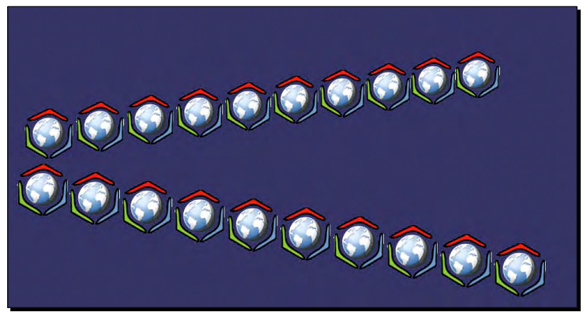
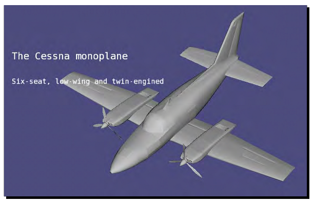
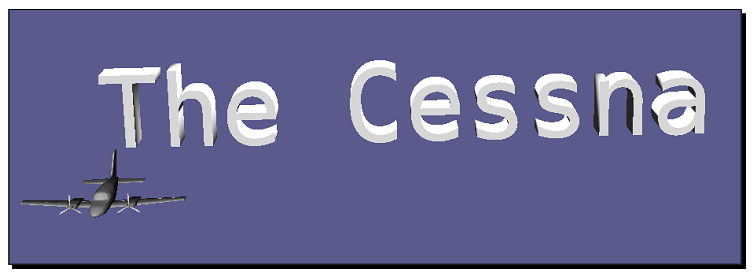
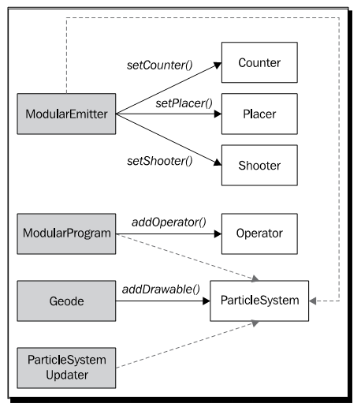
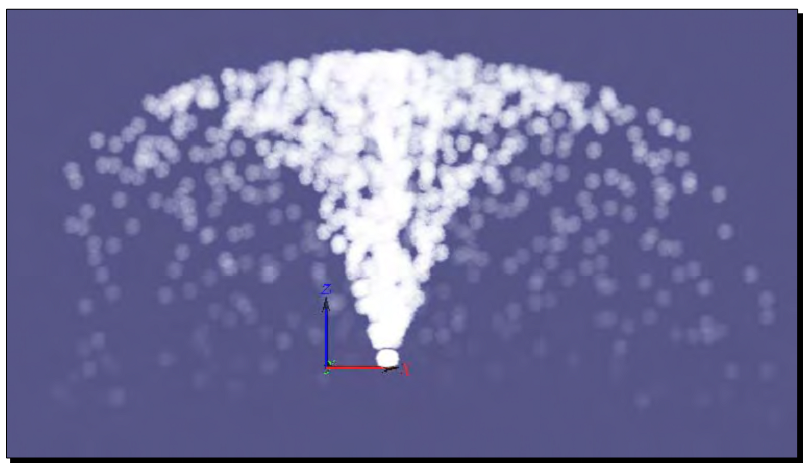
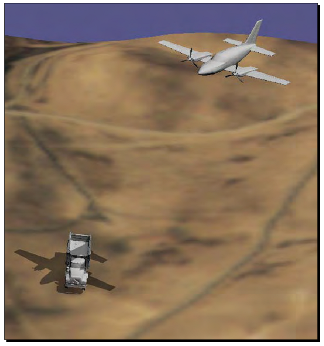
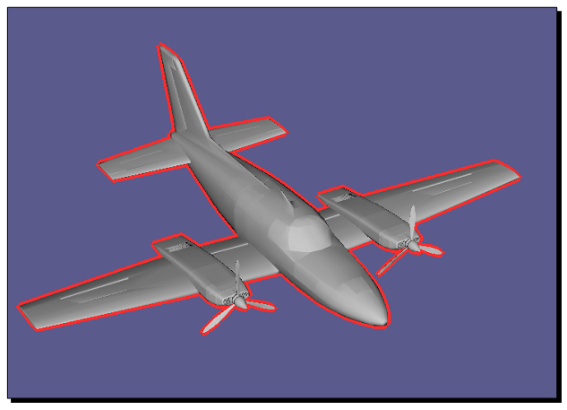
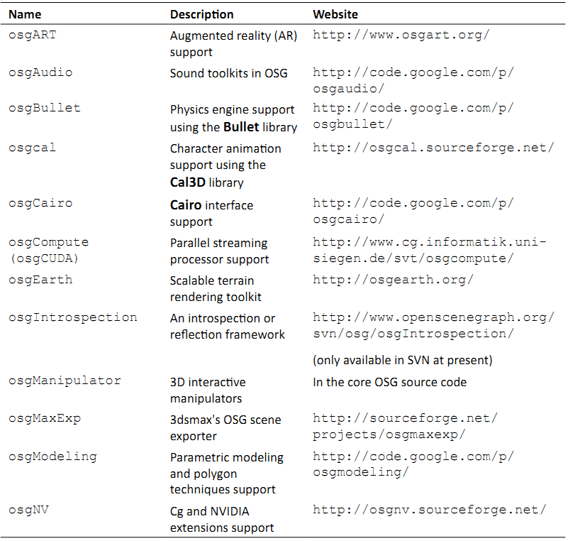
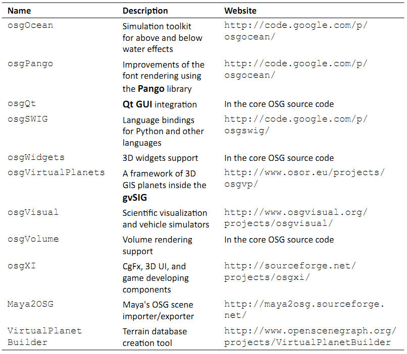

Chapter 11: Developing Visual Components
========================================

在前面的10章中，我们已经介绍了OSG的历史与安装，以及几何体，场景图节点，渲染状态，相机，动画，交互以及文件I/O机制的概念。然而完整的3D渲染API还有许多方面，包括文本显示，粒子，阴影，特殊效果，体积渲染以及大量被统称为NodeKits的模型。在本书或是任意其他的书中，解释所有这些内容都是不可能的，但是向我们民展示如何利用这些典型的可视化效果并在本章结束时通过提供一个实际的NodeKits列表来使得球旋转则是值得的。

在本章中，我们将会了解：

-   如何将几何体创建为场景中的宣传板
-   如何在场景中显示2D与3D文本
-   如何设计一个粒子系统并使其动起来
-   如何在场景对象上实现阴影
-   特殊效果的理论与实现

Creating billboards in a scene
------------------------------

在3D世界中，宣传板是总指向特定方向的2D图像。程序可以使用宣传板技术来创建许多特效类型，例如爆炸，闪光，天空，云与树。事实上，当由远处观察时，任何本身被缓冲为纹理的对象都可以被看作宣传板。所以，宣传板的实现成为最流行的技术之一，广泛用于计算机游戏与实时可视化模拟程序。

osg::BillBoard类被用来表示3D场景中的宣化板列表。他由osg::Geode类派生，并且可以使得其所有子节点（osg::Drawable对象）朝向查看器的视口。他有一个重要方法，setMode()，可以用来确定旋转行为，其必须设置下列枚举中的一个作为参数：

osg::BillBoard节点中的所有可绘制元素应具有一个轴点位置，这是通过重载的addDrawable()方法指定的，例如：

    billboard->addDrawable( child, osg::Vec3(1.0f, 0.0f, 0.0f) );

所有的可绘制元素同时需要一个统一的初始方向，该方向用来计算旋转值。初始方向是通过setNormal()方法设置的。并且每一个新添加的可绘制元素必须确保其前面朝向与其法线值位于相同的方向；否则，宣传板的结果也许会不正确。

### Time for action - creating banners facing you

在OSG中实现电子公告板的前提条件是首先创建一个或是多个四边形几何体。然后这些四边形由osg::BillBoard类进行管理。这会强制所有的子可绘制元素自动围绕指定的轴放置，或是面向查看器。这可以通过指定一个统一的法线值并依据法线与当前旋转轴或是查看向量每一个电子公告板来实现。

我们将会创建两行OSG标记，排列为V字形，来演示OSG中电子公告板的使用。无论查看者在哪里以及如何操作场景相机，标记的前面总是会朝向查看者。该特性可以用来表示我们程序中的纹理树与粒子。

1.  包括必需的头文件：

<!-- -->

    #include <osg/Billboard>
    #include <osg/Texture2D>
    #include <osgDB/ReadFile>
    #include <osgViewer/Viewer>

2.  直接由osg::createTexturedQuadGeometry()函数创建四边形几何体。每一个生成的四边形具有相同的尺寸与源点，并使用相同的图片文件。注意，osg256.png文件可以在我们的OSG安装路径下的data目录中找到，但是他需要osgdb\_png插件来读取图片文件。如果我们在配置与编译该插件遇到问题时请参考第10章。

<!-- -->

    osg::Geometry* createQuad()
    {
        osg::ref_ptr<osg::Texture2D> texture = new osg::Texture2D;
        osg::ref_ptr<osg::Image> image =
            osgDB::readImageFile( "Images/osg256.png" );
        texture->setImage( image.get() );

        osg::ref_ptr<osg::Geometry> quad=
            osg::createTexturedQuadGeometry(  
                                        osg::Vec3(-0.5f, 0.0f,-0.5f), 
                                        osg::Vec3(1.0f,0.0f,0.0f), 
                                        osg::Vec3(0.0f,0.0f,1.0f) );
        osg::StateSet* ss = quad->getOrCreateStateSet()
        ss->setTextureAttributeAndModes( 0, texture.get() );
        return quad.release();
    }

3.  在主要部分，我们首先创建一个电子公告板节点并将模型设置到POINT\_ROT\_EYE。也就是，可绘制元素将会旋转来面向查看者并使得其Z轴在渲染窗口保持向上。osg::Billboard类的默认法线设置是负Y轴，所以将其旋转到查看向量将会在XOZ平面的最佳位置处显示四边形：

<!-- -->

    osg::ref_ptr<osg::Billboard> geode = new osg::Billboard;
    geode->setMode( osg::Billboard::POINT_ROT_EYE );

4.  现在让我们创建标记四边形并将其排列为V字形：

<!-- -->

    osg::Geometry* quad = createQuad();
    for ( unsigned int i=0; i<10; ++i )
    {
        float id = (float)i;
        geode->addDrawable( quad, osg::Vec3(-2.5f+0.2f*id, id, 0.0f));
        geode->addDrawable( quad, osg::Vec3( 2.5f-0.2f*id, id, 0.0f));
    }

5.  所有四边形纹理的背景将会被自动清除，因为alpha测试在osgdb\_png插件内部是自动执行的。这意味着我们需要设置所有可绘制元素的正确渲染顺序来确保整个过程被正确处理：

<!-- -->

    osg::StateSet* ss = geode->getOrCreateStateSet();
    ss->setRenderingHint( osg::StateSet::TRANSPARENT_BIN );

6.  现在是启动查看器的时候了，因为创建并渲染电子公告板再无需其他的步骤了：

<!-- -->

    osgViewer::Viewer viewer;
    viewer.setSceneData( geode.get() );
    return viewer.run();

7.  试着在场景图中浏览：

8.  我们将会发现电子公告板的所有子节点都会进行旋转来面向查看者，但是图片的Y方面不会发生变化（始终指向窗口的Y坐标）。将模式POINT\_ROT\_EYE替换为POINT\_ROT\_WORLD并看一下是否有什么区别。

### What just happened?

该示例显示了OSG场景图中电子公告板的使用。但是依然能够进一步改进。这里所有的标记几何体都是使用createQuad()函数创建的，这意味着同样的四边形与同样的纹理至少被重新分配了20次。对象共享机制无疑是适用于这里的一种优化。不幸的是，他并不聪明到将相同的可绘制元素添加到osg::Billboard的不同位置处，从而会使得节点的处理不正确。我们所要做的就是创建共享相同纹理对象的多个四边形几何体。这将会高度重用视频纹理内存占用与渲染负载。

另一个可能的问题是有些人也许会要求所载入的节点被渲染为电子公告板，而仅是可绘制元素。一个节点可以由不同类型的子节点组成，因而要比一个基本的图形或是几何体丰富得多。OSG同时提供了osg::AutoTransform类，该类自动旋转对象的子节点与屏幕坐标相一致。

### Have a go hero - planting massive trees on the ground

电子公告板广泛用于大量的树与植物。一个或是多个具有透明背景的树图片被应用到不同尺寸的四边形，然后被添加到电子公告板节点。这些树会自动面向查看者，或是更为真实，围绕某个轴旋转就如枝叶总是向前。现在让我们创建一些简单的公告板树。我们只需要准备一幅足够好的图片（例如，OpenSceneGraph预编译包中data目录下的Images/tree0.rgba），遵从前面示例所给出的步骤来创建我们自己的树与植被。

Creating texts
--------------

在所有类型的虚拟现实程序中，文本是其中最重要的组件之一。他被用在各处－用于在屏幕上显示状态，标识3D对象，日志，以及调试。文本至少具有字体来指定字样与质量，以及其他参数，包括尺寸，对齐，布局（由左至右或由右至左）以及分辨率来确定其显示行为。OpenGL并不直接支持3D空间中字体的载入与显示文本，但是OSG为渲染高质量文本与配置不同文本属性提供了全面支持，从而使得开发相关的程序更为简单。

osgText库实际上实现了所有字体与文本功能。他需要osgdb\_freetype插件以正常工作。这个插件可以借助于FreeType，一个著名的第三方依赖，来载入与解析字体。然后，他会返回一个osgText::Font实例，该实例由纹理字体轮廓的全集构成。整个过程可以通过osgText::readFontFile()函数进行描述。

osgText::TextBase类是所有OSG文本类型的纯基类。他由osg::Drawable派生，但是默认情况下并不支持显示列表。其子类，osgText::Text被用来管理世界坐标中的平字符。重要的方法包括setFont()，setPosition()，setCharacterSize()与setText()，这些方法的每一个都很容易理解与使用，如下面的示例所示。

### Time for action - writing descriptions for the Cessna

这次我们将在3D空间中显示Cessna并在渲染场景的前面提供描述性文本。在这里可以使用HUD相机，该相机会在主相机之后渲染，并且为直接将文本更新到帧缓冲区而仅清除深度缓冲区。然后HUD相机将会以一种总是可见的方式渲染其子节点。

1.  包含必须的头文件：

<!-- -->

    #include <osg/Camera>
    #include <osgDB/ReadFile>
    #include <osgText/Font>
    #include <osgText/Text>
    #include <osgViewer/Viewer>

2.  osgText::readFontFile()函数被用来读取合适的字体文件，例如，非变形的TrueType字体。OSG数据路径（通过OSG\_FILE\_PATH指定）与windows系统路径将被搜索以确定指定的文件是否存在：

<!-- -->

    osg::ref_ptr<osgText::Font> g_font =
        osgText::readFontFile("fonts/arial.ttf");

3.  创建标准的HUD相机并且为了在2维空间绘制3D文本的目的设置2D拼接投影矩阵。相机不应接收任何用户事件，也不应受到父节点变换的影响。这是通过setAllowEventFocus()与setReferenceFrame()方法来保证的：

<!-- -->

    osg::Camera* createHUDCamera( double left, double right,
                                  double bottom, double top )
    {
        osg::ref_ptr<osg::Camera> camera = new osg::Camera;
        camera->setReferenceFrame( osg::Transform::ABSOLUTE_RF );
        camera->setClearMask( GL_DEPTH_BUFFER_BIT );
        camera->setRenderOrder( osg::Camera::POST_RENDER );
        camera->setAllowEventFocus( false );
        camera->setProjectionMatrix(
            osg::Matrix::ortho2D(left, right, bottom, top) );
        return camera.release();
    }

4.  文本也是由一个单独的全局函数创建的。他定义了一个描述每一个字符轮廓，以及世界空间中的大小与位置参数和文本内容的字体对象。在HUD文本实现中，文本应总是与XOY面对齐：

<!-- -->

    osgText::Text* createText( const osg::Vec3& pos,
                               const std::string& content,  
                               float size )
    {
        osg::ref_ptr<osgText::Text> text = new osgText::Text;
        text->setFont( g_font.get() );
        text->setCharacterSize( size );
        text->setAxisAlignment( osgText::TextBase::XY_PLANE );
        text->setPosition( pos );
        text->setText( content );
        return text.release();
    }

5.  在主体部分，我们创建一个新osg::Geode节点并向该节点添加多个文本对象。这些文本介绍了Cessna的主要特性。当然，我们也可以使用额外的osgText::Text可绘制元素添加我们自己的关于这种类型单翼机的介绍：

<!-- -->

    osg::ref_ptr<osg::Geode> textGeode = new osg::Geode;
    textGeode->addDrawable( createText(
        osg::Vec3(150.0f, 500.0f, 0.0f),
        "The Cessna monoplane",
        20.0f)
    );
    textGeode->addDrawable( createText(
        osg::Vec3(150.0f, 450.0f, 0.0f),
        "Six-seat, low-wing and twin-engined",
        15.0f)
    );

6.  这个节点包含所有应添加到HUD的文本。为了确保文本不会为OpenGL法线与光（毕竟他们也是纹理几何体）影响，我们必须关闭相机节点的光：

<!-- -->

    osg::Camera* camera = createHUDCamera(0, 1024, 0, 768);
    camera->addChild( textGeode.get() );
    camera->getOrCreateStateSet()->setMode(
        GL_LIGHTING, osg::StateAttribute::OFF );

7.  最后一步是将Cessna模型与相机添加到场景图，并像通常一样启动查看器：

<!-- -->

    osg::ref_ptr<osg::Group> root = new osg::Group;
    root->addChild( osgDB::readNodeFile("cessna.osg") );
    root->addChild( camera );
    osgViewer::Viewer viewer;
    viewer.setSceneData( root.get() );
    return viewer.run();

8.  在渲染窗口中，我们会看到在Cessna模型上有两行文本。无论我们如何变换，旋转与缩放视图矩阵，HUD文本绝不会被覆盖。所以，用户总是可以直接读取最生要的信息，而无需脱离其通常的视图：

### What just happened?

为了使用CMake或是其他的本地编译器构建该示例，我们需要将osgText库添加为依赖，并且包含osgParticle，osgShadow与osgFX库。

在这里我们指定了arial.ttf字体。这是大多数Windows与UNIX系统的默认字体，同时也可以在OSG数据路径内找到。正如我们所看到的，这种字体类型为开发者提供了高精度的字符显示，而无论字体大小设置。这是因为TrueType字体的轮廓线是由数学线段与Bezier曲线构成的，这意味着他们并不是向量字体。位图（光栅）字体不具有这种特性，因而当调整大小时会变昨非常丑陋。在这里禁止setFont()来强制osgText使用默认的12x12的位图字体。我们可以看出这种字体之间的区别吗？

### Pop quiz - text positions and the projection matrix

我们使用下面的代码来定义我们的文本对象：

    text->setAxisAlignment( osgText::TextBase::XY_PLANE );
    text->setPosition( pos );

这里有两个需要我们思考的问题：

1.  首先，为什么平面字体必须放置在XOY平面上？如果我们不这样做会出现什么情况？我们是否应该使用HUD相机？
2.  其次，这些文本位置的参考帧是什么？也就是，当设置文本对象的位置时，我们如何在渲染窗口中对其定位？他是否与拼接投影矩阵有关？我们能否将示例中的两行移动右上角？

### Have a go hero - using wide characters to support more languages

osgText::Text的setText()方法直接接受std::string变量。同时，他也可以接受宽字符作为输入参数。例如：

    wchar_t* wstr = ;
    text->setText( wstr );

这使其支持多语言，例如，中文与日文字符，成为可能。现在试着通过直接定义宽字符或是由多字节字符转换来获取一个宽字符序列，并将其应用到osgText::Text对象，来验证一下我们所感兴趣的语言是否能够被渲染。注意字体也要进行相应的变化来支持相应的语言。

Creating 3D texts
-----------------

无论是否相信，OSG同时提供了对场景图中3D文本的支持。每个字符都有一个深度参数，并且最终使用OpenGL的顶点数组机制进行渲染。实现者类，osgText::Text3D，也是由osgText::Textbase派生的，所以具有与osgText::Text几乎相同的方法。他需要一个osgText::Font3D实例作为字体参数，该参数可以通过osgText::readFont3DFile()函数获取。

### Time for action - creating texts in the world space

在该示例中我们将会创建一个简单的3D文本对象。类似于2D文本类osgText::Text，osgText::Text3D类也继承了一个方法列表来设置基本的文本参数，包括位置，大小，对齐方式，字体对象以及内容。3D文本最通常用作游戏与程序的特殊效果。

1.  包含必须的头文件：

<!-- -->

    #include <osg/MatrixTransform>
    #include <osgDB/ReadFile>
    #include <osgText/Font3D>
    #include <osgText/Text3D>
    #include <osgViewer/Viewer>

2.  使用osgText::readFont3DFile()函数读取相应的字体文件，该函数类似于osgText::readFontFile()。使用osgdb\_freetype插件，TrueType字体可以被分析为细节良好的3D字符轮廓：

<!-- -->

    osg::ref_ptr<osgText::Font3D> g_font3D =
        osgText::readFont3DFile("fonts/arial.ttf");

3.  所以我们将会模拟上个示例中的createText()函数。唯一的区别在于我们需要为文本字符设置一个额外的深度参数使其站立在3D世界中。这里的setAxisAlignment()方法表明文本对象位于XOZ平面上，并使其前面朝向Y轴负方向：

<!-- -->

    osgText::Text3D* createText3D( const osg::Vec3& pos,
                                   const std::string& content,
                                   float size, float depth )
    {
        osg::ref_ptr<osgText::Text3D> text = new osgText::Text3D;
        text->setFont( g_font3D.get() );
        text->setCharacterSize( size );
        text->setCharacterDepth( depth );
        text->setAxisAlignment( osgText::TextBase::XZ_PLANE );
        text->setPosition( pos );
        text->setText( content );
        return text.release();
    }

4.  使用简短的文本创建一个3D文本对象。注意，由于3D文本实际上是由顶点与几何体基元构成的，对其的过度使用会导致较高的资源消耗：

<!-- -->

    osg::ref_ptr<osg::Geode> textGeode = new osg::Geode;
    textGeode->addDrawable(
        createText3D(osg::Vec3(), "The Cessna", 20.0f, 10.0f) );

5.  这次我们添加一个osg::MatrixTransform作为textGeode的父节点。当渲染所有的文本可渲染元素时，他会向模型视图矩阵应用额外的变换矩阵，从而会改变他们在世界坐标系中的显示位置与高度：

<!-- -->

    osg::ref_ptr<osg::MatrixTransform> textNode= new 
    osg::MatrixTransform;
    textNode->setMatrix( osg::Matrix::translate(0.0f, 0.0f, 10.0f) );
    textNode->addChild( textGeode.get() );

6.  再次将我们的Cessna添加到场景图并启动查看器：

<!-- -->

    osg::ref_ptr<osg::Group> root = new osg::Group;
    root->addChild( osgDB::readNodeFile("cessna.osg") );
    root->addChild( textNode.get() );
    osgViewer::Viewer viewer;
    viewer.setSceneData( root.get() );
    return viewer.run();

7.  我们将会看到模型上面大大的字母，但事实上，3D文本对象的初始位置应为(0,0,0)，这也是Cessna的原点。这里osg::MatrixTransform节点通过将textNode变换到新位置(0,0,10)来避免模型与文本彼此重叠：

### What just happened?

2D与3D文本都可以通过其父节点进行变换。当我们必须构建组合或是使得模型位于文本标签之后时这会非常有用。类似于OSG的变换节点，osgText::TextBase的setPosition()方法只会设置文本对象的父节点的相对参考帧下的位置。这同样适用于setRotation()方法，该方法会确定文本的旋转，而setAxisAlignment()方法会将文本对齐到指定的平面。

唯一的例外是SCREEN对齐模式：

    text->setAxisAlignment( osgText::TextBase::SCREEN );

这会模信场景对象的公告板技术，并且使得文本（osg::Text或osg::Text3D）总是面向查看者。在3D地理信息系统（3DGIS中），将路标放置在地球上或是城市上作为公告板是非常常见的技术，因而可以通过SCREEN模式实现。在这种情况下，旋转与父节点变换不再可用，因而不会被使用，因为他们会引起误解与潜在的问题。

Creating particle animations
----------------------------

粒子系统被用在各种3D程序中用于特殊效果，例如烟，灰尘，爆炸，液体，火与雨。比起其他简单场景对象的构建，构建并管理一个完全的粒子系统更为困难。事实上，OSG在osgParticle库中提供了大量的类来支持复杂粒子系统的自定义，其中的大多数类也可以在需要用户定义的算法时使用继承进行扩展与重写。

粒子类，osgParticle::Particle，表示原子粒子单元。他通常被用作模拟循环开始前的设计模板，并且在运行时由粒子系统拷贝并重新生成来渲染大量的粒子。

粒子系统类，osgParticle::Particle，管理所有粒子的创建，更新，渲染与销毁。他由osg::Drawable派生，所以他可以接受不同的渲染属性与模式，就如同普通的可绘制元素一样。他应被添加到osg::Geode节点，如同上一个类一样。

发射器抽象类（osgParticle::Emitter）定义了每一帧新生成粒子的数量与基本操作。其派生类，osgParticle::ModularEmitter，其作用类似于一个普通的发射器，提供了对所创建粒子的控制机制。他总是存储三种类型的子控制器：

-   位置器（osgParticle::Placer）设置每个粒子的初始位置
-   射击器（osgParticle::Shooter）设置粒子的初始速度
-   计数器（osgParticle::Counter）确定要创建多少粒子

程序的抽象类（osgParticle::Program）操作其生命周期中每一个粒子的位置，速度以及其他属性。其派生类，osgParticle::ModularProgram，是由一个在已有粒子上进行操作的osgParticle::Operator子类的列表构成的。

发射器与程序类都是间接派生自osg::Node，这意味着他们可以被看作是场景图中的节点。在更新与裁剪遍历中，他们会被自动遍历，而子控制器与操作符将会被执行。然后，粒子系统将会使用其结果来重新计算并绘制其所管理的粒子。重新计算的过程可以通过osgParticle::ParticleSystemUpdater来实现，后者实际上也是一个节点。更新器应放置在场景图中的发射器与程序之后，从而确保更新以正确的顺序被执行。例如：

    root->addChild( emitter );
    root->addChild( program );
    root->addChild( updater );  // Added last

下图显示了上面的osgParticle类的层次结构：

### Time for action - building a fountain in the scene

我将会演示如何实现一个粒子喷泉。喷泉的模拟可以描述如下：首先，水以一定的初速度由某一点射出；然后由于重力的原因速度减少，直到到达最高点；之后，水掉落到地面上或是池子里。要实现该效果，osgParticle::ParticleSystem节点以及发射器与程序处理器应被创建并添加到场景图。

1.  包含必须的头文件：

<!-- -->

    #include <osg/MatrixTransform>
    #include <osg/Point>
    #include <osg/PointSprite>
    #include <osg/Texture2D>
    #include <osg/BlendFunc>
    #include <osgDB/ReadFile>
    #include <osgGA/StateSetManipulator>
    #include <osgParticle/ParticleSystem>
    #include <osgParticle/ParticleSystemUpdater>
    #include <osgParticle/ModularEmitter>
    #include <osgParticle/ModularProgram>
    #include <osgParticle/AccelOperator>
    #include <osgViewer/ViewerEventHandlers>
    #include <osgViewer/Viewer>

2.  创建粒子系统的整个过程可以在一个单独的用户函数中实现：

<!-- -->

    osgParticle::ParticleSystem* createParticleSystem(
        osg::Group* parent )
    {

    }

3.  现在我们位于函数内部。每一个粒子系统都有一个确定所有新生成粒子的行为的模板粒子。这里，我们将系统中所有粒子的形状设置为POINT。借助于OpenGL的点精灵（point
    sprite）扩展，这些点可以被渲染为纹理公告板，这在大多数情况下就足够了：

<!-- -->

    osg::ref_ptr<osgParticle::ParticleSystem> ps =
        new osgParticle::ParticleSystem;
    ps->getDefaultParticleTemplate().setShape(
        osgParticle::Particle::POINT );

4.  设置粒子系统的渲染属性与模式。这会自动影响到所有已渲染的粒子。这里，我们将一个纹理图片关联到粒子，并且定义一个混合函数以使得图片背景变得透明：

<!-- -->

    osg::ref_ptr<osg::BlendFunc> blendFunc = new osg::BlendFunc;
    blendFunc->setFunction( GL_SRC_ALPHA, GL_ONE_MINUS_SRC_ALPHA );
    osg::ref_ptr<osg::Texture2D> texture = new osg::Texture2D;
    texture->setImage( osgDB::readImageFile("Images/smoke.rgb") );

5.  另两个重要属性为osg::Point与osg::PointSprite。前者将会设置点的大小（光栅化点的直径），而后者将会打开点精灵，从而会高效的将四点四边形替换为单一顶点，而无需指定纹理坐标以及旋转前面朝向查看者。另外，我们最好关闭粒子的光线，并且我们设置一个合适的渲染顺序以使其在整个场景图中被正确绘制：

<!-- -->

    osg::StateSet* ss = ps->getOrCreateStateSet();
    ss->setAttributeAndModes( blendFunc.get() );
    ss->setTextureAttributeAndModes( 0, texture.get() );
    ss->setAttribute( new osg::Point(20.0f) );
    ss->setTextureAttributeAndModes( 0, new osg::PointSprite );
    ss->setMode( GL_LIGHTING, osg::StateAttribute::OFF);
    ss->setRenderingHint( osg::StateSet::TRANSPARENT_BIN );

6.  osgParticle::RandomRateCounter类生成每一帧粒子的随机个数。他是由osgParticle::Counter类派生并且有一个setRateRange()方法可以用来指定元素数的最小值与最大值：

<!-- -->

    osg::ref_ptr<osgParticle::RandomRateCounter> rrc =
        new osgParticle::RandomRateCounter;
    rrc->setRateRange( 500, 800 );

7.  向标准发射器添加随机速率计数器。同时我们需要将粒子系统关联到该发射器作为操作目标。默认情况下，模块发射器已经包含有(0,0,0)位置点形状位置器，以及为每个粒子选择方向与初始随机速度的光线发射器，所以我们无需指定新值：

<!-- -->

    osg::ref_ptr<osgParticle::ModularEmitter> emitter =
        new osgParticle::ModularEmitter;
    emitter->setParticleSystem( ps.get() );
    emitter->setCounter( rrc.get() );

8.  osgParticle::AccelOperator类将固定加速随时应用到所有粒子。为了模拟重力，我们可以使用setAcceleration()来指定重力加速向量，或是直接调用setToGravity()方法：

<!-- -->

    osg::ref_ptr<osgParticle::AccelOperator> accel =
        new osgParticle::AccelOperator;
    accel->setToGravity();

9.  将唯一的操作符添加到标准程序代码并同时关联粒子系统：

<!-- -->

    osg::ref_ptr<osgParticle::ModularProgram> program =
        new osgParticle::ModularProgram;
    program->setParticleSystem( ps.get() );
    program->addOperator( accel.get() );

10. 粒子系统实际上是一个可绘制元素对象，应该添加到场景图的叶子节点。然后，我们将所有粒子相关的节点添加到parent节点。这是一个关于世界坐标与本地坐标的有趣问题，我们会在稍后进行探讨：

<!-- -->

    osg::ref_ptr<osg::Geode> geode = new osg::Geode;
    geode->addDrawable( ps.get() );
    parent->addChild( emitter.get() );
    parent->addChild( program.get() );
    parent->addChild( geode.get() );
    return ps.get();

11. 现在让我们回到主体部分。首先，我们为定位粒子系统创建一个新的变换节点：

<!-- -->

    osg::ref_ptr<osg::MatrixTransform> mt = new osg::MatrixTransform;
    mt->setMatrix( osg::Matrix::translate(1.0f, 0.0f, 0.0f) );

12. 创建所有的粒子系统组件并将其添加到输入变换节点。同时使用addParticleSystem()方法将粒子系统注册到粒子系统更新器。

<!-- -->

    osgParticle::ParticleSystem* ps = createParticleSystem( mt.get() 
    );
    osg::ref_ptr<osgParticle::ParticleSystemUpdater> updater =
        new osgParticle::ParticleSystemUpdater;
    updater->addParticleSystem( ps );

13. 将上述的所有节点添加到场景的根节点，包括作为参考的小轴模型（我们可以在数据目录内找到）。然后，启动查看器：

<!-- -->

    osg::ref_ptr<osg::Group> root = new osg::Group;
    root->addChild( updater.get() );
    root->addChild( mt.get() );
    root->addChild( osgDB::readNodeFile("axes.osg") );
    osgViewer::Viewer viewer;
    viewer.setSceneData( root.get() );
    return viewer.run();

14. 我们的粒子喷泉最终完成了。放大，我们将会发现所有的粒子开始于X轴正方向的一点，X=1。现在仅通过一些简单的固定函数属性，粒子可以被渲染为良好的纹理点，并且由于溶合操作，每个粒子元素的显示非常类似于水滴：

### What just happened?

在上面的图片中，我们可以看出整个粒子系统被移动到世界空间中的(1,0,0)处。这是因为我们将发射，程序与粒子系统的父节点添加到变换节点。但事实上，如果我们将这三个元素中的一个放在变换节点之下，而另两个放在根节点之上，则会得到不同的结果。仅将osg::Geode节点添加到osg::Transform将会使得整个粒子系统随其移动；但是仅添加发射器将变改变新生成粒子的变换行为，但会使得已有粒子保留在世界坐标中。类似的，仅添加程序节点会使得父变换节点仅影响操作符。

一个很好的示例是设计喷气式飞机。当在天空中盘旋时，机翼的位置与方面会随时发生变化。使用osg::MatrixTransform作为粒子发射器的父节点将会非常有助于表示这样的基元粒子的场景。粒子系统与更新器不应被放置在相同的变换节点之下；否则空气中旧的粒子也会移动与旋转，这是真实世界中一定是不合理的。

### Have a go hero - designing a rotary sprinkler

我们是否见过旋转的洒水车？他是由至少一个可以自动旋转360度并将水喷射在洒水车直径周围的圆头组成。使用简单的圆柱模型与粒子系统来创建这样的一个机器，我们需要设计一个具有将粒子发射到指定水平方向的发射器的模块发射器，以及一个具有重力加速操作符的模块程序。

作为提示，默认的光线发射器（osgParticle::RadialShooter）使用两个指定范围内的角度，theta与phi，以确定粒子的随机方向，例如：

    osg::ref_ptr<osgParticle::RadialShooter> shooter =
        new osgParticle::RadialShooter;
    // Theta is the angle between the velocity vector and Z axis
    shooter->setThetaRange( osg::PI_2 - 0.1f, osg::PI_2 + 0.1f );
    // Phi is the angle between X axis and the velocity vector projected
    // onto the XOY plane
    shooter->setPhiRange( -0.1f, 0.1f );
    // Set the initial speed range
    shooter->setInitialSpeedRange( 5.0f, 8.0f );

要旋转发射粒子的初始方向，我们可以使用一个修改theta与phi范围的更新回调，或是考虑添加一个变换节点作为发射器的父节点。

Creating shadows on the ground
------------------------------

阴影也是3D程序的一个重要概念。当创建如数字城市这样的大规模的3D场景时，模型设计者首先在如3dsmax，Maya以及Blender这样的建模软件设计并计算建筑物上的光线，模型以及地面，然后将这些阴影应用到纹理上。然后实时程序读取这些带有纹理的模型文件，并将阴影静态的渲染到渲染窗口中。

实时阴影也是可能的，但是不能无限制的使用。osgShadow库在需要阴影的场景图上提供了一系列的阴影技术。核心类，名为osgShadow::ShadowScene，应被用作这些阴影子子图的根节点。他接受一个osgShadow::ShadowTechnique实例作为用来实现阴影的技术。派生技术类将会扩展场景图来支持更多的算法与解决方案，从而会丰富阴影功能。

### Time for action - receiving and casting shadows

我们的目标是通过在模型上转换阴影展示场景的构建。他总是包含一个特定的阴影场景根，一个内建的或自定义的阴影技术，以及一个具有可区分的接收或转换掩码的子节点。如果不添加阴影场景作为父节点，一个普通的场景不会有阴影，相对的，一个具有阴影的场景图可以通过移除应用到节点的osgShadow::ShadowedScene根节点或是阴影技术对象（通过简单的设置为null）来去除阴影计算与效果。在该示例中，我们只是在阴影场景根下创建并管理场景图，并且使用预定义的阴影映射技术来正确渲染真实对象与阴影。

1.  包含必须的头文件：

<!-- -->

    #include <osg/AnimationPath>
    #include <osg/MatrixTransform>
    #include <osgDB/ReadFile>
    #include <osgShadow/ShadowedScene>
    #include <osgShadow/ShadowMap>
    #include <osgViewer/Viewer>

2.  用于创建动画路径的代码是由第8章中拷贝的。他使用少量的采样控制点来生成圆，然后可以应用到osg::AnimationPathCallback来实现随时间变化的变换路径：

<!-- -->

    osg::AnimationPath* createAnimationPath( float radius, float time)
    {
        osg::ref_ptr<osg::AnimationPath> path =  
            new osg::AnimationPath;
        path->setLoopMode( osg::AnimationPath::LOOP );

        unsigned int numSamples = 32;
        float delta_yaw = 2.0f * osg::PI/((float)numSamples - 1.0f);
        float delta_time = time / (float)numSamples;
        for ( unsigned int i=0; i<numSamples; ++i )
        {
            float yaw = delta_yaw * (float)i;
            osg::Vec3 pos( sinf(yaw)*radius, cosf(yaw)*radius, 0.0f );
            osg::Quat rot( -yaw, osg::Z_AXIS );
            path->insert( delta_time * (float)i,
                          osg::AnimationPath::ControlPoint(pos, rot));
        }
        return path.release();   
    }

3.  设置阴影接收器与转换器的掩码。这两个掩码的与操作的结果必须为0：

<!-- -->

    unsigned int rcvShadowMask = 0x1;
    unsigned int castShadowMask = 0x2;

4.  创建地面模型。这仅会由其他场景对象接收阴影，所以在其节点掩码与接收器掩码上执行与操作将会返回一个非零值，而节点掩码与转换器掩码的位与操作应总是返回0。所以我们可以依据这些原则来确定节点掩码：

<!-- -->

    osg::ref_ptr<osg::MatrixTransform> groundNode =
        new osg::MatrixTransform;
    groundNode->addChild( osgDB::readNodeFile("lz.osg") );
    groundNode->setMatrix( osg::Matrix::translate(0.0f, 0.0f,-200.0f));
    groundNode->setNodeMask( rcvShadowMask );

5.  设置Cessna模型，该模型也接受一个执行路径动画的更新回调。在我们的示例中，他仅是在地面与其他的场景对象上转换阴影：

<!-- -->

    osg::ref_ptr<osg::MatrixTransform> cessnaNode =
        new osg::MatrixTransform;
    cessnaNode->addChild( osgDB::readNodeFile("cessna.osg.0,0,90.rot"));
    cessnaNode->setNodeMask( castShadowMask );
    osg::ref_ptr<osg::AnimationPathCallback> apcb =
        new osg::AnimationPathCallback;
    apcb->setAnimationPath( createAnimationPath(50.0f, 6.0f) );
    cessnaNode->setUpdateCallback( apcb.get() );

6.  使用合适的变换矩阵将卡车模型添加到地面。他由头上的Cessna圆接收阴影，并将阴影变换到地面上。这意味着当我们在接收器与变换器掩码之间执行位与操作时，我们需要设置合适的节点掩码来接收非零值：

<!-- -->

    osg::ref_ptr<osg::MatrixTransform> truckNode =
        new osg::MatrixTransform;
    truckNode->addChild( osgDB::readNodeFile("dumptruck.osg") );
    truckNode->setMatrix( osg::Matrix::translate(0.0f, 0.0f,-100.0f));
    truckNode->setNodeMask( rcvShadowMask|castShadowMask );

7.  为产生阴影设置光源。我们使用setPosition()方法来指定平行光的方向来生成减弱的阴影：

<!-- -->

    osg::ref_ptr<osg::LightSource> source = new osg::LightSource;
        source->getLight()->setPosition( osg::Vec4(4.0, 4.0, 10.0, 
    0.0) );
        source->getLight()->setAmbient( osg::Vec4(0.2, 0.2, 0.2, 1.0) 
    );
        source->getLight()->setDiffuse( osg::Vec4(0.8, 0.8, 0.8, 1.0) 
    );

8.  在这里我们必须设置阴影技术。已经有多种由组织与个人实现的基于OpenGL的阴影技术，包括使用投影纹理映射的阴影映射，通过stencil
    buffer实现的阴影量，以及其他实现。我们选择著名高效的阴影映射（osgShadow::ShadowMap）技术，并设置其必需的参数，包括光源，阴影纹理的大小与单位等：

<!-- -->

    osg::ref_ptr<osgShadow::ShadowMap> sm = new osgShadow::ShadowMap;
    sm->setLight( source.get() );
    sm->setTextureSize( osg::Vec2s(1024, 1024) );
    sm->setTextureUnit( 1 );

9.  设置阴影场景的根节点，并向其应用技术实例以及阴影掩码：

<!-- -->

    osg::ref_ptr<osgShadow::ShadowedScene> root =
        new osgShadow::ShadowedScene;
    root->setShadowTechnique( sm.get() );
    root->setReceivesShadowTraversalMask( rcvShadowMask );
    root->setCastsShadowTraversalMask( castShadowMask );

10. 将所有的模型与光源添加到根节点并启动查看器：

<!-- -->

    root->addChild( groundNode.get() );
    root->addChild( cessnaNode.get() );
    root->addChild( truckNode.get() );
    root->addChild( source.get() );
    osgViewer::Viewer viewer;
    viewer.setSceneData( root.get() );
    return viewer.run();

11. 应用简单的光源以及最常用且稳定的阴影映射技术，我们现在可以在阴影场景中渲染地面，Cessna以及卡车。我们可以通过setTextureSize()方法来改变纹理分辨率，或是切换到其他阴影技术来看一下是否有变化或是改进：

### What just happened?

setNodeMask()方法在第9章中进行了介绍。当时他被用来指示相交访问器略过指定地场景图。但此时，我们利用该方法来区分阴影接收器与变化器。在这里，他在阴影场景节点的掩码上执行位逻辑与操作，而不是之前节点访问器的遍历掩码。

setNodeMask()甚至可以用来由将要被渲染的场景裁剪节点，也就是，由渲染管线中移除特定的子场景图。在OSG后端的裁剪遍历中，每个节点的掩码值将会使用节点的裁剪掩码进行计算，而该裁剪掩码则是通过osg::Camera类的setCullMask()方法设置的。所以，如是节点掩码值为0，节点及其子图将不会被绘制，因为在裁剪过程中与操作总是返回0。

注意，当前的OSG阴影映射实现仅处理节点的变换阴影掩码。他会调整阴影映射使得所有对象集合的边界适应变换阴影，但是我们需要处理无需接收阴影的对象，例如，不要将其添加到阴影场景节点。实践中，几乎所有的对象都会被设置来接收阴影，而只有地面被设置为不转换阴影。

### Have a go hero - testing other shadow techniques

除了阴影映射还有其他的阴影技术，包括使用纹理与固定函数的最简单实现，stencill
buffer（目前并未完成）的volume算法，软边阴影，平行分割阴影，光空间透视阴影等。

我们可以在http://www.openscenegraph.org/projects/osg/wiki/Support/ProgrammingGuide/osgShadow找到简要介绍。

如何创建高级图像效果（阴影只是其中一部分）的知识还有许多。如果我们有兴趣了解更多的相关知识，我们可以阅读一些高级的书，例如Akenin-Moller，Haines，Hoffman的《实时渲染》（Real-time
rendering）以及Foley，Van Dam et
al的《计算机图形学：原理与实践》（Computer Graphics: Principles and
Practice）。

现在，在这些阴影技术中选择性能最好的技术。如果我们的程序开发技术需求不能由现有的阴影技术满足而且自己冒险会有切实的效益，那另一个选择是设计我们自己的阴影技术。

Implementing special effects
----------------------------

osgFX库提供了一个特殊效果框架。他有一些类似于osgShadow
NodeKits，后者使用一个阴影场景作为所有阴影子图的父节点。osgFX::Effect类，派生自osg::Group，在其子节点上实现了特殊效果，但是不会影响到其兄弟节点与父节点。

osgFX::Effect是一个不会实现真正效果的纯虚类。其派生包括散射光，亮光，卡通等，也可以随时为不同目的进行扩展。

### Time for action - drawing the outline of models

勾勒对象的轮廓是用于在游戏，多媒体与工业应用表示特殊效果的实践技术。OpenGL的一个实现是在stencil
buffer中写入固定值，然后使用细边线渲染对象。在两遍渲染过程之后，对像周围的轮廓就会显示出来。幸运的是，该效果已经由osgFX库中的osgFX::Effect的派生类osgFX::Outline类实现了。

1.  包含必须的头文件：

<!-- -->

    #include <osg/Group>
    #include <osgDB/ReadFile>
    #include <osgFX/Outline>
    #include <osgViewer/Viewer>

2.  载入Cessna模型：

<!-- -->

    osg::ref_ptr<osg::Node> model = osgDB::readNodeFile( "cessna.osg" );

3.  创建勾勒效果。设置宽度与颜色参数，并将模型节点添加为子节点：

<!-- -->

    osg::ref_ptr<osgFX::Outline> outline = new osgFX::Outline;
    outline->setWidth( 8 );
    outline->setColor( osg::Vec4(1.0f, 0.0f, 0.0f, 1.0f) );
    outline->addChild( model.get() );

4.  正如前面所讨论的，为了精确渲染效果，轮廓需要stencil
    buffer。所以我们需要在osg::DisplaySettings实例中为渲染窗口设置正确的stencil位。默认情况下，stencil被设置为0，意味着stencil
    buffer不可用。

<!-- -->

    osg::DisplaySettings::instance()->setMinimumNumStencilBits( 1 );

5.  在启动查看器之前，不要忘记重置清除掩码，以清除每一帧中的stencil位。在这里具有轮廓效果的节点被用作根节点。他可以被添加到更为复杂的场景图中进行渲染。

<!-- -->

    osgViewer::Viewer viewer;
    viewer.getCamera()->setClearMask(
        GL_COLOR_BUFFER_BIT|GL_DEPTH_BUFFER_BIT|GL_STENCIL_BUFFER_BIT);
    viewer.setSceneData( outline.get() );
    return viewer.run();

6.  这就是所需要的全部操作。当与本章中的其他示例相比时，这只是一个简单的示例。然而，通过使用传递的节点与相关联的状态集合并不容易实现类似的效果。这里osgFX库使用多次渲染概念来实现这种类型的效果：

### What just happened?

OSG的效果类实际上是状态属性与模式的集合。他们允许为一个主节点管理多个状态集合。当遍历场景图时，节点的遍历次数与预定义的状态集合的次数相同。因而，模型会在渲染管线中被绘制多闪（所谓的多遍），每一次应用不同的属性与模式，然后与前一次相组合。

对于轮廓的实现，在内部定义了两遍：首先，如果可以通过，模型使用stencil
buffer设置1的状态下绘制；其次，模型以wireframe模式被再次绘制。如果最后一次没有设置stencil
buffer，像素仅会被绘制帧缓冲区，因而结果就是带有颜色的轮廓。为了更好的理解他是如何工作的，鼓励大家了解一下OSG源码的src/osgFX目录下的osgFX::Outline类的实现。

Playing with more NodeKits
--------------------------

在OSG源码中或是第三方贡献中有大量的NodeKits。每一个都提供了可用于场景图的特定功能。其中的大多数同时了OSG原生格式（.osg，.osgb，等）来支持读取或是写入的扩展节点与对象类型。

下表是列出了可以丰富基于OSG的程序的可视组件的已有NodeKits。自由进行尝试，或是加入其中的一个社区来共享你的想法代码。注意，并不是所有的这些NodeKits都是可以直接使用的，但是他们总是被认为是值得使用的，并且将会吸引更多开发者的注意：

Summary
-------

在本章中，我们讨论了渲染API最重要的可视化组件。这些组件实际上通过继承基本场景类（例如，osg::Group），重新实现其功能，并向场景图添加派生的对象来扩展了核心OSG元素。由于场景图的灵活性，只要模拟循环启动并遍历场景节点，我们就可以享受各种自定义NodeKits的新特性。设计我们自己的NodeKits并不困难，尽管我们并不具备OSG全方面的知识。

在本章中，我们特别讨论了：

-   如何通过使用osg::Billboard来创建总是面向查看器的特殊效果
-   如何使用osgText::Text与osgText::Text3D创建并设置文本，以及如何使用osgText::Font与osgText::Font3D来指定相应的字体
-   粒子系统的主要组件，包括osgParticle::Particle与osgParticle::ParticleSystem类，以及粒子系统更新器，发射器，程序，计数器，射击器，位置器以及操作的概念
-   osgShadow::ShadowScene类与可用的阴影技术类，以及使用构建场景的使用
-   使用osgFX库的特殊效果的实现
-   当前OSG发布以及第三方工程中更多的NodeKits

